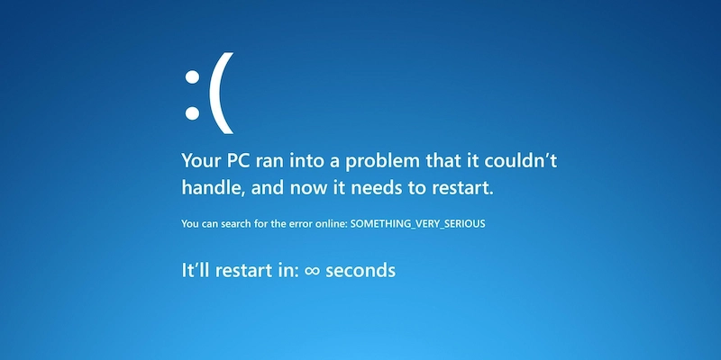
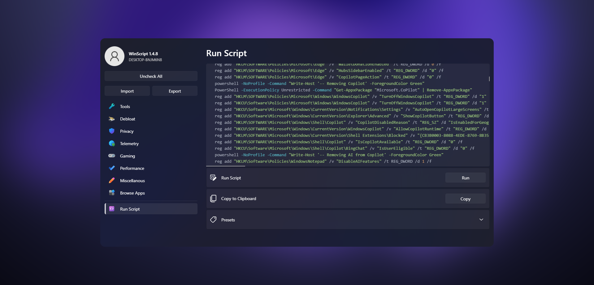

Plusieurs polémiques concernant Microsoft ont eu lieu ces dernières années. Et cela s’est intensifié depuis ce début d'année. [IA intégrée de force](https://korben.info/vscode-copilot-coauthor-polemique.html) dans différents services, respect de la vie privée, [accords militaires discutables](https://next.ink/167498/israel-hamas-microsoft-a-largement-fourni-larmee-israelienne-en-cloud-et-ia)... La liste est longue.

J’ai donc pris la décision d’arrêter d’utiliser leurs produits et leurs services autant que possible, et je me suis dit que ce serait l’occasion d’expliquer en détail les raisons de cette décision et de dérouler les différentes étapes dans un article.

## Windows 11

L’arrivée de Windows 11 a été une surprise pour beaucoup. Windows 10 devait être le dernier d’après Microsoft. Non seulement cette promesse n’a pas été tenue, mais en plus, son successeur nécessite un prérequis de sécurité indispensable : une [puce TPM2](https://fr.wikipedia.org/wiki/Trusted_Platform_Module). Cette puce permet une signature sécurisée entre l’OS et la carte mère. Elle est arrivée progressivement sur nos appareils à partir de 2016. Cela a donc obligé beaucoup de personnes et d’entreprises à renouveler un parc de machines parfaitement fonctionnelles, sachant que depuis octobre 2025, Windows 10 n’est plus supporté.

À cela s’ajoute toute la télémétrie de plus en plus envahissante, les bloatwares (ces logiciels préinstallés qui polluent nos installations toutes fraîches). Et bien sûr, l’intégration forcée de leur IA Copilot absolument partout (jusqu’au [bloc note](https://www.comptoir-hardware.com/actus/vr/48044-bloc-notes-avec-copilot-ajout-pertinent-ou-simple-gadget-.html) !). Il y a d’ailleurs leur fonctionnalité Recall qui fait [parler d’elle](https://www.clubic.com/actualite-574149-windows-11-signal-brave-adguard-la-fronde-s-etend-contre-recall.html) à plusieurs reprises, parce qu’il y avait clairement de quoi douter sur le respect de la vie privée.

Alors oui, je sais, il existe des solutions pour contourner tous ces problèmes. Je vous recommande d’ailleurs le logiciel [Rufus](https://rufus.ie/fr) pour désactiver la [vérification de la puce TPM2](https://next.ink/168574/windows-11-trois-methodes-pour-contourner-tpm-2-0/), mais également l’excellent outil [WinScript](https://winscript.cc/), qui vous facilite la désactivation/suppression de différents éléments non nécessaires. Le nombre de paramètres qu’il propose est assez dingue. Et une fois que vous avez décidé quels paramètres appliquer, vous avez juste à exécuter le script qu’il vous a généré, ou le copier pour le lancer sur d’autres machines.

Ça fait un moment maintenant que je n’utilise plus Windows dans le cadre du privé. MacOS est devenu mon OS principal. Mais je garde bien sûr un œil sur quelques distributions Linux (Debian, Ubuntu, Fedora…), parce qu’il est clair que je ne veux pas avoir à me battre contre mon système pour contourner les décisions douteuses de son éditeur.

## Gaming

Lorsque Microsoft avait présenté le Xbox GamePass, j’avais été enchanté par le concept. Pouvoir profiter d’un catalogue de jeux à la fois sur Xbox et PC, mais également d’une solution Cloud me semblait novateur. J’avais donc fait l’acquisition d’une Series S pour profiter des titres proposés, notamment ceux de la sphère indé.

Mais après quelques mois, plusieurs événements ont fait l’effet d’une douche froide. Des titres que j’affectionne sont sortis du catalogue, [Microsoft a racheté Activision Blizzard](https://fr.wikipedia.org/wiki/Acquisition_d'Activision_Blizzard_par_Microsoft), ce qui a entraîné une augmentation du prix de l’abonnement. Et les quelques rares titres qui m’intéressaient vraiment se faisaient de plus en plus rares.

En parallèle, j’ai pu récupérer un vieux PC sur lequel j’ai installé une distribution Linux orientée Gaming : [ChimeraOS](https://chimeraos.org/). Cette distribution permet de profiter de Gamescope, l’interface de [SteamOS](https://fr.wikipedia.org/wiki/SteamOS). L’expérience est vraiment réussie. C’est fluide, personnalisable, et particulièrement efficace. Dès le 1er démarrage, on connecte notre compte Steam, et on peut télécharger ses jeux pour les lancer sans se prendre la tête. Et avec un peu de configuration, on peut également installer nos jeux Epic Games et Gog, et les intégrer dans l’interface.

Vu les promos que propose Valve, cette solution est clairement mieux adaptée à ma façon de profiter du jeu vidéo. Et pour les quelques jeux incompatibles Linux ou demandant une configuration plus musclée, [GeForce Now](https://www.nvidia.com/fr-fr/geforce-now/) prend le relai. À noter que leur application est maintenant disponible sous Linux sous forme de AppImage.

Je me suis donc débarrassé de ma Xbox. Je n’ai clairement aucun regret, et je ne pense pas faire demi-tour sur ce choix. À l’avenir, soit Valve finit par sortir son [Steam Machine](https://store.steampowered.com/sale/steammachine) (en espérant que le prix de la RAM redescende en 2027), soit je me construirai moi-même ma console de jeux.

## GitHub

Voilà le dernier maillon des services Microsoft dont il est le plus difficile de se séparer : GitHub. Et à mon grand regret, force est de constater que je dois me résigner à rester chez eux. Après avoir cru pouvoir m'en passer et filer chez [Codeberg](https://codeberg.org/), j'ai finalement fait un retour arrière. Les instabilités de leur plateforme sont trop nombreuses, et ce n'est pas utilisable au quotidien.

## Et c'est tout ?

Il faut toutefois se rendre à l’évidence : même en ayant quitté la majorité des produits Microsoft dans ma vie personnelle, je reste utilisateur de leurs services au niveau professionnel. De plus, une grande majorité des projets OpenSource ont leurs sources hébergées chez GitHub, car elle reste la plateforme qui permet d'avoir un maximum de visibilité. Il est donc impossible pour moi de se défaire totalement de leurs services.

Chaque utilisateur qui fait ce choix envoie un signal, très modeste certes, mais concret. Et pour ma part, j'ai au moins la satisfaction d'avoir repris un peu plus le contrôle sur ce que font les services que j'utilise au quotidien.
