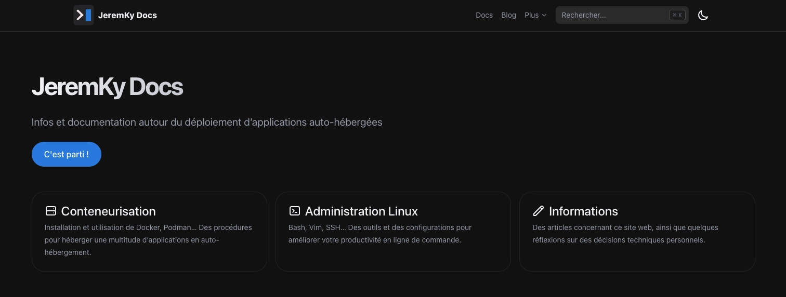

Après quelques années sous le thème [Hello Friend](https://github.com/panr/hugo-theme-hello-friend), le site fait peau neuve. C'était aussi l'occasion de repenser en profondeur la façon dont le contenu est organisé.

Le site devient **[JeremKy Docs](https://jeremky.github.io/)**.

## Pourquoi changer ?

Au fil du temps, le contenu du site a évolué : moins d'articles de fond, plus de documentation technique sur des outils et des configurations. Le format blog n'était plus vraiment adapté à ce type de contenu, difficile à retrouver et à maintenir.

Lorsque des changements avaient lieu sur un sujet, je ne savais pas si je devais refaire un nouvel article, ou modifier l'existant... Au risque qu'il ne soit pas vu, car perdu dans les archives. Il fallait donc que je revois la structure même du site, en adoptant une logique de documentation, tout en conservant une section blog pour ce genre d'informations.

Et le thème Hello Friend que j'utilisais a été abandonné par son créateur. Je devais donc le maintenir moi même selon les évolutions du CMS [Hugo](https://gohugo.io/). Cette maintenance me faisait perdre pas mal de temps, temps que je ne mettais pas dans la rédaction du contenu.

## Hextra

Le nouveau thème [Hextra](https://imfing.github.io/hextra/) est orienté documentation et offre une navigation latérale, une table des matières automatique, et un moteur de recherche intégré. Le rendu est sobre et lisible, avec un support natif du mode clair/sombre.

J'ai quand même effectué quelques modifications sur la page d'accueil, afin d'avoir rapidement un aperçu des dernières pages et news.

## Une structure repensée

Le contenu est désormais organisé par thématiques : Linux, macOS, Docker, jeux… Chaque page est autonome et mise à jour indépendamment, ce qui est bien plus adapté à ce type de contenu que des articles datés.

La section blog reste présente pour les réflexions, news, retours d'expérience... Mais elle n'est plus le cœur du site.

## Et l'ancien contenu ?

Les anciens articles ont été transformés en pages de documentation. Certains ont été archivés, soit parce qu'ils étaient tout simplement obsolètes, soit parce qu'ils étaient redondants.

Pas mal de pages ont été revues, en supprimant les commentaires autour de mes usages personnels, pour me focaliser là encore davantage sur l'aspect documentation.

N'hésitez pas à parcourir les différentes sections et à me faire part de vos retours.
