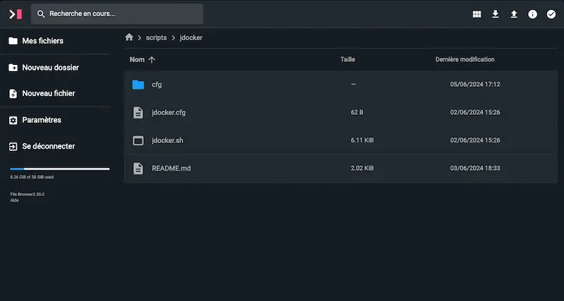
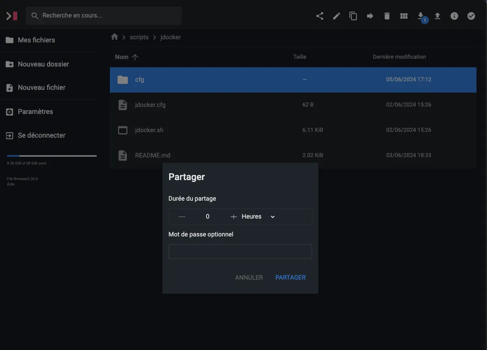
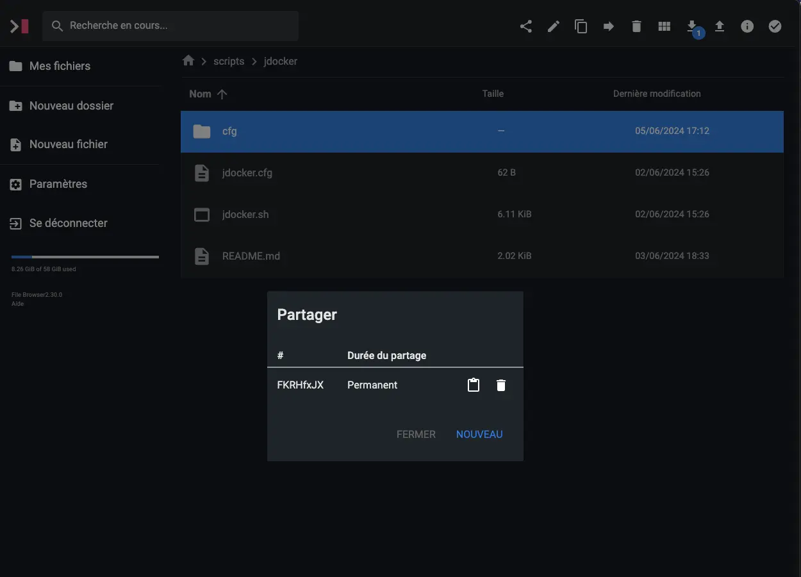
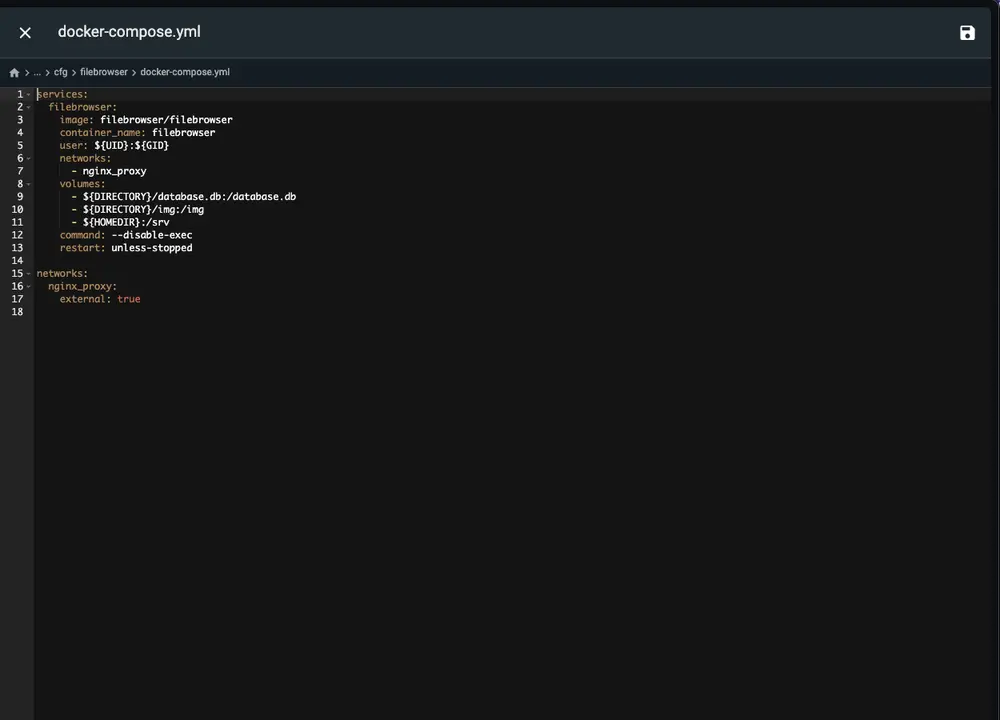
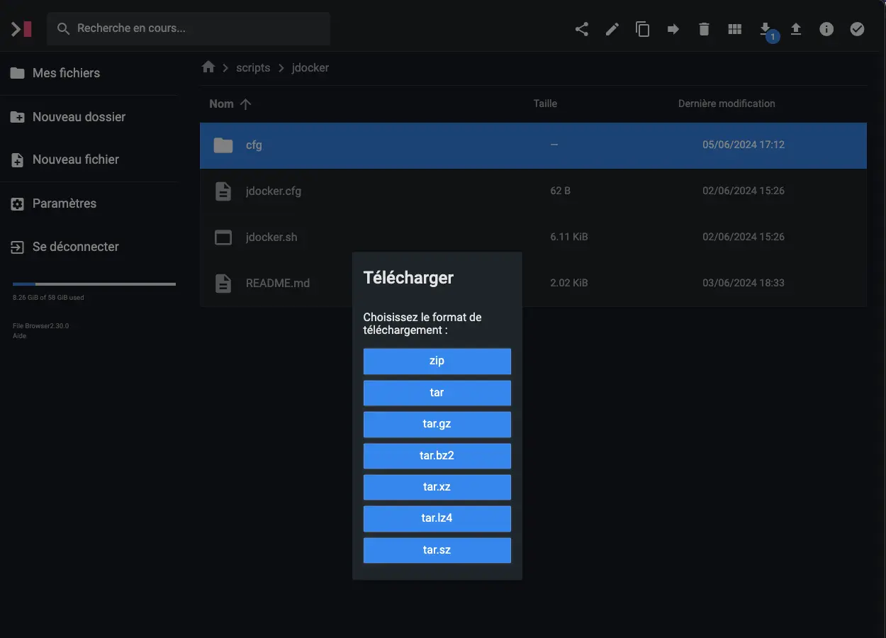
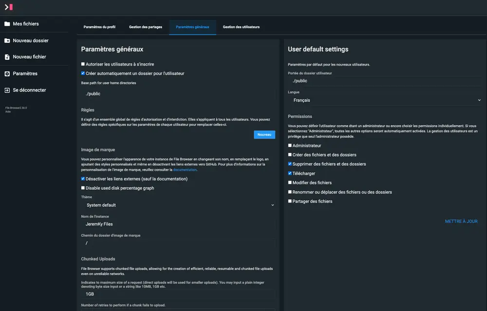

[File Browser](https://github.com/filebrowser/filebrowser) est une application web offrant une interface de gestion de fichiers dans un répertoire spécifié. Il permet de télécharger, supprimer, prévisualiser et modifier vos fichiers. Contrairement à d'autres applications, File Browser n'a besoin que d'une base simple de type fichier.



## Interface

L'interface se veut très légère, afin d'aller à l'essentiel. Vous accédez directement aux dossiers et fichiers présents sur le système (contrairement à Nextcloud par exemple qui possède sa propre arborescence).

Beaucoup de fonctionnalités sont présentes :

- Le téléchargement d'un dossier en archive compressée
- Une visualisation des images
- Un éditeur de texte
- Un lanceur de commandes système (peu utile dans le cas d'une installation Docker)
- La possibilité de partager simplement du contenu, avec durée, et protection par mot de passe









## Installation

Le fichier `docker-compose.yml` :




```yml {filename="docker-compose.yml"}
services:
  filebrowser:
    image: docker.io/filebrowser/filebrowser
    container_name: filebrowser
    hostname: filebrowser
    user: 1000:1000
    networks:
      - nginx_proxy
    volumes:
      - ./files/database:/database
      - ./files/config:/config
      - ./files/branding:/branding
      - /home:/srv
    restart: always

networks:
  nginx_proxy:
    external: true
```




```yml {filename="docker-compose.yml"}
services:
  filebrowser:
    image: docker.io/filebrowser/filebrowser
    container_name: filebrowser
    hostname: filebrowser
    user: 0:0
    networks:
      - nginx_proxy
    volumes:
      - ./files/database:/database
      - ./files/config:/config
      - ./files/branding:/branding
      - /home:/srv
    restart: always

networks:
  nginx_proxy:
    external: true
```




Quelques éléments à préciser :

- Il est nécessaire de créer un dossier `files` là où se trouve votre fichier compose
- Dans ce dossier, vous devrez créer un sous dossier `database`, avec à l'intérieur un fichier vide nommé `filebrowser.db` (qui comme son nom l'indique, servira de base de données)
- Enfin, il vous faut créer dans ce même dossier `files` un sous dossier `config`, avec à l'intérieur un fichier nommé `settings.json` pour y insérer le contenu suivant :

```json {filename="settings.json"}
{
  "port": 8080,
  "baseURL": "",
  "address": "",
  "log": "stdout",
  "database": "/database/filebrowser.db",
  "root": "/srv"
}
```

### Reverse proxy

Afin d'accéder à votre application fraîchement installée, je vous conseille d'utiliser un reverse proxy pour plus de sécurité.

> Pour rappel, une page dédiée est disponible [ici](/docs/docker/conteneurs/web/reverse-proxy-nginx/).

L'image Docker de [Linuxserver.io](https://docs.linuxserver.io/general/swag/) propose un fichier sample de configuration. Si votre reverse proxy est en place, utilisez la commande suivante pour activer sa configuration :

```bash
sudo cp /opt/containers/nginx/nginx/proxy-confs/filebrowser.subdomain.conf.sample /opt/containers/nginx/nginx/proxy-confs/filebrowser.subdomain.conf
```

Et enfin, un petit redémarrage pour la prise en compte du nouveau fichier :

```bash
sudo docker restart nginx
```

## Configuration

Dans la partie _Paramètres_, vous avez dans l'onglet _Paramètres généraux_, des éléments à modifier, notamment le dossier par défaut qui sera utilisé lors de la création d'un nouvel utilisateur, ses droits, mais également la possibilité de créer un sous dossier directement par utilisateur.


