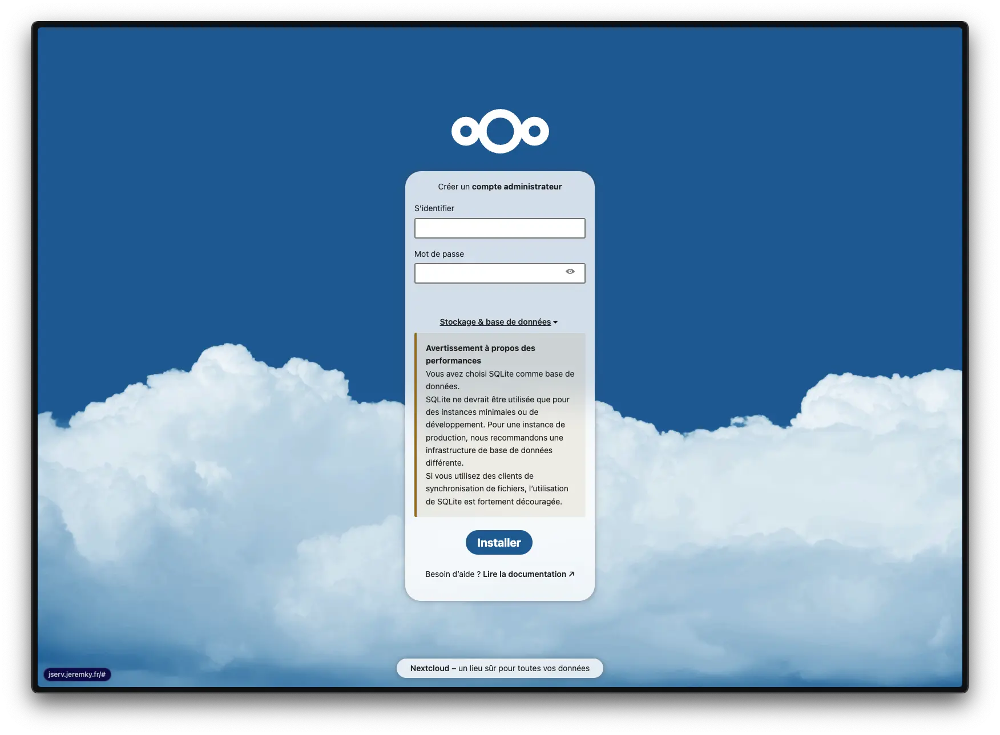
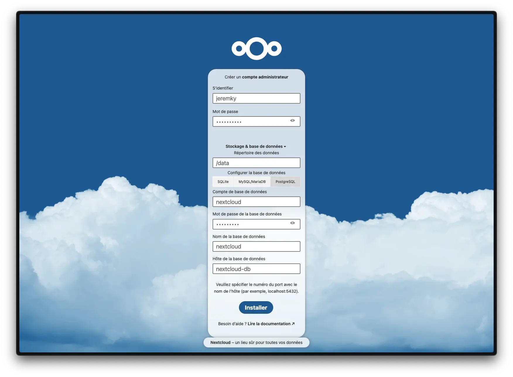
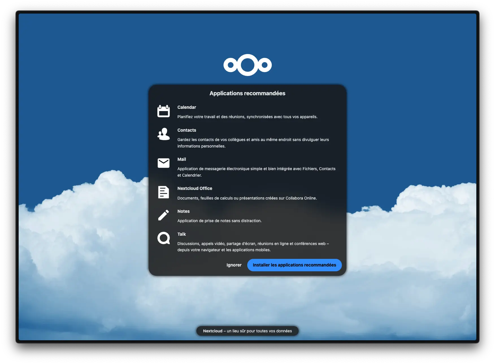
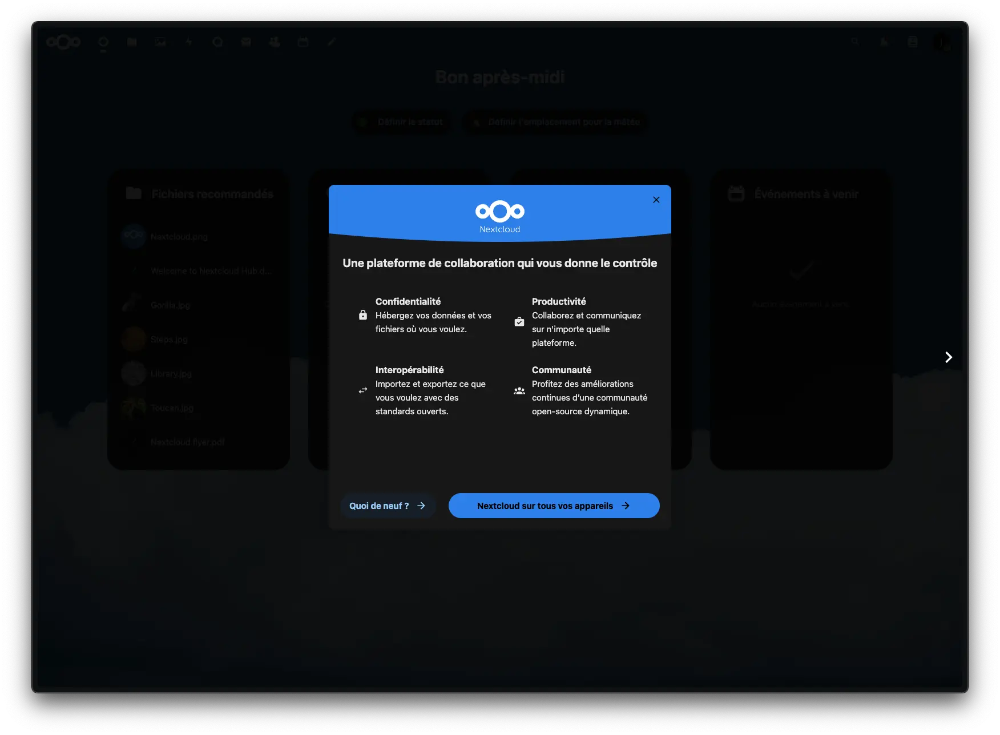
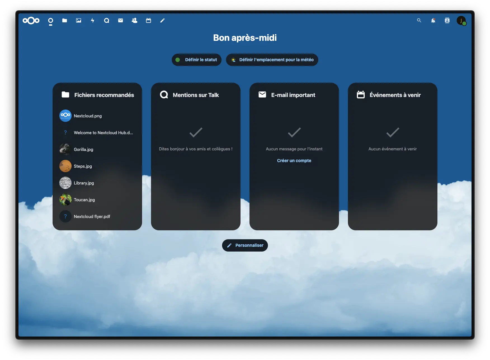

_[Nextcloud](https://fr.wikipedia.org/wiki/Nextcloud) est un logiciel libre de site d'hébergement de fichiers et une plateforme de collaboration. À l'origine accessible via WebDAV, n'importe quel navigateur web, ou des clients spécialisés, son architecture ouverte a permis de voir ses fonctionnalités s'étendre depuis ses origines. En 2020, il propose de nombreux services._


[Nextcloud](https://nextcloud.com/fr/) est une plateforme de type "cloud" personnel, où vous allez pouvoir y stocker vos fichiers, mais aussi vos agendas, vos contacts, vos notes, vos photos... Il propose également une série d'applications facultatives (travail collaboratif, visio...).

## Installation

Nextcloud a besoin d'une base de données. Je propose une installation avec postgres, plus performant que mariaDB pour ce genre d'applications.

Le fichier `docker-compose.yml` :

```yml {filename="docker-compose.yml"}
services:
  nextcloud-db:
    image: docker.io/postgres:16.4
    container_name: nextcloud-db
    hostname: nextcloud-db
    env_file: nextcloud-db.env
    networks:
      - default
    volumes:
      - /opt/containers/containers/nextcloud/postgres:/var/lib/postgresql/data
    restart: always

  nextcloud:
    image: lscr.io/linuxserver/nextcloud:latest
    container_name: nextcloud
    hostname: nextcloud
    nv_file: nextcloud.env
    networks:
      - default
      - nginx_proxy
    volumes:
      - /opt/containers/containers/nextcloud/config:/config
      - /opt/containers/containers/nextcloud/data:/data
    depends_on:
      - nextcloud-db
    restart: always

networks:
  default:
    external: false
  nginx_proxy:
    external: true
```

Le fichier `nextcloud.env` :

```ini {filename="nextcloud.env"}
PUID=1000
PGID=1000
TZ=Europe/Paris
```

Et le fichier `nextcloud-db.env` :

```ini {filename="nextcloud-db.env"}
POSTGRES_PASSWORD=Password
POSTGRES_USER=nextcloud
POSTGRES_DB=nextcloud
```

N'oubliez pas de changer le mot de passe dans la variable `POSTGRES_PASSWORD`.

### Reverse proxy

Les fichiers de configuration ci-dessus sont prévus pour être utilisés avec un reverse proxy.

> Pour rappel, une page dédiée est [disponible ici](/docs/docker/conteneurs/web/reverse-proxy-nginx/).

L'image Docker de [Linuxserver.io](https://docs.linuxserver.io/general/swag/) propose un fichier sample de configuration, il vous suffit juste de modifier votre sous domaine en conséquence :

```bash
sudo cp /opt/containers/containers/nginx/nginx/proxy-confs/nextcloud.subdomain.conf.sample /opt/containers/nginx/nginx/proxy-confs/nextcloud.subdomain.conf
sudo sed -i "s,server_name nextcloud,server_name <votre_sous_domaine>,g" /opt/containers/containers/nginx/nginx/proxy-confs/nextcloud.subdomain.conf
```

Autre point important, Nextcloud a besoin de certains éléments côté ssl. il faut donc modifier le fichier `/opt/containers/containers/nginx/nginx/ssl.conf` pour y décommenter les lignes suivantes :

```nginx
add_header Strict-Transport-Security "max-age=63072000" always;
add_header Referrer-Policy "same-origin" always;
add_header X-Content-Type-Options "nosniff" always;
add_header X-Frame-Options "SAMEORIGIN" always;
```

Enfin, un petit redémarrage pour prendre en compte vos modifications :

```bash
sudo docker restart nginx
```

## Initialisation

Une fois votre application déployée, vous connecter à l'url que vous avez défini dans votre proxy devrait vous amener à la page suivante :



Cliquez sur `Stockage & base de données` pour sélectionner `PostgreSQL`. Il vous faudra renseigner les informations de la base de données définies dans votre fichier `.env`:

- Le compte, qui est votre user postgre
- le mot de passe de la base
- le nom de la base
- le hostname, qui correspond au nom du conteneur : nextcloud-db dans notre cas

Vous pouvez maintenant cliquer sur `Installer`.



Une fois l’initialisation terminée, il vous sera demandé si vous voulez le pack d'applications recommandées. Dans notre exemple, nous allons les installer :



Vous devriez enfin vous retrouver sur la page d’accueil :




