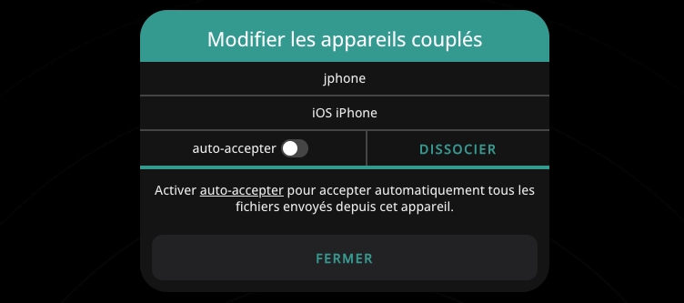

[Pairdrop](https://github.com/schlagmichdoch/pairdrop) été conçu pour reproduire le service [Airdrop](https://fr.wikipedia.org/wiki/AirDrop) disponible sur iOS et macOS. Totalement libre, il permettra à n’importe qui de se transférer des fichiers ou du texte directement d’un appareil à un autre, à partir du moment où ces appareils sont présents sur le même réseau local, et ce sans aucune configuration à effectuer.

Cette facilité d’utilisation n’est pas sans limite : vous ne pouvez transférer que des fichiers d’une taille inférieure à 200 Mo. Mais c’est en lien avec l’objectif de l’application : transférer simplement via une solution rapide, et ce sans aucun serveur de relai.

L’application est disponible en suivant [ce lien officiel](https://pairdrop.net/).

Si toutefois vous avez envie de profiter de ce service sans subir la limitation liée au réseau local, vous pouvez héberger l’application sur un serveur personnel, une [image Docker](https://docs.linuxserver.io/images/docker-pairdrop/) est effectivement disponible.

## Installation

Le fichier `docker-compose.yml` :

```yml {filename="docker-compose.yml"}
services:
  pairdrop:
    image: lscr.io/linuxserver/pairdrop:latest
    container_name: pairdrop
    hostname: pairdrop
    env_file: pairdrop.env
    networks:
      - nginx_proxy
    restart: always

networks:
  nginx_proxy:
    external: true
```

Et son fichier `pairdrop.env` :

```ini {filename="pairdrop.env"}
PUID=1000
PGID=1000
TZ=Europe/Paris
WS_FALLBACK=true
```

- L’option `RATE_LIMIT` permet d’éviter les abus, en limitant les clients à 100 requêtes toutes les 5 minutes

- L’option `WS_FALLBACK` permet quant à elle de bypasser la connexion WebRTC afin de transférer des fichiers entre des appareils sur des réseaux différents, en utilisant ce serveur comme relai

### Reverse proxy

Les fichiers de configuration ci-dessus sont prévus pour être utilisés avec un reverse proxy.

> Pour rappel, une page dédiée est [disponible ici](/docs/docker/conteneurs/web/reverse-proxy-nginx).

L’image Docker de [Linuxserver.io](https://docs.linuxserver.io/general/swag/) ne propose pas de fichier sample de configuration pour PairDrop. Vous devez donc créer un fichier nommé `/opt/containers/nginx/nginx/proxy-confs/pairdrop.subdomain.conf`, et y coller le contenu suivant :

```nginx {filename="pairdrop.subdomain.conf"}
## Version 2024/07/16
# make sure that your pairdrop container is named pairdrop
# make sure that your dns has a cname set for pairdrop

server {
    listen 443 ssl;
    listen [::]:443 ssl;

    server_name pairdrop.*;

    include /config/nginx/ssl.conf;

    client_max_body_size 0;

    #include /config/nginx/authelia-server.conf;

    location / {
        #include /config/nginx/authelia-location.conf;
        include /config/nginx/proxy.conf;
        include /config/nginx/resolver.conf;
        set $upstream_app pairdrop;
        set $upstream_port 3000;
        set $upstream_proto http;
        proxy_pass $upstream_proto://$upstream_app:$upstream_port;
    }

}
```

> Pensez à changer la section `server_name pairdrop.*;` selon votre sous domaine.

Et enfin, un petit redémarrage pour la prise en compte du nouveau fichier :

```bash
sudo docker restart nginx
```

## Utilisation

Comme dit plus haut, Pairdrop est terriblement simple à utiliser. Ouvrez la page depuis le navigateur des appareils que vous voulez transférer vos fichiers, et ils devraient se voir directement. Profitez-en pour leur donner un nom plus distinctif :smile:

### Association

Si vous hébergez l’application et que vous avez activé le routage du traffic, vous devez créer un salon et relier vos appareils via un échange de clé (option en haut à droite). Vous pouvez même directement scanner un QR code pour faciliter l’association.


Vous verrez alors en bas que vous pouvez être visible à la fois sur le réseau local ou par les appareils couplés. Notez qu’il est également possible de faire la même chose avec des salons temporaires.

### Transferts

Pour transférer des fichiers, il suffit de cliquer sur l’appareil destinataire, et d’aller chercher le fichier à envoyer.


Pour du texte, c’est via un clic droit (ou une pression longue sur mobile).


Un popup s’affichera sur le 2ème appareil, afin d’accepter la réception. Il est d’ailleurs possible d’ accepter automatiquement les fichiers envoyés une fois le couplage effectué.


