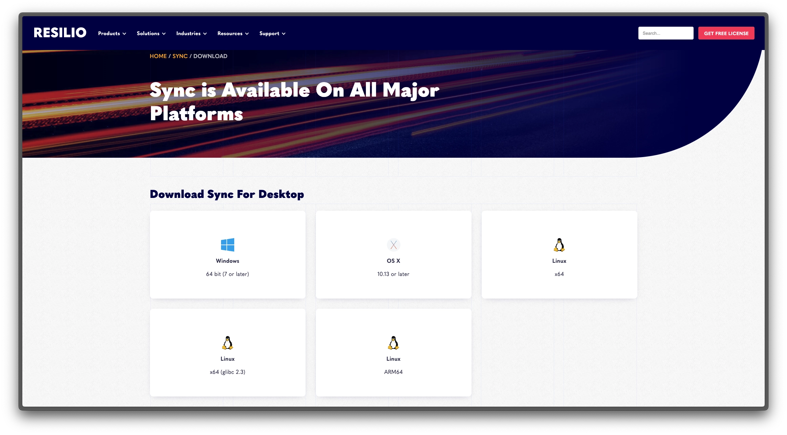
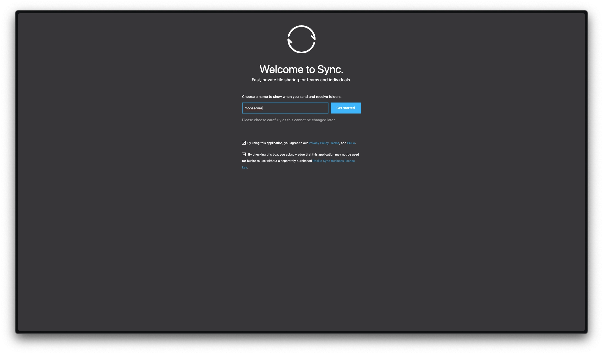
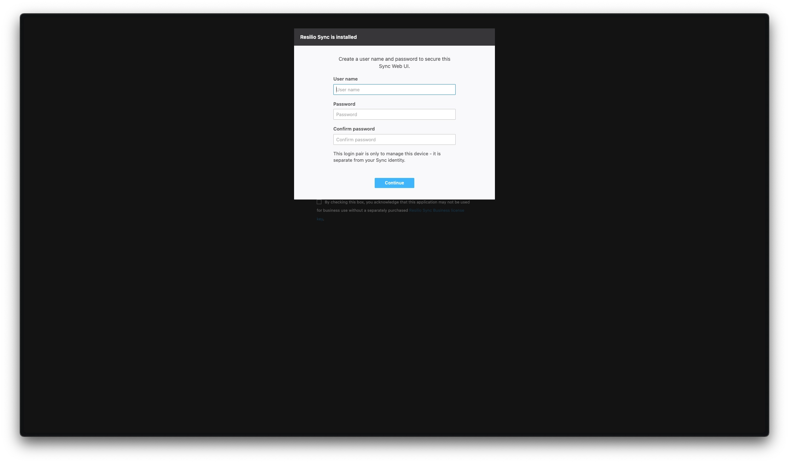
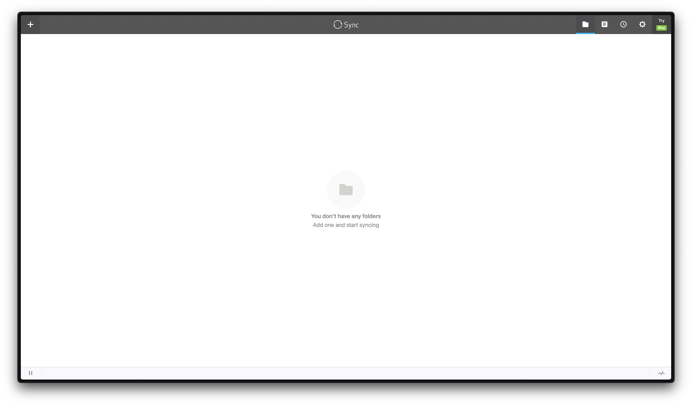
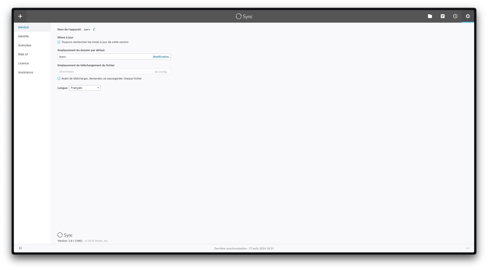
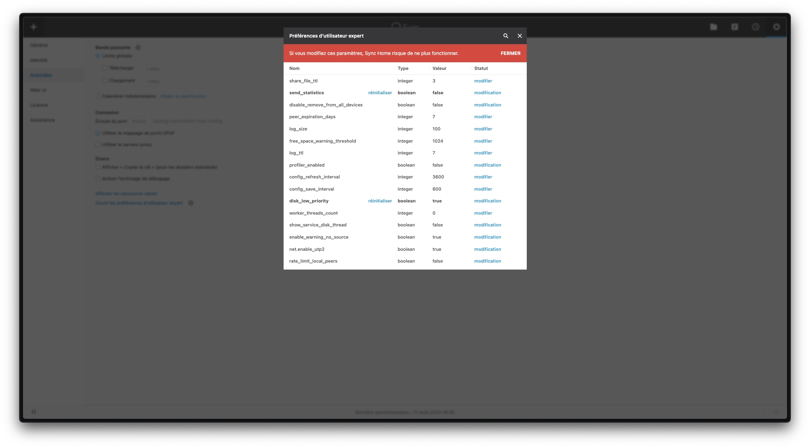
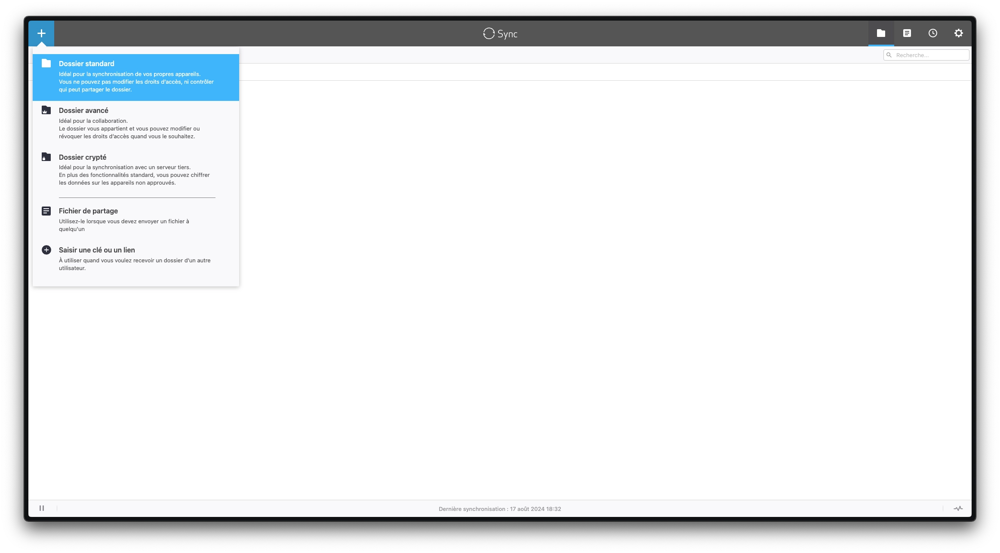
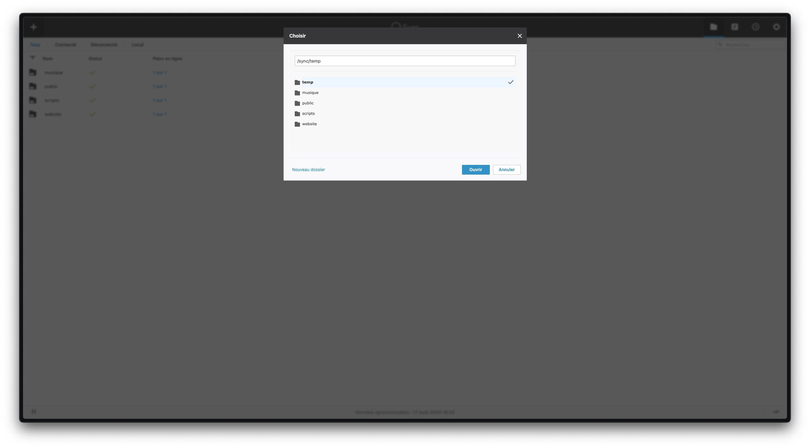
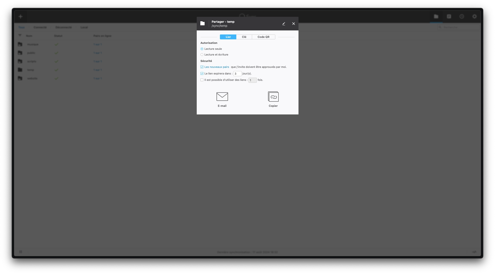

_[Resilio Sync](https://fr.wikipedia.org/wiki/Resilio_Sync) est un outil propriétaire de synchronisation de fichiers peer-to-peer disponible pour Windows, Mac, Linux, Android, iOS, Windows Phone, Amazon Kindle Fire et BSD. Il peut synchroniser des fichiers entre appareils sur un réseau local ou entre appareils distants sur Internet via une version modifiée du protocole BitTorrent. Bien qu'il ne soit pas présenté par les développeurs comme un remplacement direct ni un concurrent des services de synchronisation de fichiers basés sur le cloud, il a acquis une grande partie de sa publicité dans ce rôle potentiel._

[Resilio Sync](https://www.resilio.com/sync/) propose une synchronisation par dossier. Chaque nouveau partage génère une clé, que vous pouvez communiquer à un autre client Resilio Sync, pour effectuer une synchronisation. Chaque modification d'un dossier associé à un partage sera automatiquement répliqué sur chaque dossier connecté.

## Installation de l'application

Vous pouvez télécharger l'application directement [sur le site](https://www.resilio.com/individuals/) :



### Via Docker/Podman

Pour un serveur Linux, il est plus flexible d'utiliser une image Docker. L'emplacement du dossier par défaut et les droits utilisés sont paramétrables. Encore une fois, je vous propose une image créée par l'équipe [Linuxserver.io](https://docs.linuxserver.io/images/docker-resilio-sync/).

Le fichier `docker-compose.yml` :

```yml {filename="docker-compose.yml"}
services:
  resilio-sync:
    image: lscr.io/linuxserver/resilio-sync:latest
    container_name: resilio-sync
    hostname: resilio-sync
    env_file: resilio-sync.env
    networks:
      - nginx_proxy
    volumes:
      - /opt/containers/resilio-sync/config:/config
      - /opt/containers/resilio-sync/downloads:/downloads
      - /home:/sync
    ports:
      - 55555:55555
    restart: always

networks:
  nginx_proxy:
    external: true
```

Et le fichier `resilio-sync.env` associé :

```ini {filename="resilio-sync.env"}
PUID=1000
PGID=1000
TZ=Europe/Paris
```

Les variables `PUID` et `PGID` doivent correspondre à celui du user ayant les droits des dossiers que vous souhaitez synchroniser.

### Reverse proxy

Les fichiers de configuration ci-dessus sont prévus pour être utilisés avec un reverse proxy.

> Pour rappel, une page dédiée est [disponible ici](/docs/docker/conteneurs/web/reverse-proxy-nginx/).

L'image Docker de [Linuxserver.io](https://docs.linuxserver.io/general/swag/) propose un fichier sample de configuration, il vous suffit juste de modifier votre nom de domaine en conséquence :

```bash
sudo cp /opt/containers/nginx/nginx/proxy-confs/resilio-sync.subdomain.conf.sample /opt/containers/nginx/nginx/proxy-confs/resilio-sync.subdomain.conf
sudo sed -i "s,server_name resilio-sync,server_name <votre_sous_domaine>,g" /opt/containers/nginx/nginx/proxy-confs/resilio-sync.subdomain.conf
```

Et enfin, un petit redémarrage pour la prise en compte du nouveau fichier :

```bash
sudo docker restart nginx
```

## Initialisation

Une fois votre application déployée, vous connecter à l'url que vous avez défini dans la configuration de votre proxy devrait vous amener à la page suivante :



Définissez un nom pour votre appareil, et acceptez les conditions d'utilisation. Ensuite, il vous sera demandé de choisir un utilisateur et un mot de passe pour l'accès à votre application :



Vous arriverez enfin sur la page d'accueil :



## Paramétrage

Une fois sur l'interface de Resilio Sync, vous pouvez accéder aux réglages en cliquant sur la roue crantée en haut à droite :



Vous pouvez y modifier le nom de l'appareil, la langue, mais aussi le chemin par défaut pour les nouveaux dossiers (attention, pour l'instance Docker, `/sync` correspond au dossier spécifié au niveau de la variable `HOMEDIR` du fichier `resilio-sync.env`).

Dans la partie `Avancées`, il est possible, via le dernier lien en bas, d'accéder aux `préférences d'utilisateur expert` :



Il faut rester prudent avec ces options. Je m'y rend surtout pour passer en mode `disk_low_priority` afin de diminuer la charge disque, et pour désactiver la télémétrie (`send_statistics`).

## Ajout d'un dossier

Une fois votre application correctement configurée, vous allez pouvoir ajouter vos dossiers à synchroniser :



Il vous suffira de choisir le dossier de votre appareil à ajouter :



Une fois le dossier sélectionné, vous pourrez définir les autorisations, les paramètres de sécurité... Vous pourrez également copier la clé unique qui vous servira pour synchroniser ce dossier sur un autre appareil :



Ou alors, si vous voulez ajouter votre dossier sur un appareil mobile disposant d'une caméra, c'est encore plus simple : un QR code est à disposition pour faciliter l'ajout de votre dossier.
