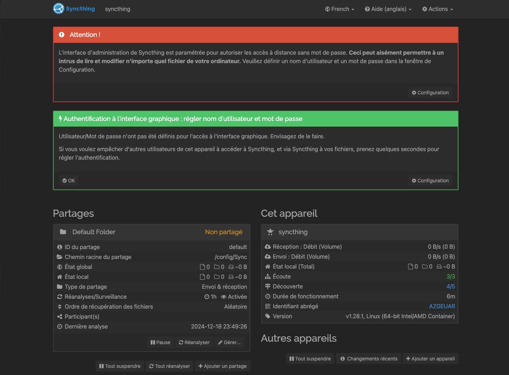
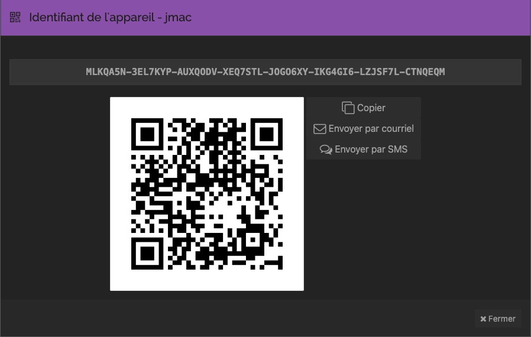
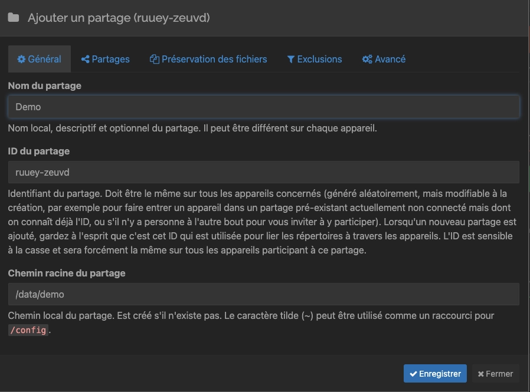
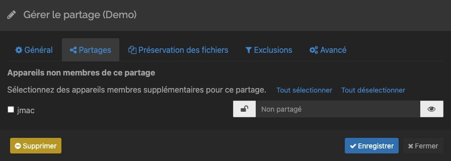
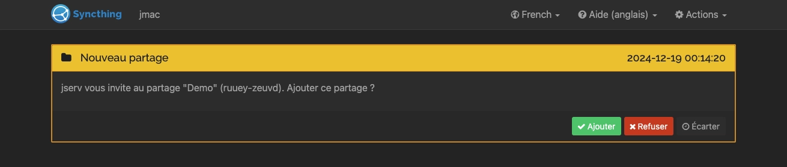
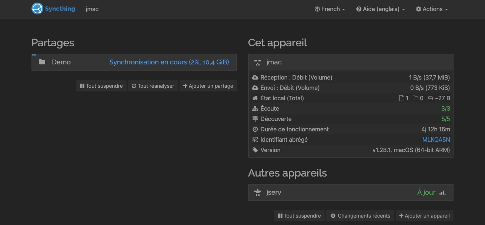

_[Syncthing](https://fr.wikipedia.org/wiki/Syncthing) est une application de synchronisation de fichiers pair à pair open source disponible pour Windows, Mac, Linux, Android, Solaris, Darwin et BSD. Aucun compte ni enregistrement préalable à l'utilisation auprès d'un tiers (comme les géants du web, ou quelque autre entité) n'est nécessaire, ni même optionnelle. La sécurité et l'intégrité des données sont intégrées dans la conception du logiciel._


## Installation

Le fichier `docker-compose.yml` :

```yml {filename="docker-compose.yml"}
services:
  syncthing:
    image: lscr.io/linuxserver/syncthing:latest
    container_name: syncthing
    hostname: syncthing
    env_file: syncthing.env
    networks:
      - nginx_proxy
    volumes:
      - /opt/containers/syncthing:/config
      - /home/user:/data
    ports:
      - 22000:22000/tcp
      - 22000:22000/udp
      - 21027:21027/udp
    restart: always

networks:
  nginx_proxy:
    external: true
```

Pensez à remplacer le volume `/home/user` par le dossier racine que vous souhaitez utiliser.

Le fichier `syncthing.env` associé :

```ini {filename="syncthing.env"}
PUID=1000
PGID=1000
TZ=Europe/Paris
```

Là encore, vérifiez l’id de votre user user ayant les droits sur les fichiers à synchroniser.

### Reverse proxy

Les fichiers de configuration ci-dessus sont prévus pour être utilisés avec un reverse proxy.

> Pour rappel, une page dédiée est [disponible ici](/docs/docker/conteneurs/web/reverse-proxy-nginx/).

L’image Docker de [Linuxserver.io](https://docs.linuxserver.io/general/swag/) propose un fichier sample de configuration, il vous suffit juste de modifier votre nom de domaine en conséquence :

```bash
sudo cp /opt/containers/nginx/nginx/proxy-confs/syncthing.subdomain.conf.sample /opt/containers/nginx/nginx/proxy-confs/syncthing.subdomain.conf
sudo sed -i "s,server_name syncthing,server_name <votre_sous_domaine>,g" /opt/containers/nginx/nginx/proxy-confs/syncthing.subdomain.conf
```

Et enfin, un petit redémarrage pour la prise en compte du nouveau fichier :

```bash
sudo docker restart nginx
```

## Configuration

Après avoir accepté ou non la collecte de données, vous aurez divers messages vous demandant de vous rendre dans la page de configuration pour y définir un utilisateur et un mot de passe.



Une fois cela fait, vous allez pouvoir ajouter les autres appareils et les dossiers que vous voulez synchroniser.

## Ajouter un appareil

Cliquez sur `Ajouter un appareil` en bas à droite. Il vous sera demandé son ID.
Pour récupérer l’ID de l’autre appareil à intégrer, il faut cliquer sur l’identifiant abrégé :



Une fois ajouté, un message apparaîtra sur l’autre appareil, afin de valider l’association.
Il est temps maintenant de passer à l’ajout de vos dossiers.

## Ajout des dossiers

Commencez par supprimer le dossier créé par défaut, en vous rendant dans `gérer`, puis cliquez sur `supprimer`. Une fois cela fait, ajoutez un partage. Spécifiez un nom, puis le chemin racine du partage. Attention, dans le conteneur, votre volume monté se trouve dans `/data` (qui est en fait `/home/user` sur l’hôte).



Rendez vous dans l’onglet `Partages` et choisissez l’appareil qui aura accès à ce dossier.



Un message apparaîtra alors sur le deuxième appareil afin d’accepter la synchronisation.



Une fois le dossier ajouté, la synchronisation va démarrer.



## Exclusion

Si vous désirez exclure des fichiers ou des dossiers, il est possible de créer un fichier nommé `.stignore` dans chaque dossier racine et d’y indiquer les éléments à ignorer. Voici un exemple de la [documentation officielle](https://docs.syncthing.net/users/ignoring.html) :

```txt {filename=".stignore"}
.DS_Store
.stignore
foo
foofoo
bar/
    baz
    quux
    quuz
bar2/
    baz
    frobble
My Pictures/
    Img15.PNG
```
