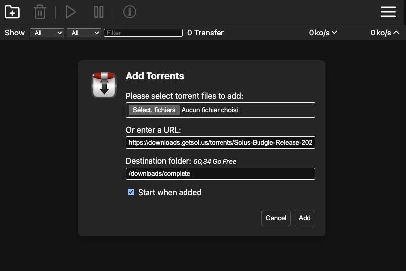
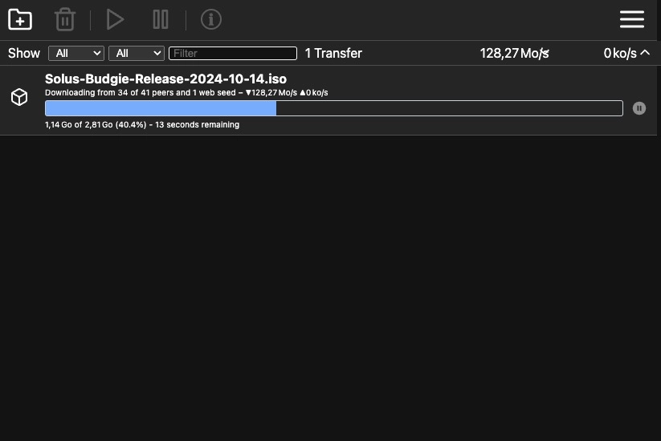

Transmission est une application de téléchargement BitTorrent légère et open-source. Elle existe également en version Web, ce qui nous intéresse ici.


## Installation

Le fichier `docker-compose.yml` :

```yml {filename="docker-compose.yml"}
services:
  transmission:
    image: lscr.io/linuxserver/transmission:latest
    container_name: transmission
    hostname: transmission
    env_file: transmission.env
    networks:
      - nginx_proxy
    volumes:
      - /opt/containers/transmission/data:/config
      - /opt/containers/transmission/downloads:/downloads
      - /opt/containers/transmission/folder:/watch
    ports:
      - 51413:51413
      - 51413:51413/udp
    restart: always

networks:
  nginx_proxy:
    external: true
```

Et son fichier `transmission.env` :

```ini {filename="transmission.env"}
PUID=1000
PGID=1000
TZ=Europe/Paris
USER=
PASS=
```

> Si aucun user/password n'est défini, l'interface sera directement accessible sans authentification. Je vous suggère de vous référer à l'article au sujet de [Tinyauth](/docs/docker/conteneurs/web/tinyauth) pour centraliser vos authentifications.

Pensez à adapter les chemins des volumes dans le fichier `docker-compose.yml` vers les dossiers où vous voulez stocker vos fichiers.

### Reverse proxy

Les fichiers de configuration ci-dessus sont prévus pour être utilisés avec un reverse proxy.

> Pour rappel, une page dédiée est [disponible ici](/docs/docker/conteneurs/web/reverse-proxy-nginx/).

L'image Docker de [Linuxserver.io](https://docs.linuxserver.io/general/swag/) propose un fichier sample de configuration, il vous suffit juste de modifier votre nom de domaine en conséquence :

```bash
sudo cp /opt/containers/nginx/nginx/proxy-confs/transmission.subdomain.conf.sample /opt/containers/nginx/nginx/proxy-confs/transmission.subdomain.conf
sudo sed -i "s,server_name transmission,server_name <votre_sous_domaine>,g" /opt/containers/nginx/nginx/proxy-confs/transmission.subdomain.conf
```

Et enfin, un petit redémarrage pour la prise en compte du nouveau fichier :

```bash
sudo docker restart nginx
```

## Utilisation

Une fois l'application déployée, rien de bien compliqué. Vous pouvez cliquer sur le + en haut à gauche pour ajouter un fichier torrent, ou lui donner directement un lien :



Une fois votre torrent ajouté, voici le rendu de l'interface :


