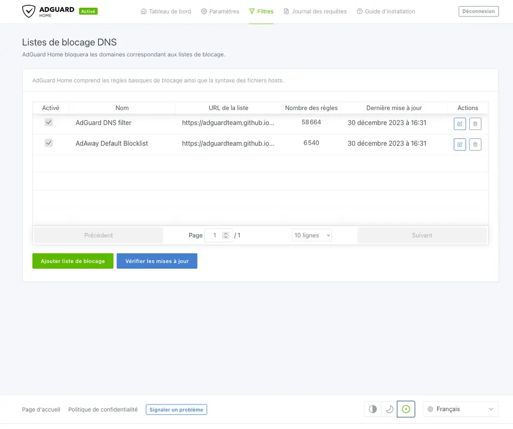

_[AdGuard Home](https://github.com/AdguardTeam/Adguardhome) est un logiciel réseau permettant de bloquer les publicités et le pistage. Une fois configuré, il couvre TOUS tes appareils domestiques, sans qu'aucun logiciel client ne soit nécessaire._

_Il fonctionne comme un serveur DNS qui redirige les domaines de pistage vers un « trou noir », empêchant ainsi tes appareils de se connecter à ces serveurs. Il est basé sur le logiciel utilisé pour les serveurs publics [AdGuard DNS](https://adguard-dns.io/fr/welcome.html)._

## Installation

Le fichier `docker-compose.yml` :

```yml {filename="docker-compose.yml"}
services:
  adguard:
    image: docker.io/adguard/adguardhome
    container_name: adguard
    hostname: adguard
    env_file: adguard.env
    volumes:
      - /opt/containers/adguard/work:/opt/adguardhome/work
      - /opt/containers/adguard/conf:/opt/adguardhome/conf
    network_mode: host
    restart: always
```

Et son fichier de configuration `adguard.env` :

```ini {filename="adguard.env"}
TZ=Europe/Paris
```

Petite particularité par rapport à cette configuration : le mode réseau utilisé par Docker est en mode _host_. Cela signifie que l'intégralité des ports sera ouverte sur l'hôte, préférable pour s'assurer du bon fonctionnement du serveur DHCP.

## Configuration

Une fois votre image Docker déployée, vous pouvez accéder à l'interface d'administration directement à l'adresse `http://<IP>:3000`. La configuration étant intuitive, je vous laisse suivre le wizard du 1er démarrage pour finaliser votre configuration.


