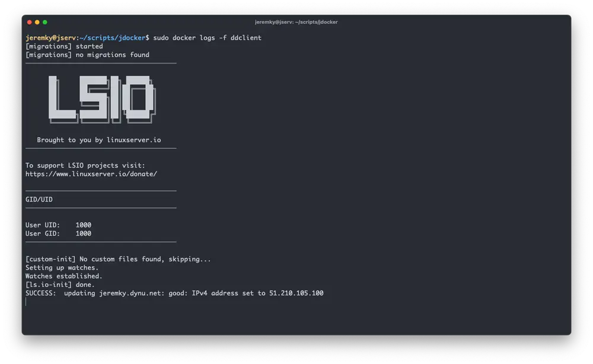

[ddclient](https://ddclient.net/) est un logiciel qui permet de mettre à jour son IP dynamiquement auprès de différents fournisseur. Dans cette documentation, nous allons utiliser le fournisseur [Dynu](https://www.dynu.com/fr-FR/). Je vous suggère de consulter [cette page](/docs/reseau/mise-a-jour-ip-dynamique) pour plus d'informations.

## Installation

Le fichier `docker-compose.yml` :

```yml {filename="docker-compose.yml"}
services:
  ddclient:
    image: lscr.io/linuxserver/ddclient:latest
    container_name: ddclient
    hostname: ddclient
    env_file: ddclient.env
    volumes:
      - ./files:/config
    restart: always
```

Et son fichier `ddclient.env` :

```ini {filename="ddclient.env"}
PUID=1000
PGID=1000
TZ=Europe/Paris
```

## Configuration

Dans le dossier où se trouvent vos fichiers, créez un répertoire `files`, et ajoutez-y le fichier de config suivant, sous le nom `ddclient.conf` :

```ini {filename="./files/ddclient.conf"}
# ddclient config for Dynu.com
pid=/var/run/ddclient.pid
daemon=300
syslog=yes
ssl=yes
use=web, web=checkip.dynu.com/, web-skip='IP Address'
server=api.dynu.com
protocol=dyndns2
login=dynu_username
password=md5_password
your-domain.dynu.net
```

Quelques éléments y sont à modifier :

- `dynu_username`
- `md5_password`
- `your-domain.dynu.net`

Une fois démarré, on peut consulter les logs du conteneur et vérifier la dernière ligne :

```bash
sudo docker logs -f ddclient
```


