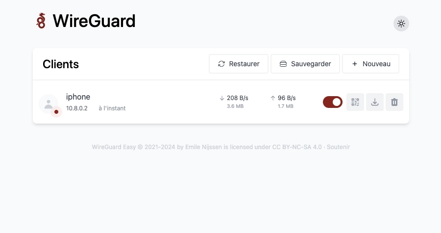
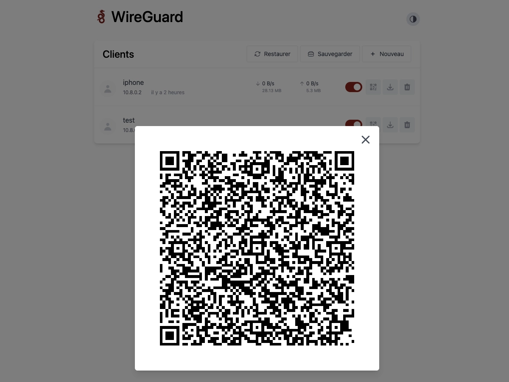

[Wireguard Easy](https://github.com/wg-easy/wg-easy) est une interface graphique légère et open source conçue pour simplifier la gestion de [WireGuard](/docs/docker/conteneurs/wireguard). Elle permet de gérer facilement les pairs (clients), de visualiser l'état des connexions, ainsi que la volumétrie de données transitant en temps réel. Il est également possible d'exporter facilement la configuration en cas de réinstallation ultérieure.



## Installation

Le fichier `docker-compose.yml` :




```yml {filename="docker-compose.yml"}
services:
  wireguard:
    image: ghcr.io/wg-easy/wg-easy
    container_name: wireguard
    hostname: wireguard
    env_file: wireguard.env
    networks:
      - nginx_proxy
    volumes:
      - /opt/containers/wireguard:/etc/wireguard
    ports:
      - 51820:51820/udp
    cap_add:
      - NET_ADMIN
      - SYS_MODULE
    sysctls:
      - net.ipv4.ip_forward=1
      - net.ipv4.conf.all.src_valid_mark=1
    restart: always

networks:
  nginx_proxy:
    external: true
```




```yml {filename="docker-compose.yml"}
services:
  wireguard:
    image: ghcr.io/wg-easy/wg-easy
    container_name: wireguard
    hostname: wireguard
    env_file: wireguard.env
    networks:
      - nginx_proxy
    volumes:
      - /opt/containers/wireguard:/etc/wireguard
    ports:
      - 51820:51820/udp
    cap_add:
      - NET_ADMIN
      - SYS_MODULE
      - NET_RAW
    sysctls:
      - net.ipv4.ip_forward=1
      - net.ipv4.conf.all.src_valid_mark=1
    restart: always

networks:
  nginx_proxy:
    external: true
```




Le fichier `wireguard.env` associé :

```ini {filename="wireguard.env"}
LANG=fr
WG_HOST=vpn.domaine.fr
WG_DEFAULT_DNS=1.1.1.2,1.0.0.2
UI_TRAFFIC_STATS=true
```

D'autres options de paramétrage sont disponibles. Vous pouvez vous rendre sur [cette page](https://github.com/wg-easy/wg-easy) pour les consulter.

A noter que les DNS que utilisés dans cet exemple sont ceux de Cloudflare, ceux bloquant les malwares.

> [!IMPORTANT]
L'accès à l'application n'est pas protégé par mot de passe dans cette configuration. Je vous propose de vous référer à la mise en place d'un serveur d'authentification [Tinyauth](/docs/docker/conteneurs/web/tinyauth/)

### Reverse proxy

Les fichiers de configuration ci-dessus sont prévus pour être utilisés avec un reverse proxy.

> Pour rappel, une page dédiée est [disponible ici](/docs/docker/conteneurs/web/reverse-proxy-nginx/).

L'image Docker de [Linuxserver.io](https://docs.linuxserver.io/general/swag/) ne propose pas de fichier sample de configuration pour WG-Easy. Vous devez donc créer un fichier nommé `/opt/containers/nginx/nginx/proxy-confs/wgeasy.subdomain.conf`, et y coller le contenu suivant :

```nginx {filename="wgeasy.subdomain.conf"}
## Version 2024/07/16
# make sure that your wireguard container is named wireguard
# make sure that your dns has a cname set for wireguard

server {
    listen 443 ssl;
    listen [::]:443 ssl;

    server_name vpn.*;

    include /config/nginx/ssl.conf;

    client_max_body_size 0;

    # enable for ldap auth (requires ldap-location.conf in the location block)
    #include /config/nginx/ldap-server.conf;

    # enable for Authelia (requires authelia-location.conf in the location block)
    #include /config/nginx/authelia-server.conf;

    # enable for Authentik (requires authentik-location.conf in the location block)
    #include /config/nginx/authentik-server.conf;

    location / {
        # enable the next two lines for http auth
        #auth_basic "Restricted";
        #auth_basic_user_file /config/nginx/.htpasswd;

        # enable for ldap auth (requires ldap-server.conf in the server block)
        #include /config/nginx/ldap-location.conf;

        # enable for Authelia (requires authelia-server.conf in the server block)
        #include /config/nginx/authelia-location.conf;

        # enable for Authentik (requires authentik-server.conf in the server block)
        #include /config/nginx/authentik-location.conf;

        include /config/nginx/proxy.conf;
        include /config/nginx/resolver.conf;
        set $upstream_app wireguard;
        set $upstream_port 51821;
        set $upstream_proto http;
        proxy_pass $upstream_proto://$upstream_app:$upstream_port;

    }
}
```

Et enfin, un petit redémarrage pour la prise en compte du nouveau fichier :

```bash
sudo docker restart nginx
```

## Utilisation

Une fois votre service accessible, il est très simple d'ajouter des clients. Cliquez sur `Nouveau`, spécifiez un nom, et la configuration sera terminée...
Vous pouvez télécharger la configuration générée pour l'ajouter à votre client. Et si c'est un mobile, il vous suffit d'afficher le QR Code afin de le faire scanner par l'application Wireguard de votre mobile.


