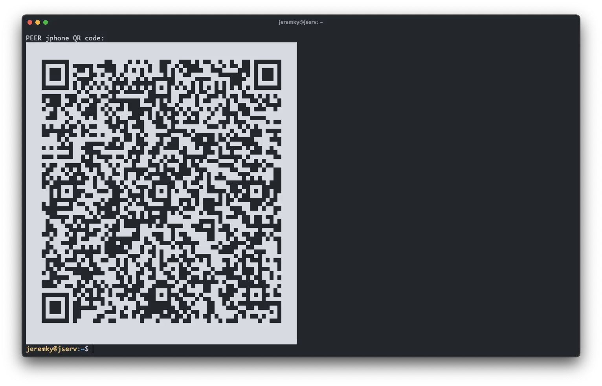

_[Wireguard](https://fr.wikipedia.org/wiki/WireGuard) est un protocole de communication et un logiciel libre et open source permettant de créer un réseau privé virtuel. Il est conçu avec des objectifs de facilité d'utilisation, de performances et de surface d'attaque basse. Il vise une meilleure performance et une plus grande économie d'énergie que les protocoles IPsec et OpenVPN Tunneling. Le protocole WireGuard transmet le trafic sur UDP. En mars 2020, la version Linux du logiciel a atteint une version de production stable et a été intégrée au noyau Linux 5.6. Les composants du noyau Linux sont sous licence GNU (GLPL) version 2. D'autres implémentations sont sous GPLV2 ou d'autres licences gratuites / Open-Source._

## Installation du serveur

L'image utilisée est fournie par [Linuxserver.io](https://www.linuxserver.io/).

Le fichier `docker-compose.yml` :

```yml {filename="docker-compose.yml"}
services:
  wireguard:
    image: lscr.io/linuxserver/wireguard:latest
    container_name: wireguard
    hostname: wireguard
    env_file: wireguard.env
    cap_add:
      - NET_ADMIN
    volumes:
      - /opt/containers/wireguard:/config
      - /lib/modules:/lib/modules
    ports:
      - 51820:51820/udp
    sysctls:
      - net.ipv4.conf.all.src_valid_mark=1
    restart: always
```

Son fichier `wireguard.env` :

```ini {filename="wireguard.env"}
PUID=1000
PGID=1000
TZ=Europe/Paris
SERVERURL=foo.bar.com
SERVERPORT=51820
PEERS=client1,client2
PEERDNS=1.1.1.2,1.0.0.2
INTERNAL_SUBNET=10.13.13.0
ALLOWEDIPS=0.0.0.0/0
```

Dans ce fichier, vous avez quelques éléments à modifier :

- La variable `SERVERURL` à remplacer par votre nom de domaine
- La variable `PEERS`, qui contient la liste de vos clients VPN séparés par une virgule
- La variable `PEERDNS`, où vous allez définir les serveurs DNS à utiliser (Cloudflare dans notre exemple)

## Configuration du client

Pour l'installation du client, vous pouvez vous rendre sur [cette page](https://www.wireguard.com/install/). Le client est disponible pour tous les systèmes d'exploitation. Une fois installé, vous pouvez ajouter la configuration soit manuellement, soit en effectuant un scan d'un QR code depuis vos appareils mobile. Il peut s'afficher directement dans votre terminal :

```bash
docker exec -it wireguard /app/show-peer client1
```



Je vous conseille d'ajouter un alias dans votre fichier `.bash_aliases` pour plus de confort :

```bash
alias peer='docker exec -it wireguard /app/show-peer $1'
```

Si toutefois vous devez ajouter les infos manuellement, le fichier de configuration se trouve sur votre hôte dans un sous dossier de `/opt/containers/wireguard`. Dans notre exemple : `/opt/containers/wireguard/peer_client1/peer_client1.conf` Une fois la configuration importée, vous pouvez activer votre VPN !

## Port NAT

Enfin, pour pouvoir accéder à votre VPN depuis Internet, vous devez ajouter une ouverture de port NAT sur votre box. Dans le cas de Wireguard, il faut ouvrir le port UDP **51820**.
