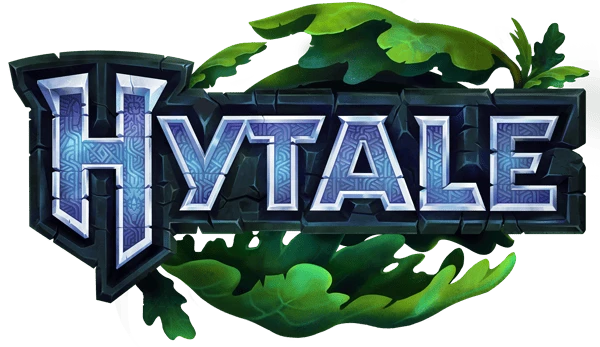
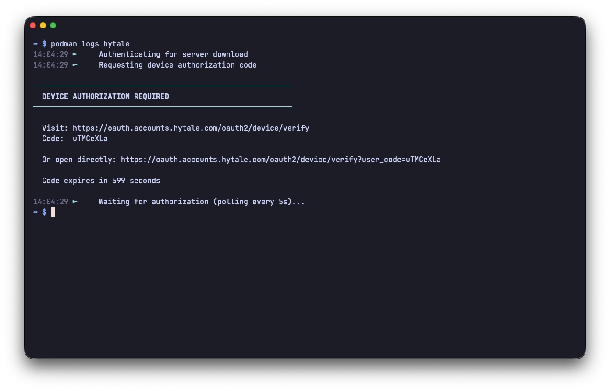
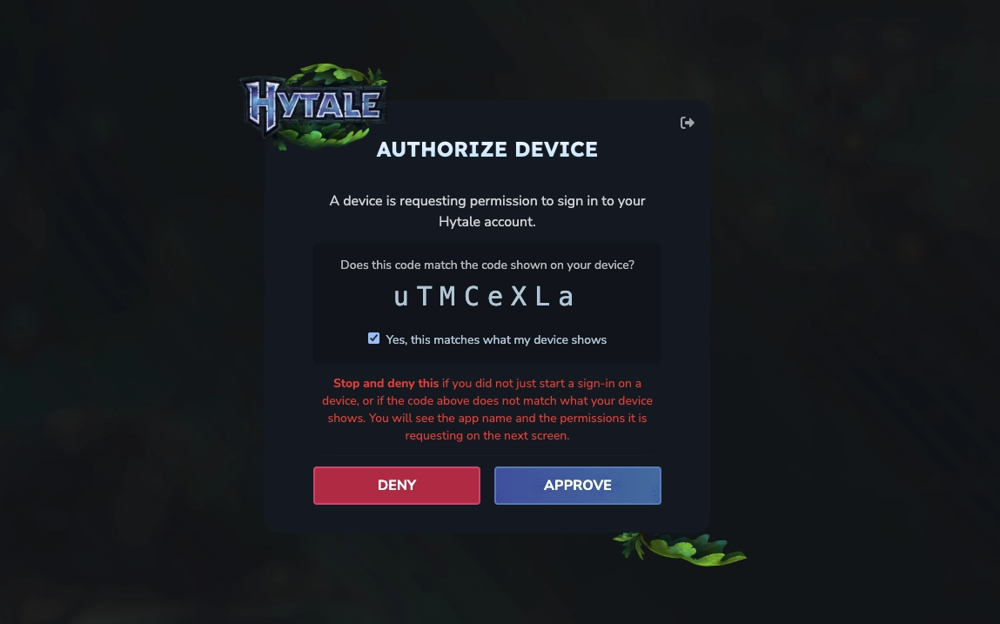
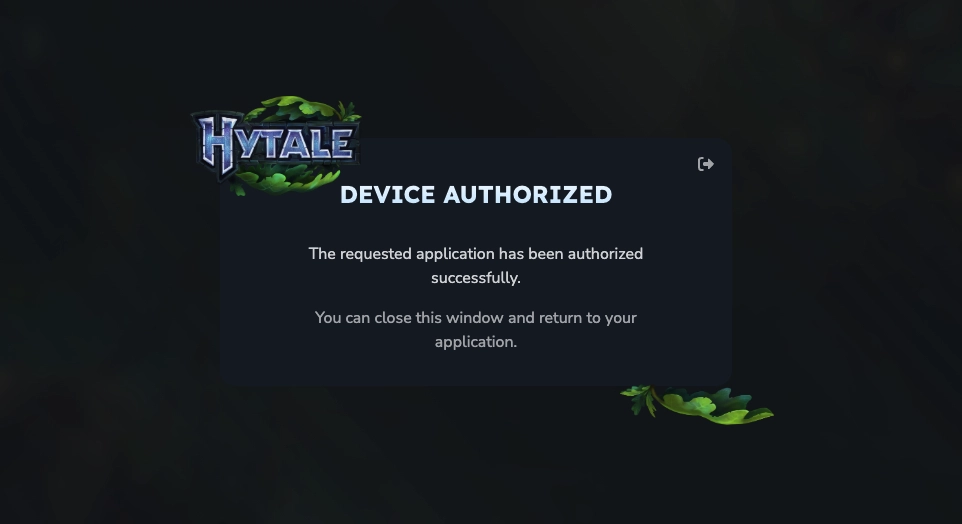
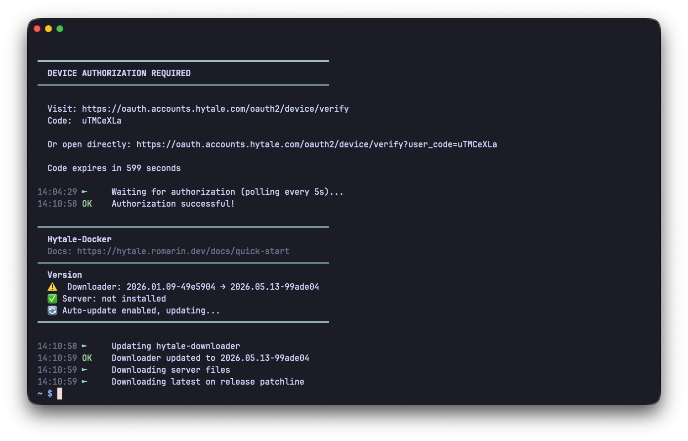

_[Hytale](https://fr.wikipedia.org/wiki/Hytale) est un jeu vidéo de type sandbox développé et édité par Hypixel Studios (équipe à l’origine du serveur Minecraft Hypixel), sorti en accès anticipé le 13 janvier 2026 sur Windows, Mac et Linux._

_Le développement du jeu a débuté en 2015. Son annonce officielle a eu lieu fin 2018, accompagnée d'une bande-annonce sur YouTube qui a cumulé plus de 60 millions de vues. Initialement annoncé pour une sortie en 2021, le jeu a été racheté par Riot Games, repoussé plusieurs fois, abandonné en juin 2025, puis racheté en novembre 2025 par Simon Collins, co-créateur du studio et fondateur d'Hypixel._
_Hytale est fondé sur un système de construction par blocs inspiré de Minecraft, tout en restant totalement indépendant._



## Installation

Après pas mal de recherche, j'ai finalement trouvé une image Docker simple à déployer, et surtout stable dans son approche. La page du créateur est disponible [ici](https://github.com/romariin/hytale-docker).

Le fichier `docker-compose.yml` :




```yml {filename="docker-compose.yml"}
services:
  hytale:
    image: docker.io/rxmarin/hytale-docker:latest
    container_name: hytale
    hostname: hytale
    env_file: hytale.env
    stdin_open: true
    tty: true
    volumes:
      - /opt/containers/hytale:/server
    ports:
      - 5520:5520/udp
    restart: always
```




```yml {filename="docker-compose.yml"}
services:
  hytale:
    image: docker.io/rxmarin/hytale-docker:latest
    container_name: hytale
    hostname: hytale
    user: 0:0
    env_file: hytale.env
    stdin_open: true
    tty: true
    volumes:
      - /opt/containers/hytale:/server
    ports:
      - 5520:5520/udp
    restart: always
```




Le fichier `hytale.env` associé :

```ini {filename="hytale.env"}
TZ=Europe/Paris
SERVER_PORT=5520
AUTO_UPDATE=true
DISABLE_SENTRY=true
FORCE_UPDATE=false
```

> Avec ces variables, on désactive notamment la télémétrie, et on s'assure que le serveur se mettra à jour à chaque redémarrage du conteneur

## Configuration

Le serveur Hytale a besoin d'un compte valide pour démarrer. Au 1er lancement, une URL vous sera indiquée, ainsi qu'un code à saisir que vous obtiendrez une fois connecté à votre compte.

### Initialisation

{}

#### Consultez les logs de votre conteneur




```bash
docker logs -f hytale
```




```bash
podman logs -f hytale
```






#### Rendez-vous au lien affiché



#### Autorisez l'appareil



#### Vérifiez de nouveau les logs



L'autorisation est terminée, le serveur procède au téléchargement des fichiers nécessaires.

{}

### Firewall

Hytale utilise le port 5520 en UDP pour fonctionner. Si vous utilisez UFW :

```bash
sudo ufw allow 5520/udp
```
