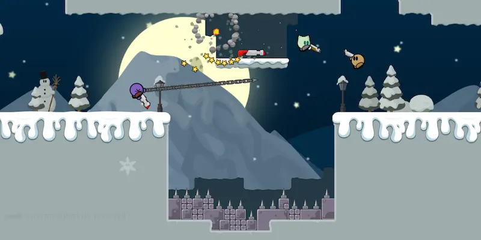

_[Teeworlds](https://fr.wikipedia.org/wiki/Teeworlds), anciennement Teewars, est un jeu de tir TPS (third person shooter) multijoueur en 2D. Le joueur y incarne une petite créature ronde, le tee. A l'aide de plusieurs armes différentes, le joueur doit parcourir différentes cartes à la recherche de ses adversaires._



## Installation

Le fichier `docker-compose.yml` :

```yml {filename="docker-compose.yml"}
services:
  teeworlds:
    image: docker.io/riftbit/teeworlds:latest
    container_name: teeworlds
    hostname: teeworlds
    env_file: teeworlds.env
    volumes:
      - data:/teeworlds/data
    ports:
      - 8303:8303/udp
    tty: true
    stdin_open: true
    restart: always

volumes:
  data:
```

Et son fichier de configuration `teeworlds.env` :

```ini {filename="teeworlds.env"}
TW_sv_name=Deathmatch Server
TW_sv_max_clients=8
TW_sv_register=1
TW_sv_map=dm1
TW_password=
TW_sv_rcon_password=
TW_sv_scorelimit=30
TW_sv_timelimit=0
TW_sv_gametype=dm
TW_sv_maprotation=dm6 dm7 dm8 dm1
TW_sv_motd=Welcome to a Deathmatch Server !
```
