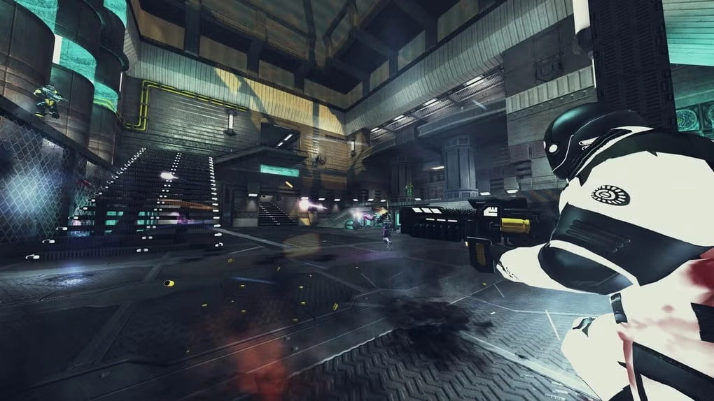

_[Xonotic](https://fr.wikipedia.org/wiki/Xonotic) est un jeu de tir à la première personne développé par Team Xonotic. C'est un jeu libre et ses données (sons, etc) sont des œuvres libres. Il est distribué sous licence GPL._

_Le but de Xonotic est de devenir le meilleur FPS open-source possible (jeu de tir à la première personne) de son genre. En 2020, Beebom classait Xonotic parmi les meilleurs jeux pour Linux en le comparant à Counter-Strike: Global Offensive, Team Fortress 2, et Doom (2016), rapportant que Xonotic se distinguait par ses mises à jour fréquentes, son haut niveau de finition et sa base d'utilisateurs actifs. Xonotic propose 16 types de jeux au choix et fournit des statistiques intégrées pour comparer et suivre la progression des joueurs._



## Téléchargement du client

Le jeu est disponible sur Windows, Linux et MacOS, sur [cette page](https://xonotic.org/download/).

## Déploiement d'un serveur

Le fichier `docker-compose.yml` :

```yml {filename="docker-compose.yml"}
services:
  xonotic:
    image: docker.io/itom34/xonotic:latest
    container_name: xonotic
    hostname: xonotic
    cpus: 2
    mem_limit: 1G
    volumes:
      - ./files:/root/.xonotic/
    ports:
      - 26000:26000/tcp
      - 26000:26000/udp
    healthcheck:
      test: ["CMD", "pgrep", "xonotic"]
      interval: 30s
      timeout: 10s
      retries: 3
      start_period: 10s
    restart: always
```

Une fois le serveur démarré, ce dernier va créer l'arborescence des fichiers nécessaires dans le sous dossier `./files`. Vous devrez y créer un fichier de configuration nommé `server.cfg` dans le sous dossier `data`. Un exemple de contenu :

```txt {filename="server.cfg"}
/////////////////////////////////////////////////////////////////////
// SERVER

sv_public 1
sv_status_privacy 1
hostname "Xonotic $g_xonoticversion Server"
maxplayers 8
port 26000
log_file "server.log"

//rcon_password ""
//rcon_restricted_password ""

/////////////////////////////////////////////////////////////////////
// GAME

gametype dm

g_maplist_shuffle 1
g_maplist_mostrecent_count 3
g_maplist_check_waypoints 1
g_spawnshieldtime 3

fraglimit_override 30
timelimit_override -1

skill 4
minplayers 4
bot_prefix [BOT]

g_maplist_votable 6
sv_vote_call 1

//g_instagib 1
//g_weapon_stay 1
//g_powerups -1

/////////////////////////////////////////////////////////////////////
// PRIVACY

sv_weaponstats_file http://www.xonotic.org/weaponbalance/
```

Une fois le fichier créé, on redémarre le conteneur pour prise en compte :

```bash
sudo docker restart xonotic
```
