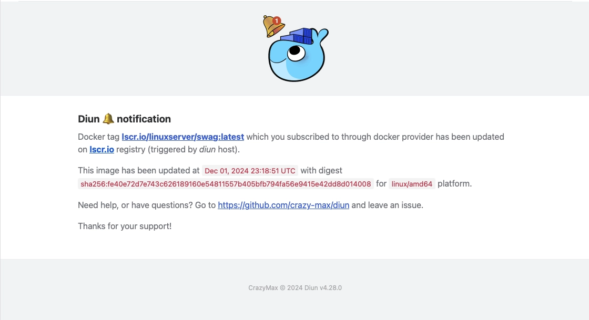

[Diun](https://crazymax.dev/diun/), pour _Docker Image Update Notifier_, est une application qui permet de recevoir des notifications lorsqu’une image Docker est mise à jour sur un registre.



## Installation

Le fichier `docker-compose.yml` :




```yml {filename="docker-compose.yml"}
services:
  diun:
    image: docker.io/crazymax/diun:latest
    container_name: diun
    hostname: diun
    env_file: diun.env
    volumes:
      - data:/data
      - /var/run/docker.sock:/var/run/docker.sock:ro
    healthcheck:
      test: ["CMD", "pgrep", "diun"]
      interval: 30s
      timeout: 10s
      retries: 3
      start_period: 10s
    restart: always

volumes:
  data:
```




```yml {filename="docker-compose.yml"}
services:
  diun:
    image: docker.io/crazymax/diun:latest
    container_name: diun
    hostname: diun
    env_file: diun.env
    volumes:
      - data:/data
      - /var/run/podman/podman.sock:/var/run/docker.sock:ro
    healthcheck:
      test: ["CMD", "pgrep", "diun"]
      interval: 30s
      timeout: 10s
      retries: 3
      start_period: 10s
    restart: always

volumes:
  data:
```




Et son fichier `diun.env` :

```ini {filename="diun.env"}
TZ=Europe/Paris

DIUN_WATCH_WORKERS=20
DIUN_WATCH_SCHEDULE=0 */2 * * *
DIUN_WATCH_JITTER=30s
DIUN_PROVIDERS_DOCKER=true
DIUN_PROVIDERS_DOCKER_WATCHBYDEFAULT=true
```

Cette configuration permet d'effectuer une vérification toutes les 2 heures.

Par défaut, il est normalement nécessaire de spécifier pour chaque conteneur un label pour lui indiquer que l'on souhaite l'inclure aux vérifications. Il est possible d'automatiquement les intégrer avec la variable `DIUN_PROVIDERS_DOCKER_WATCHBYDEFAULT`. A l'inverse, pour exclure une conteneur, il est nécessaire d'y placer le label suivant :

```yml
labels:
  - diun.enable=false
```

## Notification

Dans le fichier `diun.env`, vous pouvez lui spécifier des éléments en fonction de la façon dont vous voulez être notifié. Un exemple avec une notification par e-mail :

```ini
DIUN_NOTIF_MAIL_HOST=host
DIUN_NOTIF_MAIL_PORT=587
DIUN_NOTIF_MAIL_SSL=false
DIUN_NOTIF_MAIL_INSECURESKIPVERIFY=false
DIUN_NOTIF_MAIL_USERNAME=username
DIUN_NOTIF_MAIL_PASSWORD=password
DIUN_NOTIF_MAIL_FROM=emmeteur@mail.com
DIUN_NOTIF_MAIL_TO=destinataire1@mail.com,destinataire2@mail.com
```

Diun permet de vous notifier via d'autres canaux : Discord, Slack, Teams...
Je vous laisse aller voir en exemple le cas de Discord sur [cette page](https://crazymax.dev/diun/notif/discord/).
