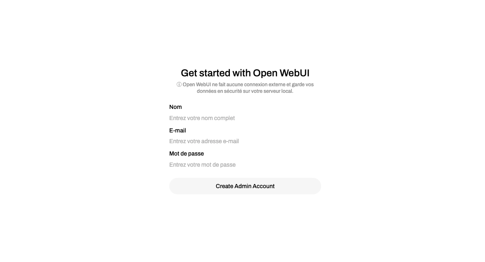
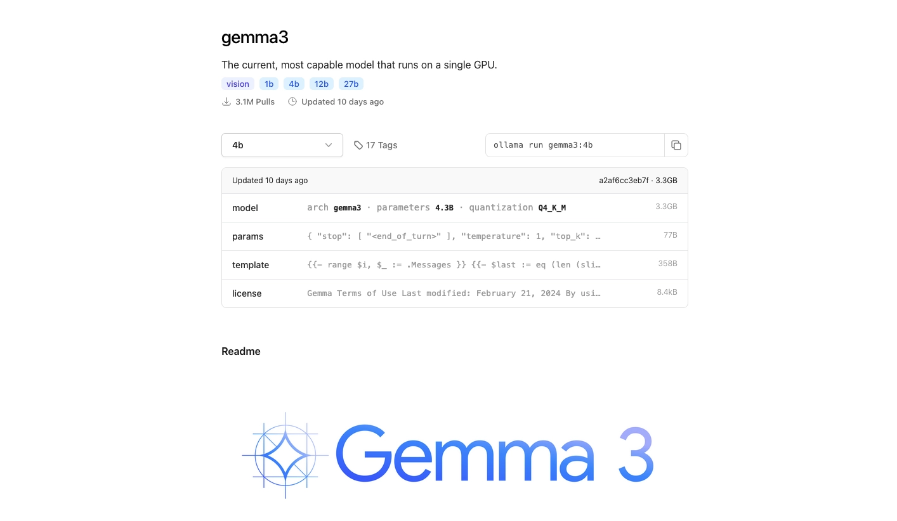
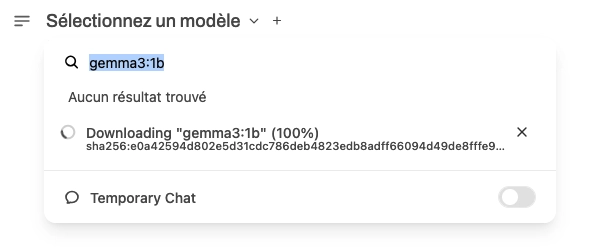
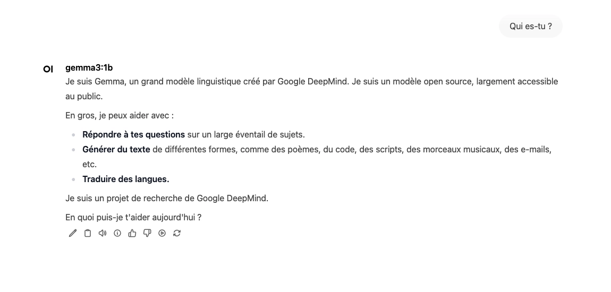

[Open WebUI](https://github.com/open-webui/open-webui) est une interface web permettant d'interagir avec des modèles d'IA hébergés en local avec [Ollama](https://ollama.com/), tels que les grands modèles de langage (LLM). Selon les ressources disponibles, vous pourrez exécuter des modèles comme DeepSeek, Mistral, Gemini...

## Installation

Le fichier `docker-compose.yml` :

```yml {filename="docker-compose.yml"}
services:
  ollama:
    image: ollama/ollama:latest
    container_name: ollama
    hostname: ollama
    tty: true
    networks:
      - nginx_proxy
    volumes:
      - /opt/containers/containers/ollama/ollama:/root/.ollama
    restart: always

  openwebwebui:
    image: ghcr.io/open-webui/open-webui:main
    container_name: ollama-webui
    hostname: ollama-webui
    env_file: ollama.env
    depends_on:
      - ollama
    networks:
      - nginx_proxy
    volumes:
      - /opt/containers/containers/ollama/webui:/app/backend/data
    restart: always

networks:
  nginx_proxy:
    external: true
```

Le fichier `openwebui.env` associé :

```ini {filename="openwebui.env"}
OLLAMA_BASE_URL=http://ollama:11434
WEBUI_SECRET_KEY=CLE_SECRETE_A_MODIFIER
DEFAULT_LOCALE=fr-FR
WEBUI_AUTH=True
```

Pensez à définir la clé secrète dans ce fichier, et à modifier la variable `WEBUI_AUTH` si vous n'avez pas besoin de l'authentification.

### Reverse proxy

Les fichiers de configuration ci-dessus sont prévus pour être utilisés avec un reverse proxy.

> Pour rappel, une page dédiée est [disponible ici](/docs/docker/conteneurs/web/reverse-proxy-nginx/).

L'image Docker de [Linuxserver.io](https://docs.linuxserver.io/general/swag/) ne propose pas de fichier sample de configuration pour Open WebUI. Vous devez donc créer un fichier nommé `/opt/containers/nginx/nginx/proxy-confs/ollama.subdomain.conf`, et y coller le contenu suivant :

```nginx {filename="openwebui.subdomain.conf"}
## Version 2024/07/16

server {
    listen 443 ssl;
    listen [::]:443 ssl;

    server_name ollama.*;

    include /config/nginx/ssl.conf;

    client_max_body_size 0;

    # enable for ldap auth (requires ldap-location.conf in the location block)
    #include /config/nginx/ldap-server.conf;

    # enable for Authelia (requires authelia-location.conf in the location block)
    #include /config/nginx/authelia-server.conf;

    # enable for Authentik (requires authentik-location.conf in the location block)
    #include /config/nginx/authentik-server.conf;

    location / {
        # enable the next two lines for http auth
        #auth_basic "Restricted";
        #auth_basic_user_file /config/nginx/.htpasswd;

        # enable for ldap auth (requires ldap-server.conf in the server block)
        #include /config/nginx/ldap-location.conf;

        # enable for Authelia (requires authelia-server.conf in the server block)
        #include /config/nginx/authelia-location.conf;

        # enable for Authentik (requires authentik-server.conf in the server block)
        #include /config/nginx/authentik-location.conf;

        include /config/nginx/proxy.conf;
        include /config/nginx/resolver.conf;
        set $upstream_app ollama-webui;
        set $upstream_port 8080;
        set $upstream_proto http;
        proxy_pass $upstream_proto://$upstream_app:$upstream_port;

    }
}
```

> Pensez à changer la section `server_name openwebui.*;` selon votre sous domaine.

Et enfin, un petit redémarrage pour la prise en compte du nouveau fichier :

```bash
sudo docker restart nginx
```

## Initialisation

Une fois le déploiement effectué, rendez vous sur l'url que vous avez défini dans votre reverse proxy. Cliquez sur "Get Started". Il vous sera ensuite demandé de créer le compte principal :



Une fois connecté, vous allez pouvoir demander à Ollama de télécharger le(s) modèle(s) de votre choix directement depuis l'interface de Open WebUI. Tout d'abord, rendez vous sur [cette page](https://ollama.com/search) pour consulter la liste des modèles disponibles. Choisissez le modèle que vous voulez, et copiez la commande sur la droite. Par exemple avec gemma3 : `ollama run gemma3`.



Le modèle Gemma, créé pour Gemini, permet d'obtenir de bons résultats avec une consommation de ressources raisonnable.

> Étant limité par les ressources de mon serveur, j'ai opté pour la version avec un milliard de paramètres, la version gemma3:1b

Retournez sur Open WebUI, et en haut à gauche, cliquez sur "Sélectionnez un modèle" pour coller votre commande dans la zone de recherche. Il vous sera proposé de télécharger le modèle correspondant.



Vous pourrez ensuite sélectionner le modèle téléchargé et commencer à l'utiliser ! A noter qu'il est possible de charger plusieurs modèles, et de basculer de l'un à l'autre sans changer de prompt.


