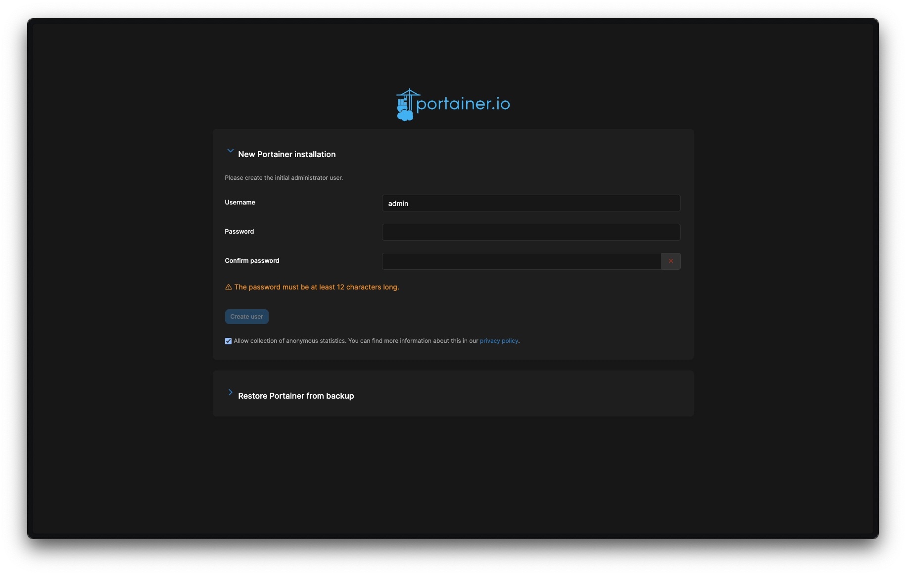
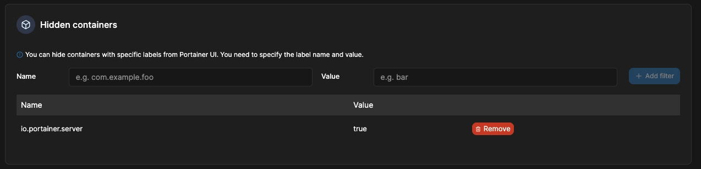
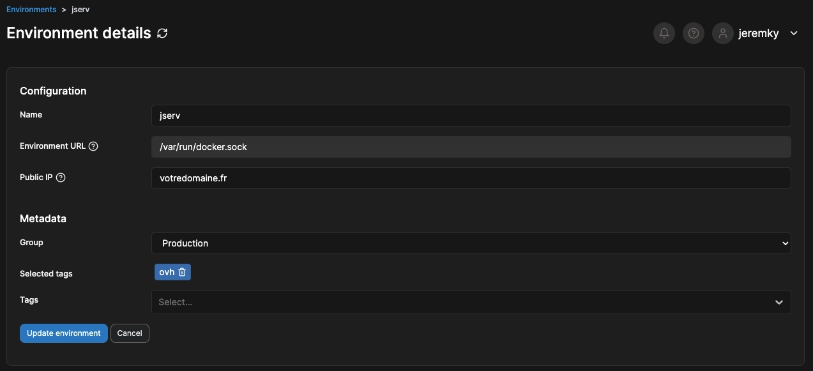
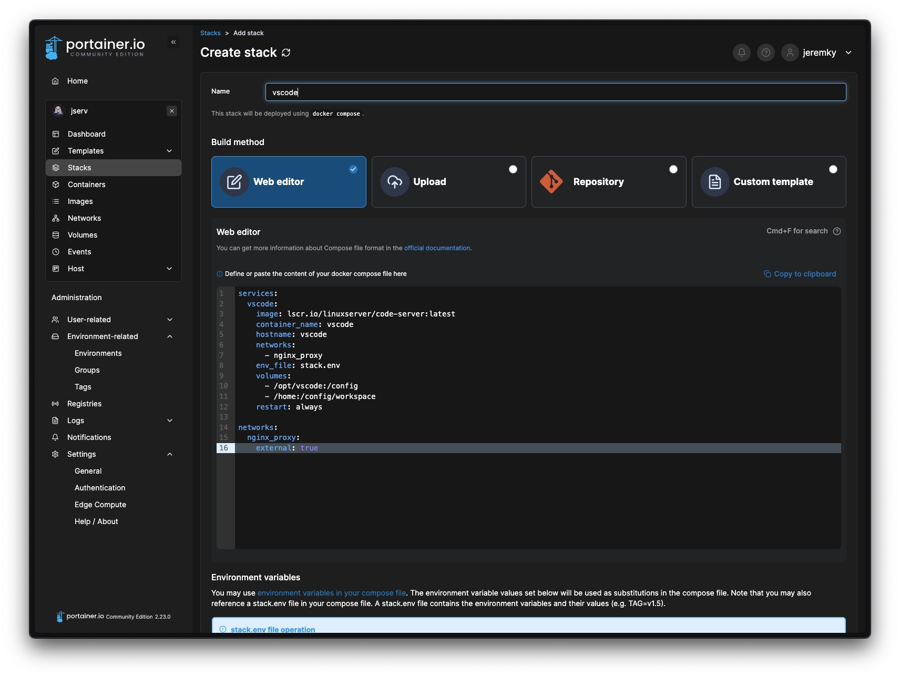
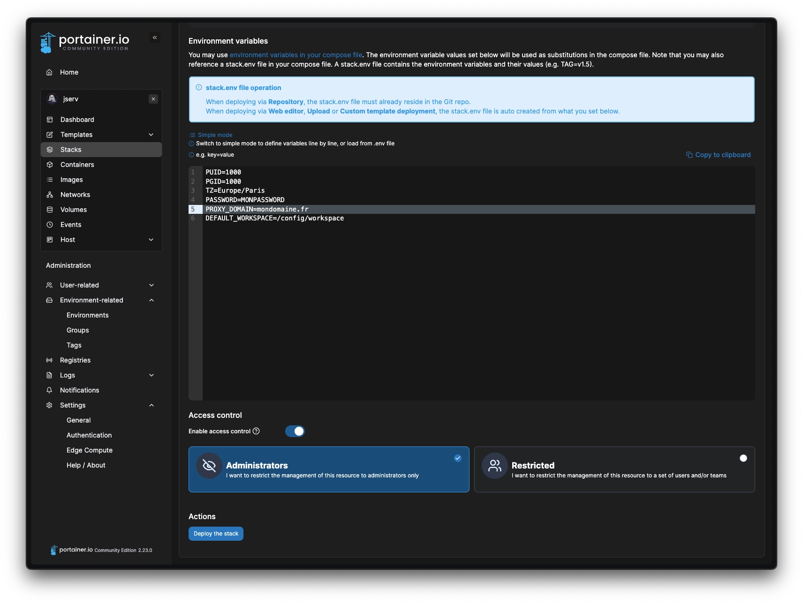
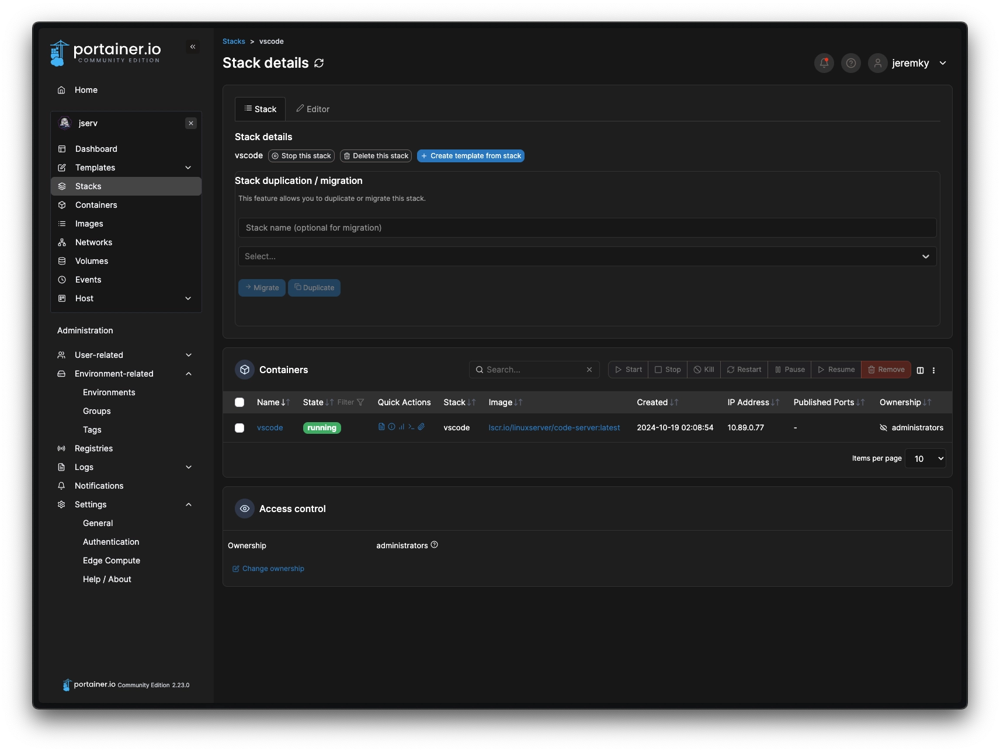
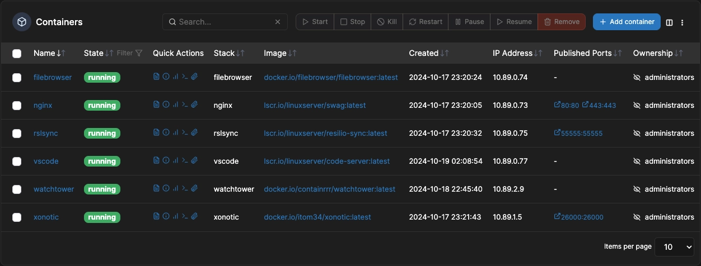
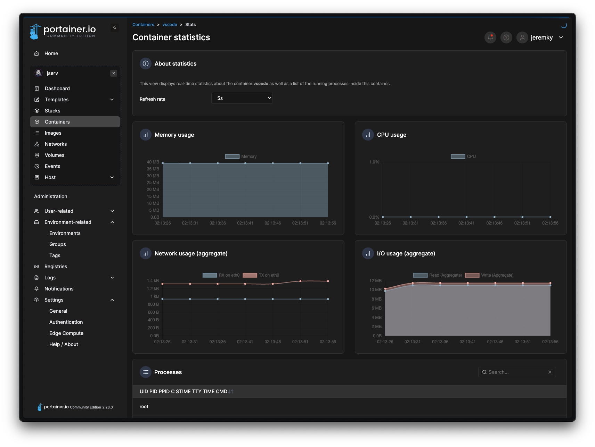

Pour l'administration de conteneurs, il existe différentes applications web afin de rendre les choses moins austères. [Portainer](https://www.portainer.io/) est l'une de ces solutions.

D'après [Hostinger](https://www.hostinger.fr/vps/hebergement-portainer) :

> _Optimisez votre expérience Docker en la rendant plus plaisante grâce à un serveur Portainer, l'outil ultime pour déployer, gérer et dimensionner aisément vos applications conteneurisées._
>
> _Que vous soyez un développeur chevronné ou un débutant complet, son tableau de bord convivial vous permet de simplifier la gestion de Docker sans avoir recours à une interface en ligne de commande._

Depuis la dernière version, Portainer est capable de contrôler également des environnements utilisant [Podman](/docs/docker/migration-vers-podman). Et même s'il est officiellement compatible qu'à partir de la version 5 de Podman, la version 4 inclue dans les packages de Debian 12 est d'après mes tests correctement prise en charge.

## Installation

Pour installer Portainer, je considère que vous avez déjà suivi les tutos pour l'installation de Docker ou de Podman. Ensuite, et bien... C'est comme d'habitude :smile:

Le fichier `docker-compose.yml` :




```yml {filename="docker-compose.yml"}
services:
  portainer:
    image: docker.io/portainer/portainer-ce:sts
    container_name: portainer
    hostname: portainer
    privileged: true
    volumes:
      - /opt/containers/portainer:/data
      - /var/run/docker.sock:/var/run/docker.sock
    ports:
      - 9443:9443
    restart: always
```




```yml {filename="docker-compose.yml"}
services:
  portainer:
    image: docker.io/portainer/portainer-ce:sts
    container_name: portainer
    hostname: portainer
    privileged: true
    volumes:
      - /opt/containers/portainer:/data
      - /var/run/podman/podman.sock:/var/run/docker.sock
    ports:
      - 9443:9443
    restart: always
```




Pas de fichier `.env` ici, la configuration se fait directement via l'interface de Portainer. A noter aussi que je n'ai volontairement laissé que l'ouverture du port https. Il faudra par la suite ajouter un certificat valide dans l'interface de Portainer pour éviter les messages de sécurité de votre navigateur.

## Configuration

Une fois Portainer installé, on créé notre compte :



En théorie, Portainer devrait trouver votre environnement de conteneurs après quelques secondes et l'ajouter automatiquement :


### Exclusion des conteneurs

Dans les configurations générales, je vous propose d'exclure de la liste de vos conteneurs le conteneur Portainer. Cela n'a pas vraiment d'intérêt d'avoir Portainer... Dans Portainer :smile:

Pour cela, il faut ajouter le nom `io.portainer.server` et avec comme valeur `true` :



### Définition du domaine

Lorsque vous listez vos conteneurs, il affiche les ports ouverts sous forme de lien. Pour que cela fonctionne, il faut ajouter votre domaine public dans la configuration de l'environnement. Vous pourrez alors vous rendre sur l'application web directement en cliquant sur le port ouvert par votre configuration :



Profitez en pour personnaliser le nom de votre environnement, et y ajouter des tags si l'envie vous prend. Cela peut être utile si vous souhaitez ajouter plusieurs environnements à votre Portainer (je vous laisse consulter [cette page](https://docs.portainer.io/admin/environments/add/docker/agent) si besoin).

## Ajout de vos conteneurs

Je ne vais pas m'attarder sur la création des réseaux, des volumes, et des conteneurs. Ce site se basant principalement sur les fichiers `docker-compose.yml`, nous allons intégrer les configurations tel quel dans Portainer. Cela se situe dans la partie `Stacks`.

Cliquez sur `Add Stack` en haut à droite. Nommez votre stack et choisissez entre uploader votre fichier, ou insérer dans l'éditeur web le contenu de ce dernier :



Plus bas, vous pouvez faire de même avec le fichier `.env` associé. Je vous suggère de passer en mode avancé pour y coller directement son contenu.



> Point important : Portainer ne sait pas gérer plusieurs fichiers `.env` pour un stack. Comme indiqué dans l'application, il est nécessaire que votre fichier soit nommé `stack.env` (entrée `env_file: stack.env` dans votre compose).
> Lorsque votre config contient plusieurs conteneurs à créer, vous avez alors 2 possibilités : accepter de partager les variables entre les conteneurs, ce qui n'est pas vraiment sécurisé... Ou alors, déclarer manuellement chaque variable via l'entrée `environment:`, à l'ancienne.
> Attention également avec vos volumes : il faudra indiquer les chemins absolus.

Une fois votre configuration prête, vous pouvez cliquer sur `Deploy the stack`. Comme pour Docker/Podman, l'image sera automatiquement téléchargée, chaque réseau virtuel et les potentiels volumes seront configurés et votre conteneur sera démarré.
Vous serez alors redirigé sur la page des stacks. Vous pouvez cliquer sur le nouveau stack fraîchement déployé pour obtenir des détails :



## Administration des conteneurs

En allant dans la partie `containers`, vous aurez une visualisation des conteneurs installés et de l'état de ces derniers. A noter que Portainer est capable de contrôler tous les conteneurs, même s'ils ont été déployés à l'extérieur. Il est également capable de détecter si compose à été utilisé, mais ne sera pas en mesure de récupérer les configurations (Contrôle limité).



Malgré cela, il vous sera possible dans tous les cas de changer l'état des conteneurs, consulter les logs, contrôler la consommation des ressources, et même vous connecter en console. Pour les réseaux virtuels, les volumes et les images, vous pourrez également les contrôler, mais là encore, ne vous embêtez pas à faire cela manuellement. Il vous sera plus simple de passer par les stacks, afin que tout soit ménagé automatiquement.



## Les limitations

Malgré le confort que peut apporter à certains une interface graphique, il faut savoir que Portainer n'est pas sans défaut. Comme dit plus haut, il y a déjà la limitation liée au fait que Portainer ne sache pas gérer plusieurs fichiers `.env` dans la configuration des stacks.

Autre problème, il n'y a pas de solution rapide pour nettoyer les résidus si vous ne supprimez pas proprement les conteneurs à partir des stacks. On peut vite se retrouver avec des réseaux ou des images sans conteneur associé.
