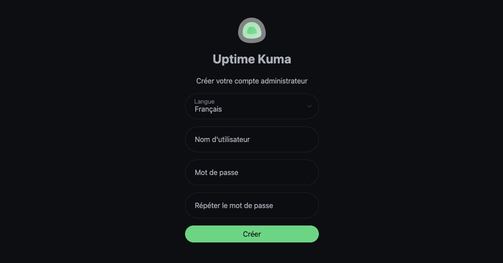
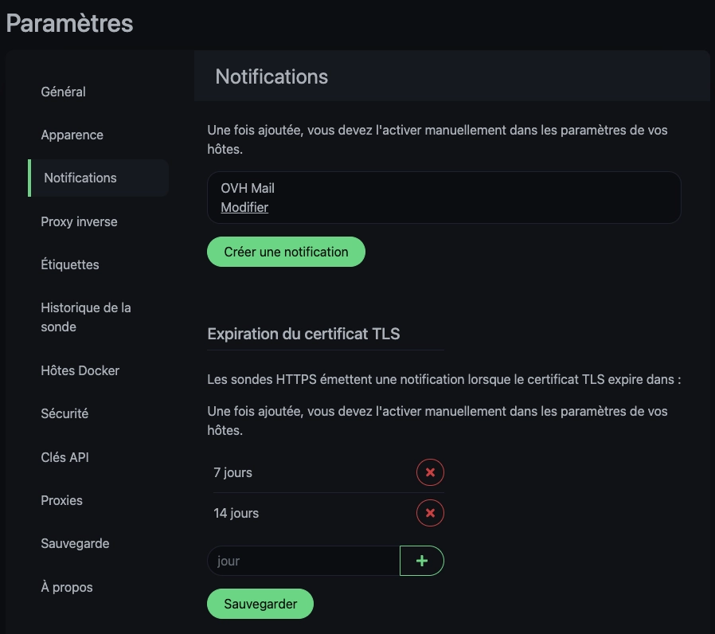
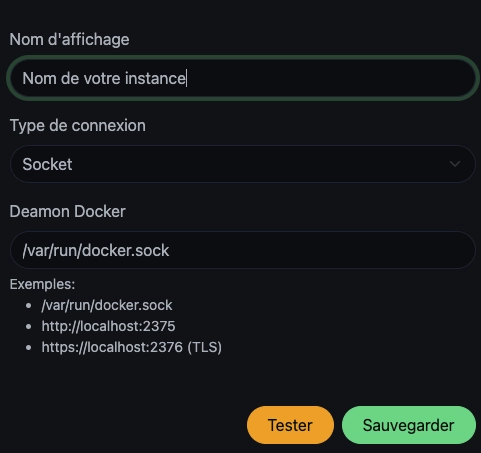
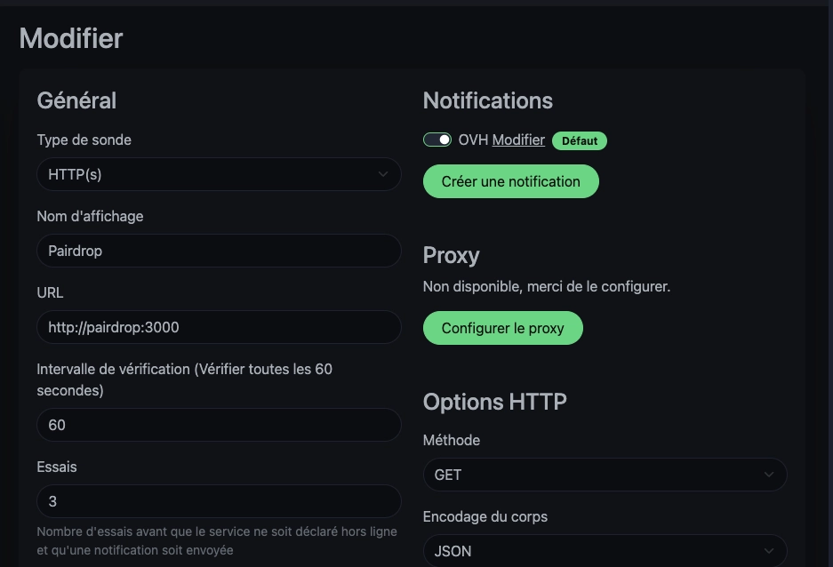
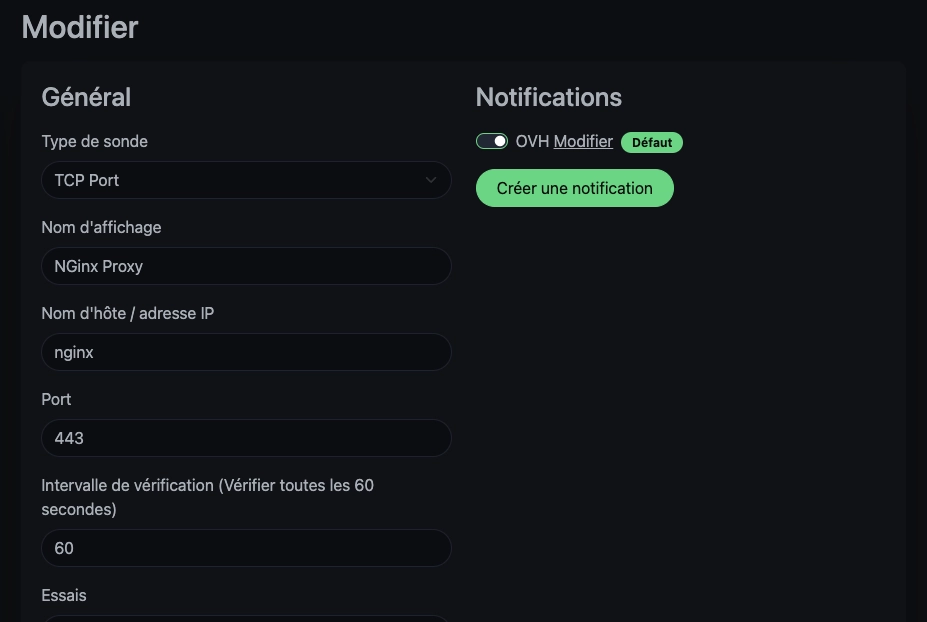
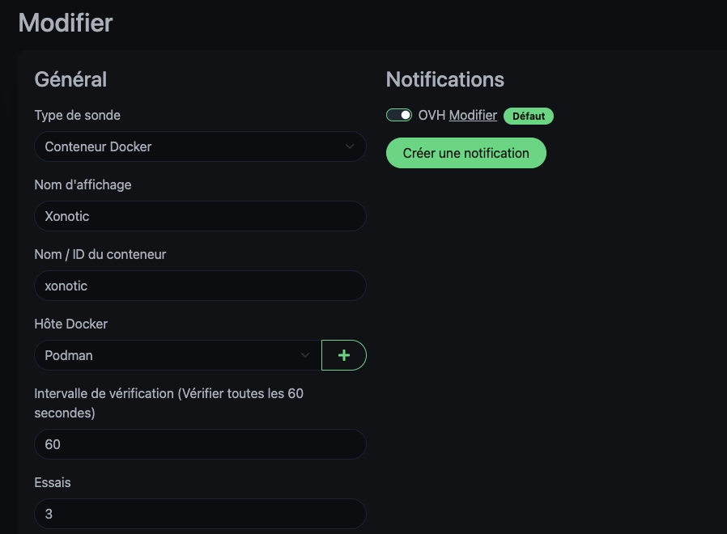
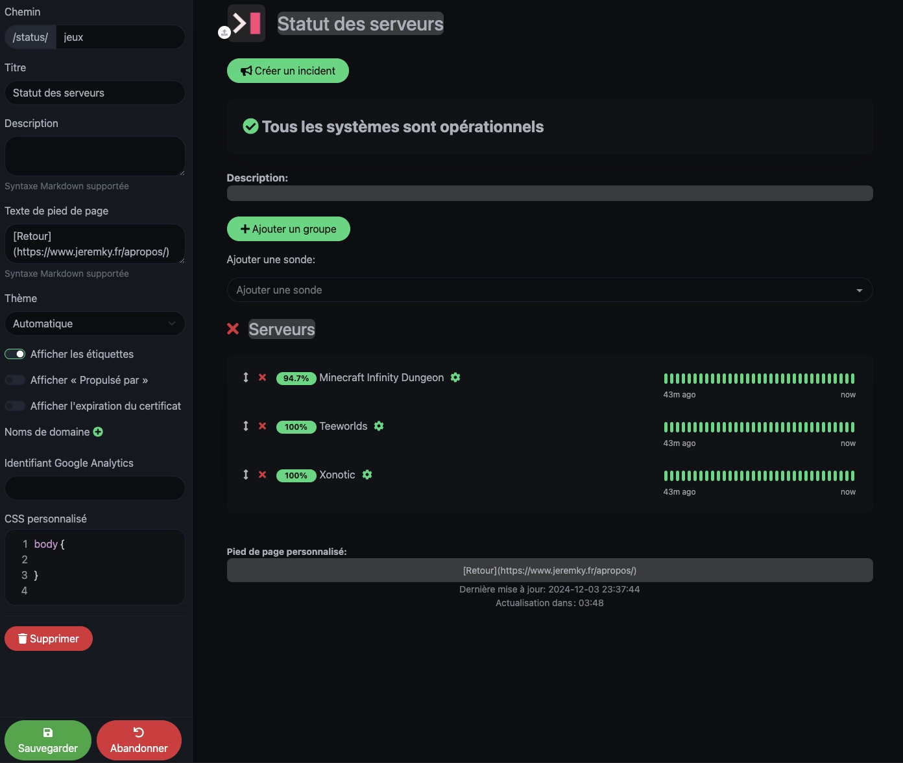
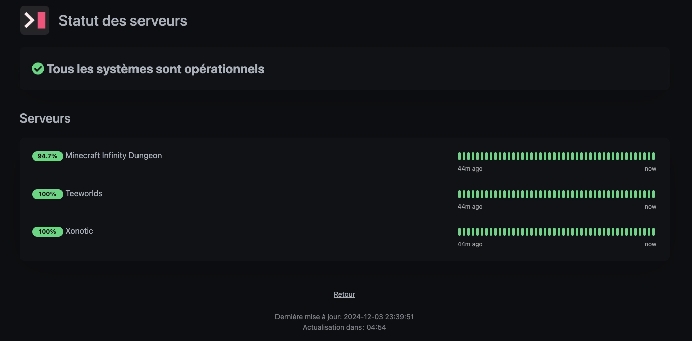

[Uptime Kuma](https://uptime.kuma.pet/) est un outil de surveillance d’état en temps réel qui vous permet de vérifier la disponibilité de vos sites web, serveurs et services. Open-source et auto-hébergé, il dispose d'une interface web moderne et intuitive.

## Installation

Le fichier `docker-compose.yml` :




```yml {filename="docker-compose.yml"}
services:
  uptime-kuma:
    image: docker.io/louislam/uptime-kuma:2
    container_name: uptime-kuma
    hostname: uptime-kuma
    networks:
      - nginx_proxy
    volumes:
      - /opt/containers/uptime-kuma:/app/data
      - /var/run/docker.sock:/var/run/docker.sock:ro
    restart: always

networks:
  nginx_proxy:
    external: true
```




```yml {filename="docker-compose.yml"}
services:
  uptime-kuma:
    image: docker.io/louislam/uptime-kuma:2
    container_name: uptime-kuma
    hostname: uptime-kuma
    networks:
      - nginx_proxy
    volumes:
      - /opt/containers/uptime-kuma:/app/data
      - /var/run/podman/podman.sock:/var/run/docker.sock:ro
    restart: always

networks:
  nginx_proxy:
    external: true
```




### Reverse proxy

Le fichier de configuration ci-dessus est prévu pour être utilisé avec un reverse proxy.

> Pour rappel, une page dédiée est [disponible ici](/docs/docker/conteneurs/web/reverse-proxy-nginx/).

L'image Docker de [Linuxserver.io](https://docs.linuxserver.io/general/swag/) propose un fichier sample de configuration, il vous suffit juste de modifier votre nom de domaine en conséquence :

```bash
sudo cp /opt/containers/nginx/nginx/proxy-confs/uptime-kuma.subdomain.conf.sample /opt/containers/nginx/nginx/proxy-confs/uptime-kuma.subdomain.conf
sudo sed -i "s,server_name uptime-kuma,server_name <votre_sous_domaine>,g" /opt/containers/nginx/nginx/proxy-confs/uptime-kuma.subdomain.conf
```

Et enfin, un petit redémarrage pour la prise en compte du nouveau fichier :

```bash
sudo docker restart nginx
```

## Configuration

A la première connexion à l’interface, Il vous sera demandé de créer un identifiant de connexion.



Il est toutefois possible de le désactiver dans le cas où vous utiliseriez un service d’authentification externe comme [Tinyauth](/docs/docker/conteneurs/web/tinyauth). Pour cela, rendez-vous dans `Sécurité` et cliquez sur `Désactiver l'authentification`.



### Notifications

Uptime Kuma propose un service de notification. Une longue liste d'application est compatible, notamment par e-mail,Discord, Telegram, Teams...

Il vous notifiera lorsque un service est tombé, mais vous pouvez aussi demandé une alerte lorsque l'un de vos certificat SSL arrivera à expiration.


### Docker

Si vous souhaitez contrôler vos conteneurs via le système de statut, vous devrez ajouter une configuration. Toujours dans les paramètres, rendez vous dans `Hôtes Docker` et cliquez sur `Configurer l'hôte Docker`, afin de lui indiquer l’emplacement du fichier `docker.sock`.



## Sondes

Maintenant que la configuration initiale est terminée, cliquez sur `Ajouter une nouvelle sonde` pour commencer à alimenter vos surveillances.

Afin d’effectuer vos contrôles, Uptime Kuma dispose de plusieurs méthodes d’authentification. Voici les principaux que j’ai utilisé pour mes différents contrôles.

### HTTP(s)

C'est en théorie celui que vous allez utiliser le plus souvent. Pour contrôler vos applications Web hébergées sous Docker, je vous recommande de bypass votre reverse proxy et de dialoguer directement avec le conteneur concerné (surtout si vous utilisez le service [Tinyauth](/docs/docker/conteneurs/web/tinyauth)). Exemple Le logiciel Pairdrop :



Dans l'url, spécifiez le nom du conteneur, ainsi que le port. A noter que c'est bien le protocole http qui est utilisé, puisque c'est le reverse proxy qui se charge de sécuriser la connexion.

### TCP

N'ayant pas d'application non redirigée sur mon reverse proxy, un bonne façon de le tester est d'effectuer un check de son port d'écoute :



### Healthy Docker

Les surveillances précédentes ne fonctionnent que si vos conteneurs se trouvent dans le même réseau. Dans le cas contraire, la seule solution est de contrôler l'état de votre conteneur directement.

Pour cela, votre conteneur doit disposer du statut `Healthy`. Si l'image utilisée n'a pas cette fonctionnalité en place, il est possible de le configurer dans le fichier `docker-compose.yml`. Pour cela, rajoutez la section suivante :

```yml
healthcheck:
  test: ["CMD", "pgrep", "<votre_process>"]
  interval: 30s
  timeout: 10s
  retries: 3
  start_period: 10s
```

Il est possible de faire d'autres types de test, via `curl` ou `wget` par exemple. Mais autant utiliser la fonctionnalité de test http à la place.

Une fois votre conteneur redémarré, il vous suffit d'ajouter une surveillance de type `conteneur docker` et de choisir l’hôte Docker configuré précédemment :



## Pages de statut

Il est possible de créer des pages de statut accessibles publiquement. Rendez-vous en haut à droite pour créer une nouvelle page. Nommez-là pour arriver à la page de configuration. De là, vous pourrez ajouter les sondes, ajouter un pied de page...



Une fois la page créée, celle-ci est accessible au lien `/status/jeux` :


