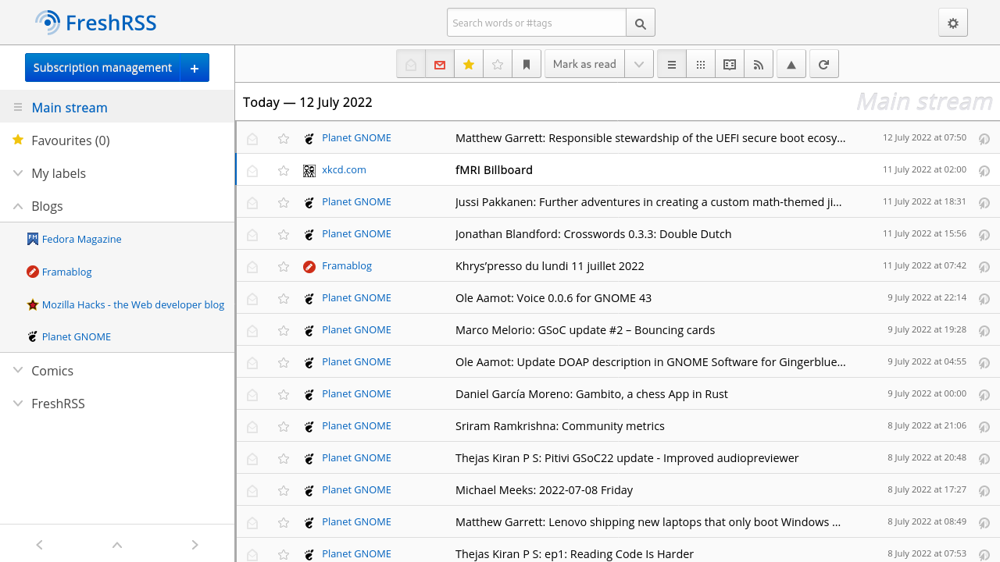
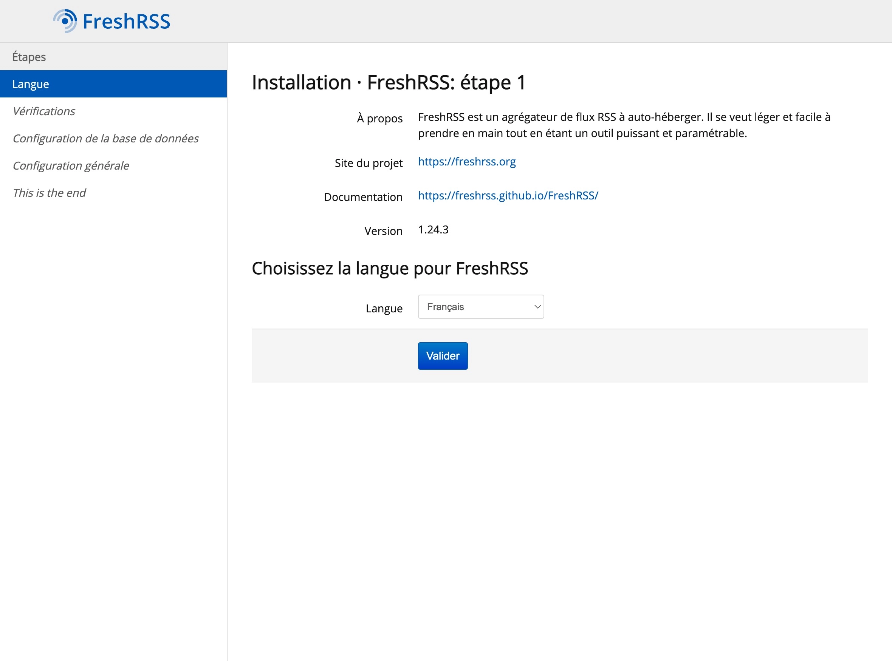
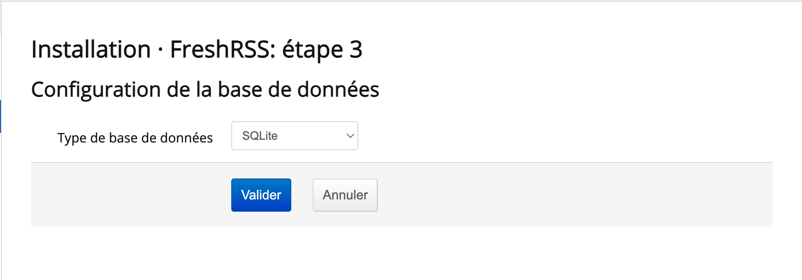
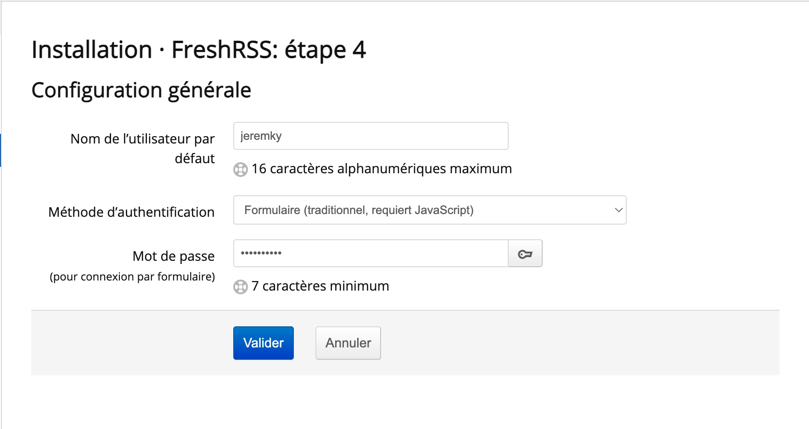
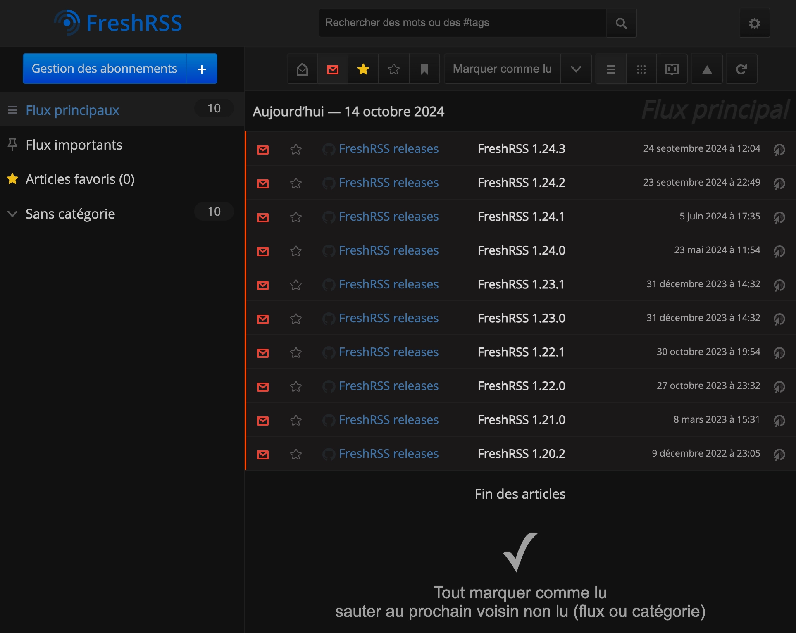

_[FreshRSS](https://fr.wikipedia.org/wiki/FreshRSS) est un agrégateur de flux RSS, Atom Syndication Format et WebSub en ligne, sous licence libre GNU AGPL v32._

_[RSS](https://fr.wikipedia.org/wiki/RSS) est une ressource du World Wide Web dont le contenu est produit automatiquement (sauf cas exceptionnels) en fonction des mises à jour d’un site Web. Les flux RSS sont des fichiers XML qui sont souvent utilisés par les sites d'actualité et les blogs pour présenter les titres des dernières informations consultables._

Petite capture de l'application présente sur le [site officiel](https://www.freshrss.org/) :



## Utilisation

Même si FreshRSS dispose d'une interface web dédiée pour consulter les articles, sa force est à mon sens sa compatibilité avec beaucoup d'applications mobile iOS/Android, mais aussi avec des applications Windows, MacOS et Linux.

Vous pourrez alors centraliser vos sources de news et les consulter indépendamment de l'appareil que vous voulez utiliser.

Pour vérifier quelles applications sont compatibles avec FreshRSS, je vous laisse aller voir directement sur leur [page Github](https://github.com/FreshRSS/FreshRSS). Ils y précisent si l'application est gratuite ou non, et si le développement est toujours en cours.

## Installation

Le fichier `docker-compose.yml` :

```yml {filename="docker-compose.yml"}
services:
  freshrss:
    image: lscr.io/linuxserver/freshrss:latest
    container_name: freshrss
    hostname: freshrss
    env_file: freshrss.env
    networks:
      - nginx_proxy
    volumes:
      - /opt/containers/freshrss/config:/config
    restart: always

networks:
  nginx_proxy:
    external: true
```

Et le fichier `freshrss.env` associé :

```ini {filename="fresshrss.env"}
PUID=1000
PGID=1000
TZ=Europe/Paris
```

### Moteur SQL

A noter que cette configuration suppose que vous allez utilisez SQLite comme moteur de base de données. FreshRSS est compatible avec MariaDB et PosgreSQL. Si c'est pour de l'auto hébergement avec quelques utilisateurs, SQLite suffira largement. Je vous renvoie vers la [documentation officielle](https://freshrss.github.io/FreshRSS/en/) si vous désirez utiliser une autre base SQL.

### Reverse proxy

Les fichiers de configuration ci-dessus sont prévus pour être utilisés avec un reverse proxy.

> Pour rappel, une page dédiée est [disponible ici](/docs/docker/conteneurs/web/reverse-proxy-nginx/).

L'image Docker de [Linuxserver.io](https://docs.linuxserver.io/general/swag/) propose un fichier sample de configuration, il vous suffit juste de modifier votre nom de domaine en conséquence :

```bash
sudo cp /opt/containers/nginx/nginx/proxy-confs/freshrss.subdomain.conf.sample /opt/containers/nginx/nginx/proxy-confs/freshrss.subdomain.conf
sudo sed -i "s,server_name freshrss,server_name <votre_sous_domaine>,g" /opt/containers/nginx/nginx/proxy-confs/freshrss.subdomain.conf
```

Et enfin, un petit redémarrage pour la prise en compte du nouveau fichier :

```bash
sudo docker restart nginx
```

## Initialisation

Une fois FreshRSS déployé, vous pouvez ouvrir votre navigateur et y terminer l'installation :



Il vous sera demandé de sélectionner la base à utiliser. Comme vu plus haut, nous allons faire simple et choisir SQLite :



Ensuite, saisissez votre nom d'utilisateur et votre mot de passe :



Une fois les différentes étapes effectuées, FreshRSS va vous renvoyer vers la page d'accueil :


