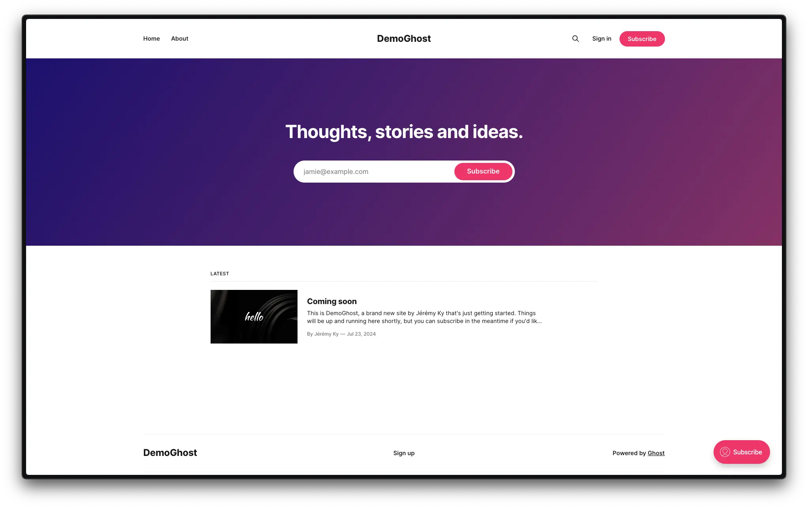
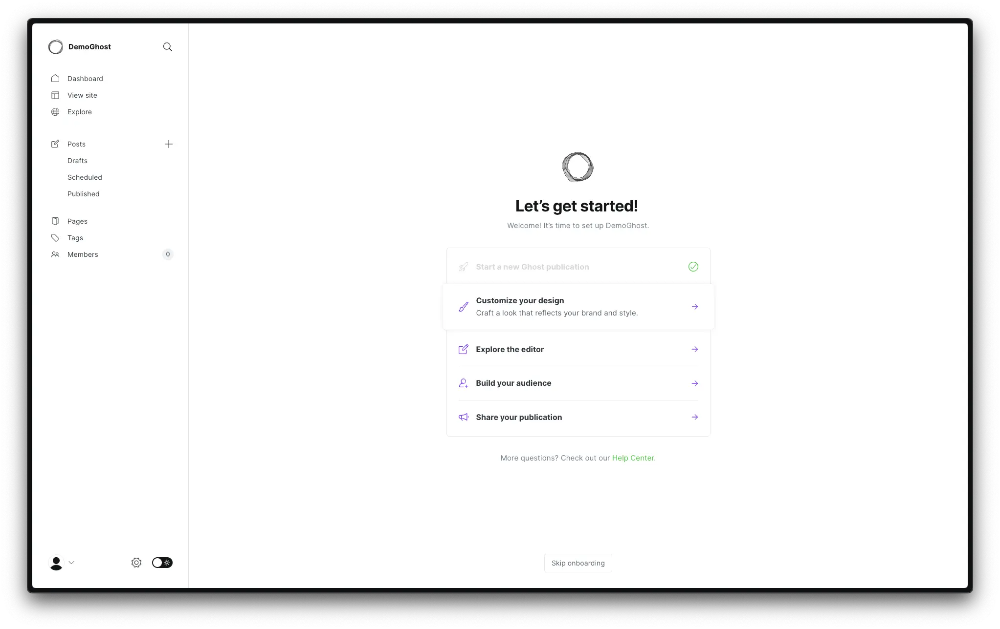
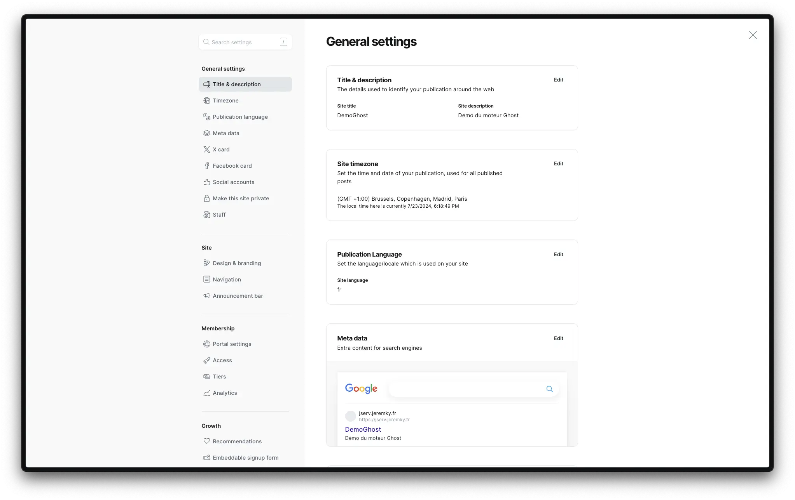
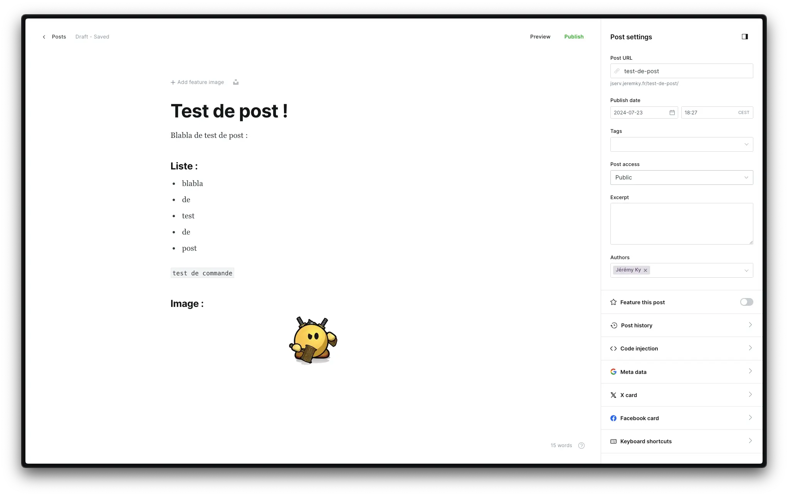
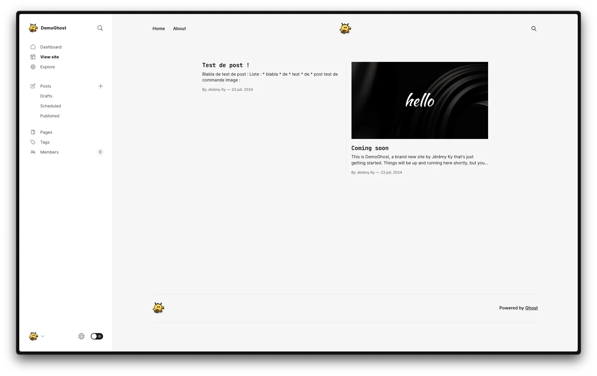
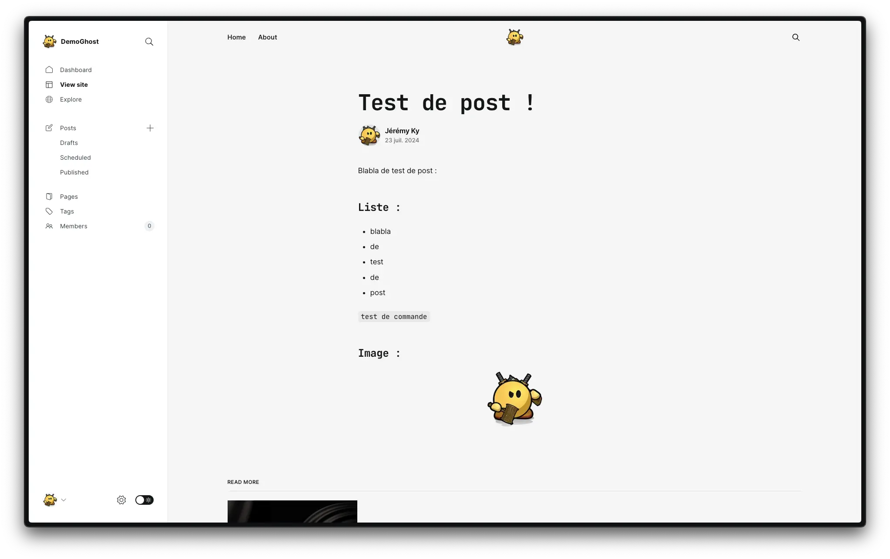

_[Ghost](<https://fr.wikipedia.org/wiki/Ghost_(moteur_de_blog)>) est un moteur de blog libre et open source écrit en JavaScript et distribué sous licence MIT. Ghost est conçu pour simplifier le processus de publication en ligne par des blogueurs._

_L'idée de Ghost a été écrite pour la première fois début novembre 2012 dans un billet de blog par le fondateur John O'Nolan, ancien responsable de l'équipe interface utilisateur de WordPress, à la suite de sa frustration face à la complexité d'utilisation de WordPress en tant que moteur de blog plutôt qu'en tant que système de gestion de contenu._

## Installation

Le fichier `docker-compose.yml` :

```yml {filename="docker-compose.yml"}
services:
  ghost-db:
    image: docker.io/mysql:8.0
    container_name: ghost-db
    hostname: ghost-db
    env_file: ghost-db.env
    networks:
      - default
    volumes:
      - /opt/containers/ghost/mysql:/var/lib/mysql
    restart: always

  ghost:
    image: docker.io/ghost:latest
    container_name: ghost
    hostname: ghost
    env_file: ghost.env
    networks:
      - default
      - nginx_proxy
    volumes:
      - /opt/containers/ghost/app:/var/lib/ghost/content
    depends_on:
      - ghost-db
    restart: always

networks:
  default:
    external: false
  nginx_proxy:
    external: true
```

Le fichier `ghost-db.env`:

```ini {filename="ghost-db.env"}
MYSQL_ROOT_PASSWORD=PASSWORD
```

Et son fichier `ghost.env` :

```ini {filename="ghost.env"}
database__client=mysql
database__connection__host=ghost-db
database__connection__user=root
database__connection__password=PASSWORD
database__connection__database=ghost

url=https://www.foo.bar
mail__from=FooBar <ghost@foo.bar>
```

Dans ce fichier `ghost.env`, vous devez modifier les variables `PASSWORD`, `url` et `mail__from`.

### Reverse proxy

Les fichiers de configuration ci-dessus sont prévus pour être utilisés avec un reverse proxy.

> Pour rappel, une page dédiée est [disponible ici](/docs/docker/conteneurs/web/reverse-proxy-nginx/).

L'image Docker de [Linuxserver.io](https://docs.linuxserver.io/general/swag/) propose un fichier sample de configuration, il vous suffit juste de modifier votre nom de domaine en conséquence :

```bash
sudo cp /opt/containers/nginx/nginx/proxy-confs/ghost.subdomain.conf.sample /opt/containers/nginx/nginx/proxy-confs/ghost.subdomain.conf
sudo sed -i "s,server_name ghost,server_name <votre_sous_domaine>,g" /opt/containers/nginx/nginx/proxy-confs/ghost.subdomain.conf
```

Et enfin, un petit redémarrage pour la prise en compte du nouveau fichier :

```bash
sudo docker restart nginx
```

## Configuration

Une fois le déploiement effectué, vous pouvez aller vérifier que tout est en ordre :



Pour accéder a la page d'administration, il faut ajouter `/ghost` après votre url. Il vous sera alors demandé de choisir un nom de site, et de saisir vos informations de compte principal.

Ghost vous affichera ensuite un assistant de démarrage :



Vous pouvez modifier le design de votre site, afin de changer la couleur, la bannière, l'affichage des articles... Et il est possible de changer de thème utilisé.

Pensez à modifier rapidement les informations comme la langue et le timezone dans le panneau principal :



## Utilisation

Une fois votre site personnalisé et correctement configuré, on peut passer à l'édition :sunglasses:

Ghost propose une interface d'édition confortable à utiliser :



Résultat des modifications :



L'article :


