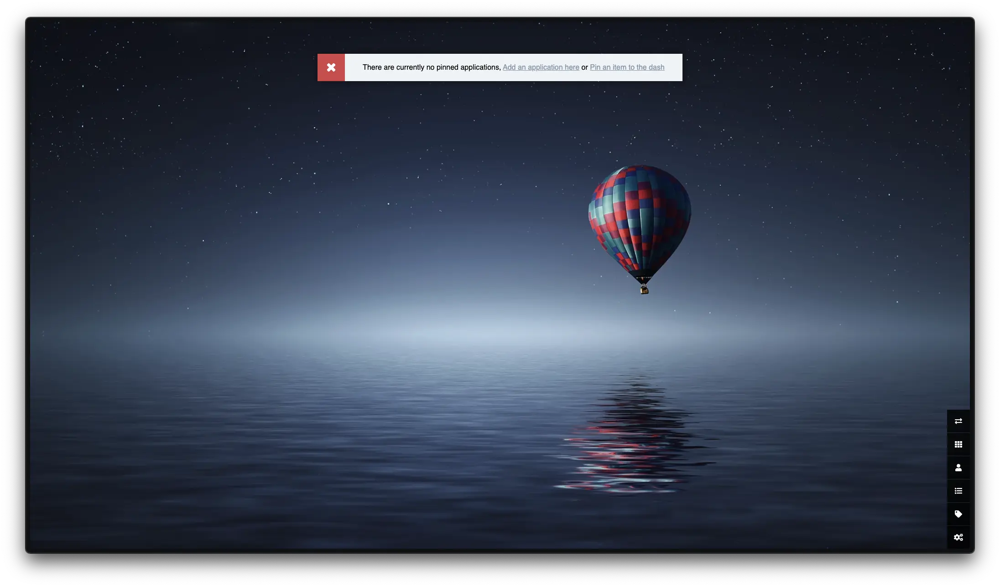
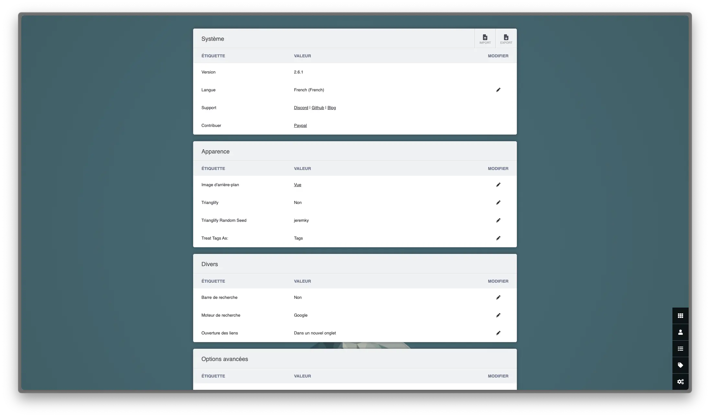
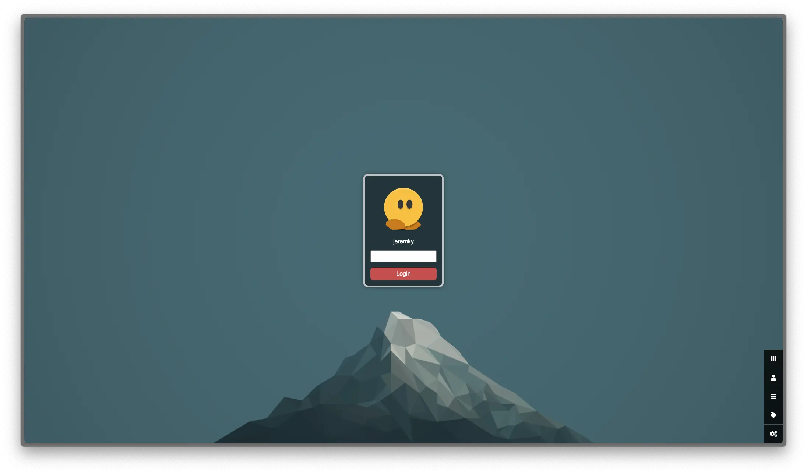
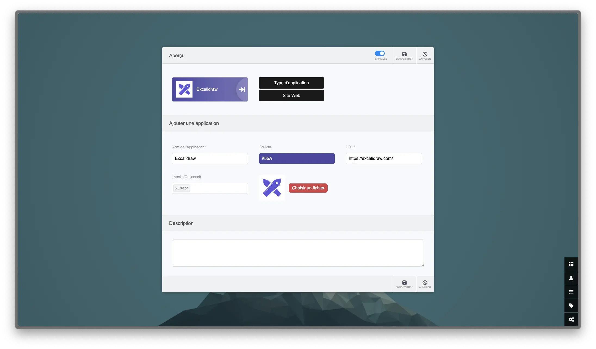
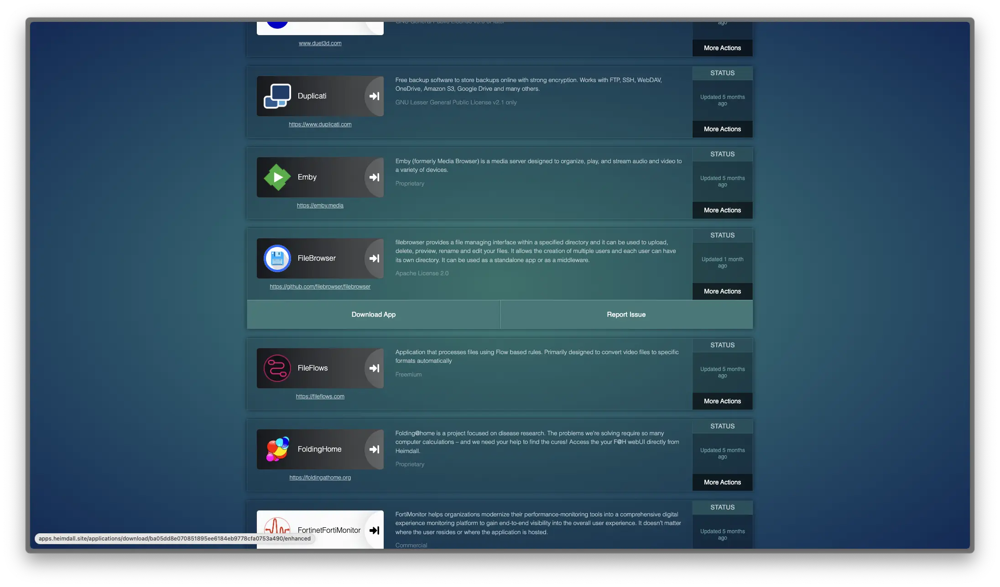

_[Heimdall](https://heimdall.site/) est un moyen d'organiser de manière simple les liens vers vos sites Web et applications Web les plus utilisés. La simplicité est la clé de Heimdall. Pourquoi ne pas l'utiliser comme page de démarrage de votre navigateur ? Il a même la possibilité d'inclure une barre de recherche utilisant Google, Bing ou DuckDuckGo."_

Vous pouvez y créer vos propres applications sous forme de lien web, mais il est parfois possible d'avoir davantage d'interactions, afin d'y afficher des informations supplémentaires sous forme de widget.

Plus d'informations [sur leur site web](https://heimdall.site/).

## Installation

Le fichier `docker-compose.yml` :

```yml {filename="docker-compose.yml"}
services:
  heimdall:
    image: lscr.io/linuxserver/heimdall:latest
    container_name: heimdall
    hostname: heimdall
    env_file: heimdall.env
    networks:
      - nginx_proxy
    volumes:
      - /opt/containers/heimdall:/config
    restart: always

networks:
  nginx_proxy:
    external: true
```

Et son fichier `heimdall.env` :

```ini {filename="heimdall.env"}
PUID=1000
PGID=1000
TZ=Europe/Paris
```

### Reverse proxy

Les fichiers de configuration ci-dessus sont prévus pour être utilisés avec un reverse proxy.

> Pour rappel, une page dédiée est [disponible ici](/docs/docker/conteneurs/web/reverse-proxy-nginx/).

L'image Docker de [Linuxserver.io](https://docs.linuxserver.io/general/swag/) propose un fichier sample de configuration, il vous suffit juste de modifier votre nom de domaine en conséquence :

```bash
sudo cp /opt/containers/nginx/nginx/proxy-confs/heimdall.subdomain.conf.sample /opt/containers/nginx/nginx/proxy-confs/heimdall.subdomain.conf
sudo sed -i "s,server_name heimdall,server_name <votre_sous_domaine>,g" /opt/containers/nginx/nginx/proxy-confs/heimdall.subdomain.conf
```

Et enfin, un petit redémarrage pour la prise en compte du nouveau fichier :

```bash
sudo docker restart nginx
```

## Configuration

Une fois le déploiement terminé, vérifiez le bon fonctionnement de l'app dans
votre navigateur :



Commencez par vous rendre dans la partie `user` pour modifier l'utilisateur par défaut. Lui assigner un mot de passe désactivera l'accès public.

Vous pouvez ensuite vous rendre dans `settings` pour changer les paramètres de langue, le fond d'écran...



Une fois cela effectué, relancez votre navigateur, et votre conteneur via la commande :

```bash
sudo docker restart heimdall
```



### Applications Web

Il est temps d'y ajouter vos applications. Après avoir cliqué sur le bouton `Liste des applications`, un bouton `ADD` se trouve en haut à droite. Vous pouvez lui spécifier quelle application parmi la liste, ou pointer directement sur un site web.



### Applications améliorées

Vous trouverez la liste des applications disponibles [sur cette page](https://apps.heimdall.site/applications/enhanced).
Téléchargez y l'application de votre choix et déposez le fichier zip dans le dossier `/opt/containers/heimdall/config/www/SupportedApps`.



Redémarrez ensuite Heimdall, toujours avec cette commande :

```bash
sudo docker restart heimdall
```
