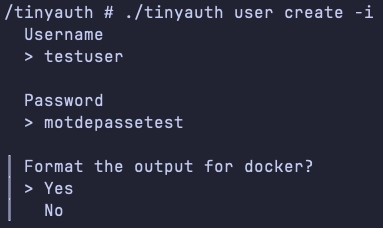
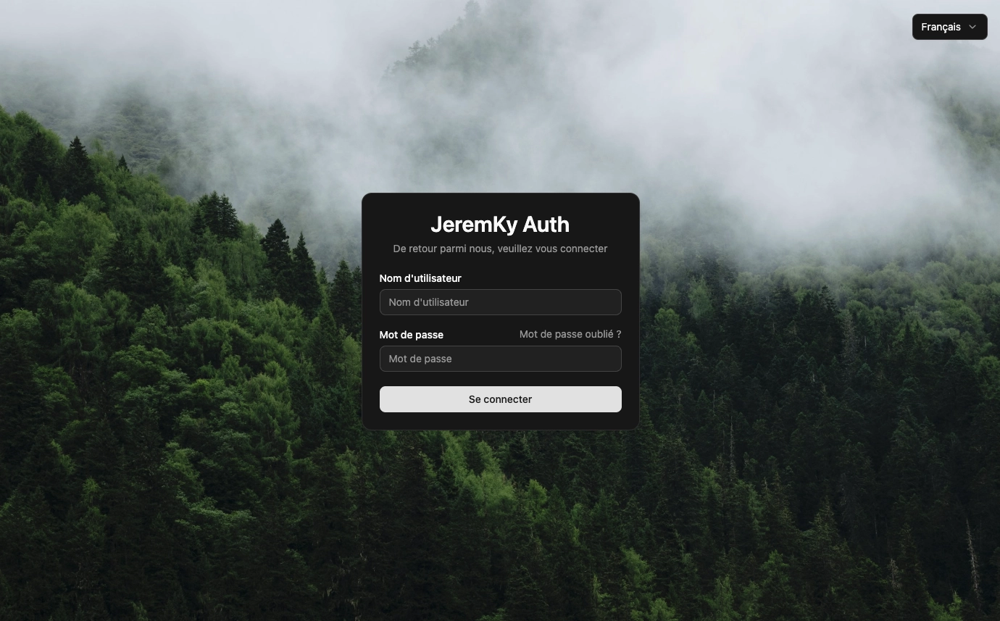
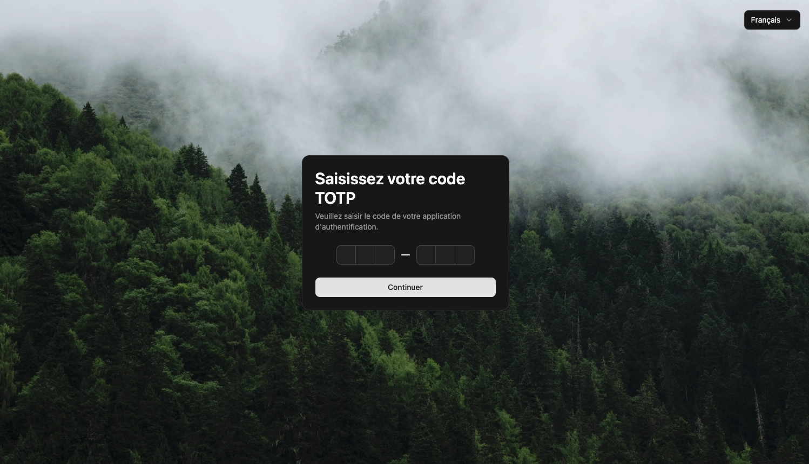

[Tinyauth](https://github.com/tinyauthapp/tinyauth) est un serveur d'authentification et d'autorisation particulièrement léger. Il est conçu pour fonctionner à la fois comme middleware d'authentification pour vos applications, avec support d'OAuth, LDAP et contrôles d'accès, et comme serveur d'authentification autonome. Il est compatible avec tous les proxies populaires tels que Traefik, Nginx et Caddy.


## Fonctionnalités

Tinyauth propose les fonctionnalités suivantes :

- Déploiement ultra rapide via Docker/Podman
- Possibilité de créer des users locaux directement dans les variables d'environnement (donc pas besoin de gérer un fichier de config)
- Interfaçage avec des services d'authentification externe, comme du LDAP, du Oauth via Github, Google...
- De la double authentification TOTP

## Installation

Le fichier `docker-compose.yml` :

```yml {filename="docker-compose.yml"}
services:
  tinyauth:
    image: ghcr.io/tinyauthapp/tinyauth:latest
    container_name: tinyauth
    hostname: tinyauth
    env_file: tinyauth.env
    networks:
      - nginx_proxy
    volumes:
      - /opt/containers/tinyauth:/data
    restart: always

networks:
  nginx_proxy:
    external: true
```

Le fichier `tinyauth.env` associé :

```ini {filename="tinyauth.env"}
TINYAUTH_APPURL=https://tinyauth.mondomaine.fr
TINYAUTH_ANALYTICS_ENABLED=false
TINYAUTH_UI_TITLE=Tinyauth
# TINYAUTH_UI_BACKGROUNDIMAGE=
# TINYAUTH_AUTH_USERS
```

### Reverse proxy

Les fichiers de configuration ci-dessus sont prévus pour être utilisés avec un reverse proxy.

> Pour rappel, une page dédiée est [disponible ici](/docs/docker/conteneurs/web/reverse-proxy-nginx/).

L'image Docker de [Linuxserver.io](https://docs.linuxserver.io/general/swag/) propose un fichier sample de configuration, il vous suffit juste de modifier votre nom de domaine en conséquence :

```bash
sudo cp /opt/containers/nginx/nginx/proxy-confs/tinyauth.subdomain.conf.sample /opt/containers/nginx/nginx/proxy-confs/tinyauth.subdomain.conf
```

### Configuration de nginx

Vous devez maintenant activer Tinyauth dans vos fichiers de configuration présents dans `/opt/containers/nginx/nginx/proxy-confs` pour protéger les services souhaités. 2 lignes sont à décommenter.

Dans le bloc `server` :

```nginx
include /config/nginx/tinyauth-server.conf;
```

Et dans le bloc `location` :

```nginx
include /config/nginx/tinyauth-location.conf;
```

Redémarrez ensuite nginx pour prendre en compte vos modifications :

```bash
docker restart nginx
```

## Configuration

### Création des utilisateurs locaux

Maintenant que Tinyauth est installé, nous allons créer nos utilisateurs. On aurait pu les créer en amont, mais il dispose d'un outil intégré permettant de générer facilement la ligne à insérer dans le fichier `tinyauth.env`.

Pour cela, connectez vous au conteneur fraîchement démarré :




```bash
docker exec -it tinyauth sh
```




```bash
podman exec -it tinyauth sh
```




Et lancez la commande suivante :

```bash
./tinyauth user create -i
```

Renseignez les éléments demandés (tabulation pour suivant) :



Spécifiez que vous voulez un format pour Docker, pour que le hash du mot de passe soit compatible (les symboles `$` sont doublés). Vous allez avoir dans le retour une ligne de ce type :

```bash
testuser:$$2a$$10$$0fsXGdP6yfivZixOlpE.VOzjrheliau3x6f1Q1PyOJwtiTfnzGogG
```

Modifiez le fichier `tinyauth.env` pour ajouter ce user à la variable `TINYAUTH_AUTH_USERS`. Vous pouvez en ajouter plusieurs en les séparant par des virgules.

Redéployez votre Tinyauth pour prendre en compte la nouvelle variable. Cela devrait être tout bon ! Vous devriez pouvoir profiter de votre nouveau service !



### TOTP

Si vous voulez ajouter une double authentification TOTP, utilisez la commande suivante dans votre conteneur :

```bash
./tinyauth totp generate -i
```

Il vous sera demandé de saisir la ligne créée précédemment. Vous allez vous retrouver avec un ÉNORME QR Code dans votre terminal.

Mais c'est surtout la ligne en dessous qui va nous intéresser :

```bash
testuser:$$2a$$10$$0fsXGdP6yfivZixOlpE.VOzjrheliau3x6f1Q1PyOJwtiTfnzGogG:54JVQL5HDB7T2F7NO27JHLT2S2ITKHJN
```

La ligne contient désormais la clé TOTP en plus du mot de passe. Remplacez la ligne de la variable `TINYAUTH_AUTH_USERS` dans le fichier `tinyauth.env` par cette nouvelle valeur.

Il ne vous reste plus qu'à redéployer l'application pour prendre en compte la modification :



### Authentification via GitHub OAuth

Si vous ne voulez pas avoir à gérer les mots de passe utilisateur, Tinyauth permet d'utiliser un service externe. Il est compatible avec les services suivants :

- [OAuth Github](https://tinyauth.app/docs/guides/github-oauth)
- [OAuth Google](https://tinyauth.app/docs/guides/google-oauth)
- [Service LDAP](https://tinyauth.app/docs/guides/ldap)


Dans cet exemple, nous allons utiliser GitHub OAuth. Je vous suggère d'aller voir la documentation sur [le site](https://tinyauth.app/docs/guides/github-oauth) pour obtenir davantage d'informations sur la création de l'application côté GitHub.

Une fois votre configuration en place, vous devez modifier votre fichier `tinyauth.env` pour y ajouter les variables suivantes :

```ini
TINYAUTH_OAUTH_WHITELIST=user1@mail.com,user2@mail.com
TINYAUTH_OAUTH_PROVIDERS_GITHUB_CLIENTID=<id_app>
TINYAUTH_OAUTH_PROVIDERS_GITHUB_CLIENTSECRET=<secret_key>
```

- `TINYAUTH_OAUTH_WHITELIST` : le(s) compte(s) autorisé(s) (A spécifier, car sinon, tous les utilisateurs ayant un compte pourront se connecter)
- `TINYAUTH_OAUTH_PROVIDERS_GITHUB_CLIENTID` : l'ID de votre application créée sur Github
- `TINYAUTH_OAUTH_PROVIDERS_GITHUB_CLIENTSECRET` : La clé générée dans la configuration de votre app Github

> Vous pouvez maintenant supprimer la variable `TINYAUTH_AUTH_USERS` du fichier `tinyauth.env` si vous ne voulez pas conserver la méthode d'authentification classique

Après un redéploiement de Tinyauth, il devrait désormais vous proposer la connexion via Github :


> Je vous laisse consulter la [documentation](https://tinyauth.app/docs/about) si vous désirez utiliser un autre service tiers.

### Contrôle d'accès par labels

Même si Tinyauth est assez simpliste dans la gestion des droits, il reste possible de limiter les accès à vos applications. Tinyauth peut lire des labels de vos fichiers de déploiement Docker et agir en conséquence.

Pour cela, vous devez d'abord permettre à Tinyauth de pouvoir lire les labels. Dans votre fichier `compose.yml`, ajoutez l'entrée `volumes` suivante :




```yml
volumes:
  - /var/run/docker.sock:/var/run/docker.sock:ro
```




```yml
volumes:
  - /var/run/user/1000/podman/podman.sock:/var/run/docker.sock:ro
```




Ensuite, pour chaque application, ajoutez les labels suivants à votre fichier `compose.yml` :

```yml
labels:
  - "tinyauth.apps.<app>.oauth.whitelist=mail@gmail.com,autremail@gmail.com"
```

Si vous utilisez des comptes locaux :

```yml
labels:
  - "tinyauth.apps.<app>.users.allow=<user>"
```

Pensez à redéployer vos applications pour prise en compte. Si l'utilisateur ne figure pas dans la liste des utilisateurs autorisés, il sera alors renvoyé sur la page de Tinyauth.

Si le domaine de l'app ne correspond pas à son nom, ajoutez ce label
en complément des précédents :

```yml
labels:
  - "tinyauth.apps.<app>.config.domain=<domain>"
```
