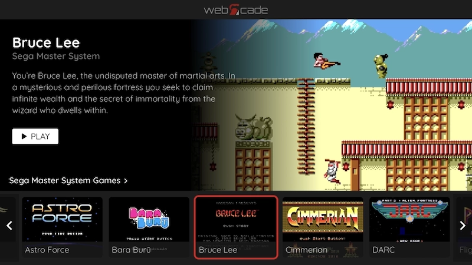
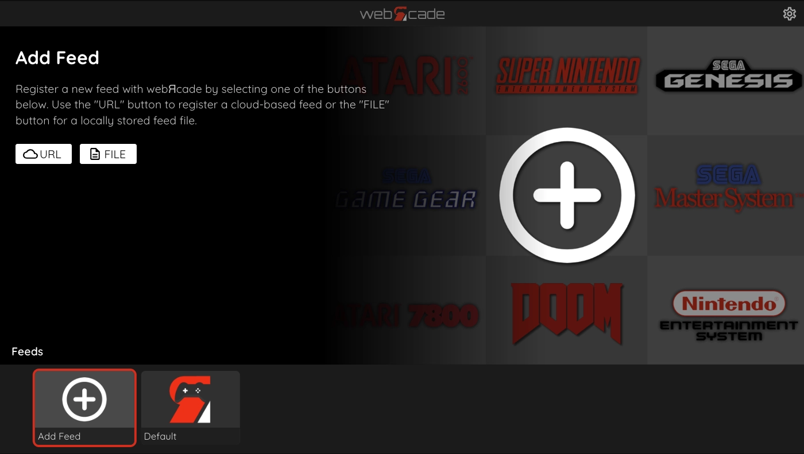
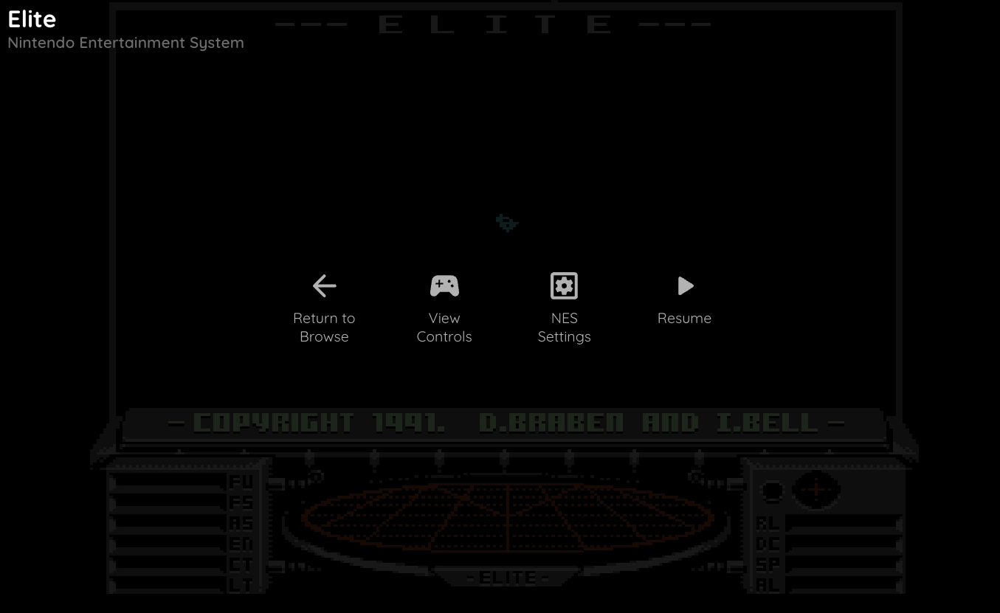
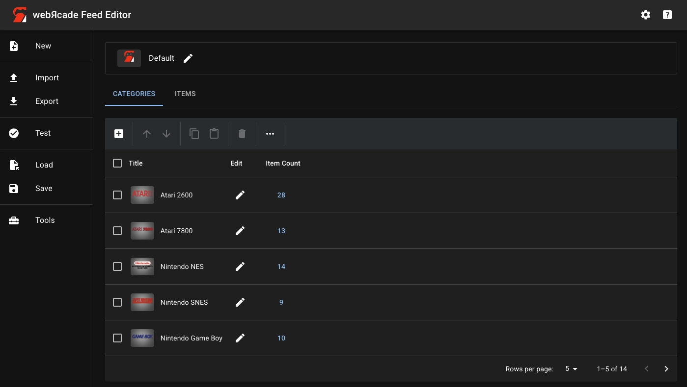
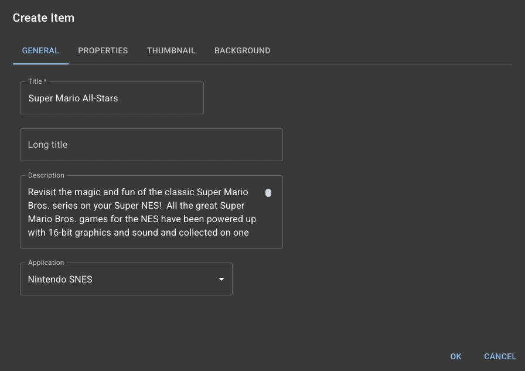
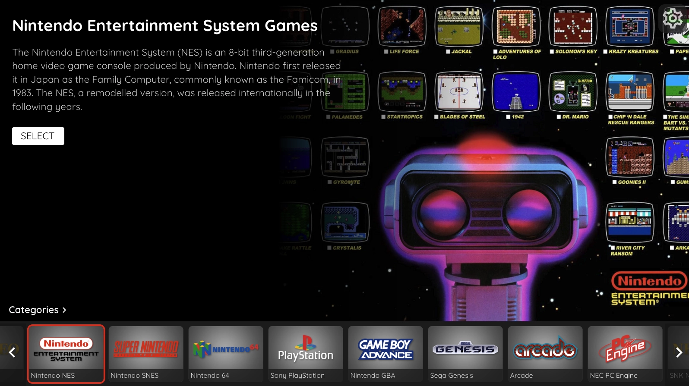

[WebRcade](https://www.webrcade.com/) est une application Web gratuite qui permet de lancer des jeux rétro directement depuis votre navigateur. Pas besoin d’installer quoi que ce soit : il suffit de configurer une liste de jeux pour y jouer de n'importe où.

L’application prend en charge un grand nombre de consoles emblématiques : NES, Super Nintendo, Mega Drive, PlayStation, Game Boy Advance, Nintendo 64, et bien d’autres.

## Avantages

- Ultra simple : jouable directement en ligne, sans installation côté client ou serveur

- Sauvegardes automatiques : vous pouvez synchroniser vos sauvegardes à l'aide d'un compte Dropbox pour les partager entre différents appareils

- Interface claire : pensée pour être utilisée aussi bien au clavier qu’à la manette, et sur tout type d'écran

- Bibliothèque personnalisable : il est possible d'ajouter des ROMs via un éditeur en ligne pour créer une collection de vos jeux préférés (pour rappel, le téléchargement ou le partage de jeux protégés par copyright sans en posséder l’original est illégal)

## Limites

- Ce n’est pas aussi complet ou paramétrable qu’un système comme RetroArch ou Recalbox. Mais pour jouer rapidement à vos classiques, c’est largement suffisant

- La compatibilité avec tous les navigateurs n'est pas parfaite, notamment avec Edge sur Xbox, où j'ai constaté une très légère latence

- Si vous voulez utiliser vos ROMs, il est nécessaire qu'elles soient accessibles via un partage public

## Interface

L'interface est directement disponible au lien suivant : <https://play.webrcade.com>.

Elle est pensée pour être simple et claire. Voici les principaux éléments :

- Le bas de l'interface vous permet de choisir votre console ou vos jeux

- Juste au-dessus, en cliquant sur `Categories`, vous accédez aux listes personnalisées, appelées feeds, que l'on peut ajouter via URL ou via fichier (nous allons voir cette partie plus bas)

- En haut à droite, la roue crantée permet de configurer l'affichage, le stockage Dropbox pour vos sauvegardes, et quelques paramètres avancés

- Lorsque vous lancez un jeu, l’écran passe en plein écran, avec un panneau discret qui permet de sauvegarder, charger ou quitter la partie

## Ajouter vos jeux

Pour créer votre propre feed, rendez-vous sur <https://editor.webrcade.com>. L’éditeur permet d’ajouter vos consoles et vos jeux. Les fichiers doivent simplement être accessibles via un lien public (Dropbox, par exemple).

Quelques points importants :

- Je vous conseille de partir d'une liste existante. Cela vous permettra d'avoir les images des vignettes des consoles

- Pour chaque jeu, l’éditeur récupère automatiquement les images et descriptions en fonction du nom spécifié

### Feed perso

Voici un feed d'exemple pointant vers des ROMs hébergées publiquement sur [Internet Archive](https://archive.org). Pour le tester, il vous suffit d'importer le lien suivant :

<https://jeremky.github.io/files/webrcade.zip>

> [!IMPORTANT]
> À noter que je ne suis en aucun cas responsable de la mise à disposition de jeux protégés par copyright sur Internet Archive

Petite précision pour la Nintendo 64 : il est nécessaire d'activer les applications expérimentales pour qu'elle soit disponible. Je n'ai pas constaté de problème avec les titres testés, mais je ne peux pas garantir la stabilité.
