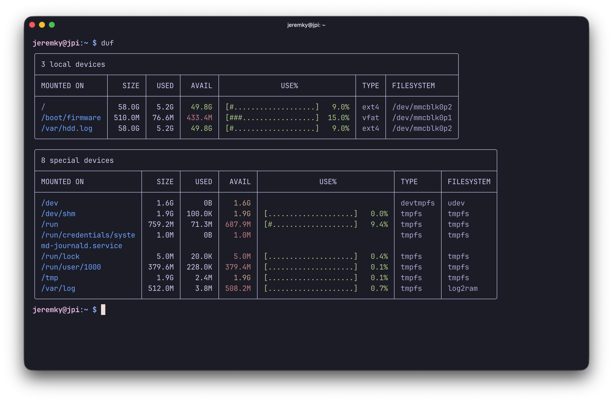

[duf](https://github.com/muesli/duf) (Disk Usage/Free) est une alternative moderne à la commande `df`, affichant l'utilisation des disques dans un tableau coloré et lisible directement dans le terminal.



## Installation

duf est disponible dans les dépôts officiels Debian/Ubuntu :

```bash
sudo apt install duf
```

Sous Fedora :

```bash
sudo dnf install duf
```


## Utilisation

Sans argument, duf affiche tous les systèmes de fichiers montés :

```bash
duf
```

Il est également possible de cibler un ou plusieurs points de montage spécifiques :

```bash
duf /home /var
```

Pour tout afficher, y compris les systèmes de fichiers virtuels et spéciaux :

```bash
duf -all
```

## Options utiles

### Trier les résultats

```bash
duf -sort size
```

Les clés disponibles sont : `mountpoint`, `size`, `used`, `avail`, `usage`, `type`, `filesystem`.

### Afficher uniquement certaines colonnes

```bash
duf -output mountpoint,size,used,avail,usage
```

### Filtrer par type de système de fichiers

```bash
duf -hide-fs tmpfs,devtmpfs
```

Pour masquer les systèmes de fichiers spéciaux (boucles, pseudo-systèmes, etc.) :

```bash
duf -hide special
```

### Afficher les informations sur les inodes

```bash
duf -inodes
```
