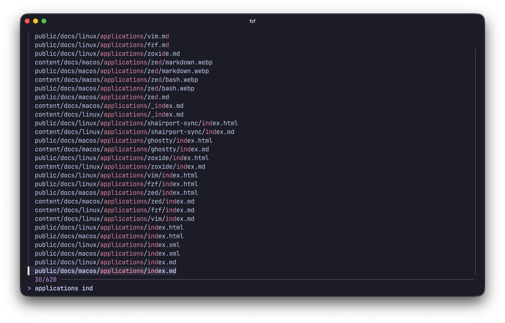
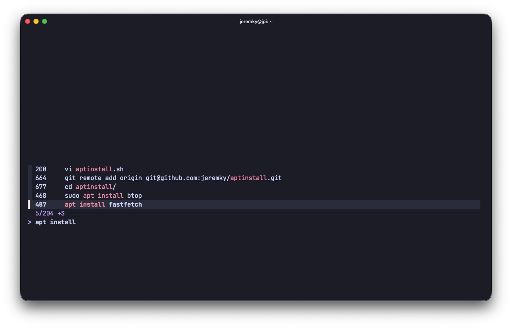

[fzf](https://github.com/junegunn/fzf) est un outil de recherche interactive en ligne de commande. Il intercepte n'importe quelle liste en entrée et affiche une interface de sélection permettant de filtrer les résultats en temps réel avec une correspondance approximative. Il s'intègre nativement avec bash pour enrichir la complétion de commandes et la recherche dans l'historique.



## Installation

fzf est disponible dans les dépôts Debian/Ubuntu :

```bash
sudo apt install fzf
```

## Configuration

L'intégration de fzf dans bash se fait en ajoutant la ligne suivante dans le fichier `.bash_aliases` ou `.bashrc` :

```bash
if [[ -f /usr/bin/fzf ]]; then
  eval "$(fzf --bash)"
fi
```

Suivi de cette commande pour prise en compte :

```bash
source ~/.bashrc
```

### Thème

Il est possible de personnaliser les couleurs de fzf.

- Pour passer en monochrome :

```bash
if [[ -f /usr/bin/fzf ]]; then
  eval "$(fzf --bash)"
  export FZF_DEFAULT_OPTS="--color=bw"
fi
```

- Pour utiliser le thème [Catppuccin Mocha](/docs/linux/theme-catppuccin) : 

```bash
if [[ -f /usr/bin/fzf ]]; then
  eval "$(fzf --bash)"
  export FZF_DEFAULT_OPTS=" \
    --color=bg+:#313244,bg:#1E1E2E,spinner:#F5E0DC,hl:#F38BA8 \
    --color=fg:#CDD6F4,header:#F38BA8,info:#CBA6F7,pointer:#F5E0DC \
    --color=marker:#B4BEFE,fg+:#CDD6F4,prompt:#CBA6F7,hl+:#F38BA8 \
    --color=selected-bg:#45475A \
    --color=border:#6C7086,label:#CDD6F4"
fi
```

## Utilisation

Une fois intégré à bash, fzf ajoute trois raccourcis clavier :

| Raccourci  | Description                                                              |
| ---------- | ------------------------------------------------------------------------ |
| `Ctrl + T` | Recherche interactive de fichiers dans le répertoire courant             |
| `Ctrl + R` | Recherche interactive dans l'historique des commandes                    |
| `Alt + C`  | Navigation interactive dans les sous-répertoires                         |



### Applications

Il est également possible d'appeler `fzf` directement dans le terminal pour filtrer n'importe quelle sortie :

#### Sélectionner un fichier et l'ouvrir dans vim

```bash
# Sélectionner un fichier et l'ouvrir dans vim
vim $(fzf)
```

#### Rechercher dans les processus actifs

```bash
ps aux | fzf
```
