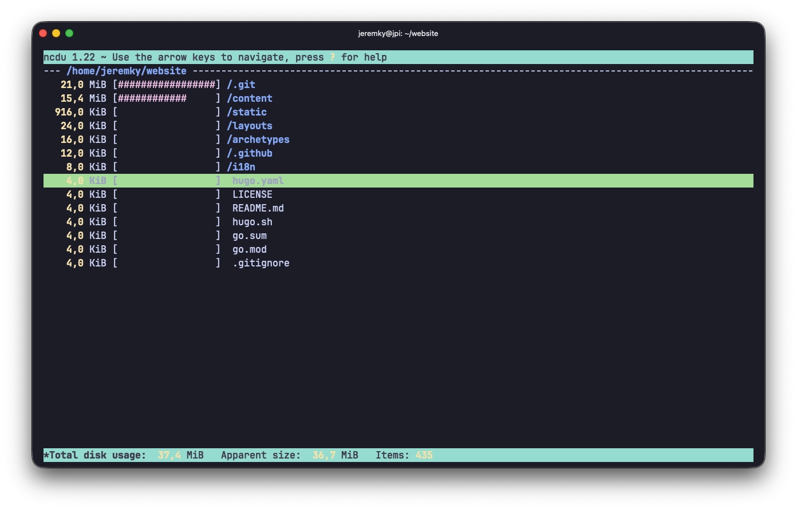

[ncdu](https://dev.yorhel.nl/ncdu) (NCurses Disk Usage) est une alternative interactive à la commande `du`. Il analyse l'utilisation de l'espace disque et affiche les résultats dans une interface navigable directement dans le terminal, triés par taille.



## Installation

ncdu est disponible dans les dépôts Debian/Ubuntu :

```bash
sudo apt install ncdu
```

## Utilisation

Lancez ncdu en lui passant un répertoire à analyser :

```bash
ncdu /
```

Sans argument, ncdu analyse le répertoire courant.

### Navigation

| Touche         | Action                                         |
| -------------- | ---------------------------------------------- |
| `↑` / `↓`      | Naviguer dans la liste                         |
| `→` / `Entrée` | Entrer dans le répertoire sélectionné          |
| `←` / `n`      | Revenir au répertoire parent                   |
| `d`            | Supprimer le fichier ou répertoire sélectionné |
| `i`            | Afficher les informations détaillées           |
| `?`            | Afficher l'aide                                |
| `q`            | Quitter                                        |
