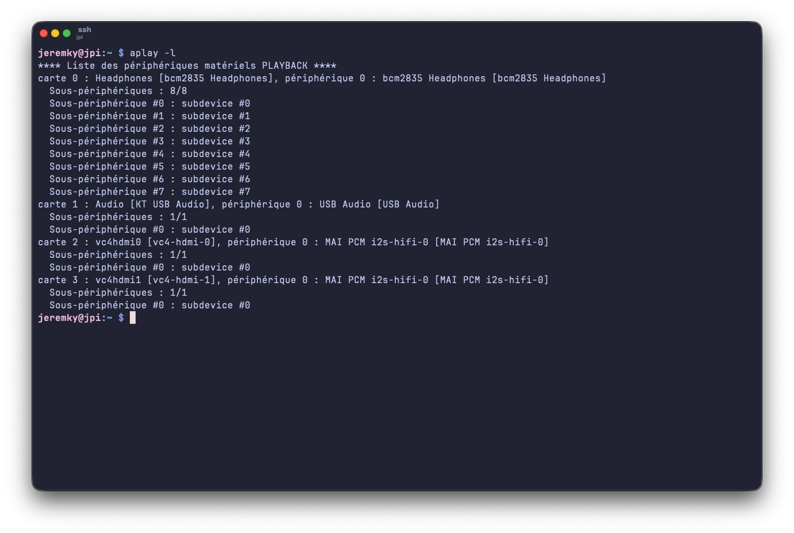
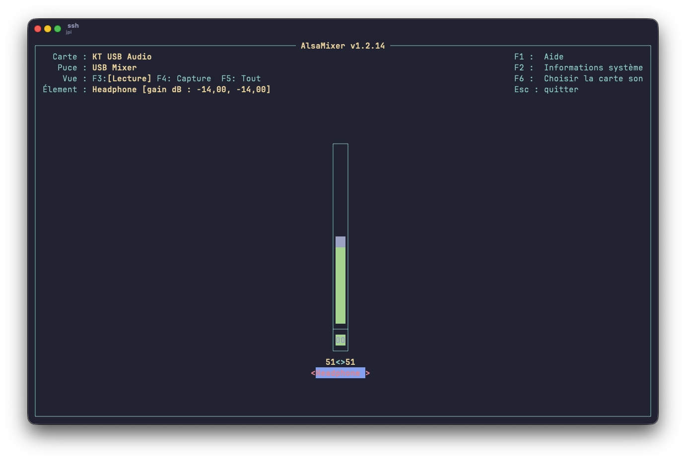

[Shairport Sync](https://github.com/mikebrady/shairport-sync) est un outil qui permet de transformer n’importe quelle machine Linux en récepteur AirPlay.
Concrètement : vous envoyez le son de votre iPhone, iPad ou Mac directement vers votre PC/serveur. Dans mon cas, c'est un Raspberry Pi 4 qui servira de récepteur.

> Shairport Sync annonce sa présence sur le réseau via mDNS (Avahi). Votre appareil iOS détecte le service AirPlay automatiquement

## Installation

Shairport Sync est désormais disponible directement dans les dépôts Debian/Ubuntu. Pour l'installer, une simple commande apt :

```bash
sudo apt install shairport-sync
```

## Configuration

Par défaut, Shairport Sync devrait fonctionner tel quel. Mais dans mon cas, je devais forcer l'utilisation d'une carte son USB dédiée. Pour cela, il faut éditer le fichier :

```bash
sudo vi /etc/shairport-sync.conf
```

Voici ma configuration simplifiée. Elle définit le nom du récepteur, les volumes min et max, un timeout :

```txt {filename="/etc/shairport-sync.conf"}
// Configuration File for Shairport Sync

// General Settings
general =
{
  name = "%h";

  volume_range_db = 50 ;
  volume_max_db = 0.0 ;
};

// Advanced parameters
sessioncontrol =
{
  allow_session_interruption = "yes";
  session_timeout = 120;
};

// Alsa Settings
alsa =
{
  output_device = "hw:0";
  mixer_control_name = "PCM";
};
```

Il reste à modifier la partie `alsa` si vous souhaitez utiliser une autre carte son.

### Carte son

Pour lister les cartes sons disponibles, utilisez la commande suivante :

```bash
aplay -l
```

Vous devriez avoir un retour du genre :



La carte que je souhaite utiliser est la carte 1 (USB Audio). Pour connaître le `mixer_control_name`, utilisez la commande `alsamixer` :



> Le nom du mixer se trouve à la ligne `élément` (`Headphone` dans notre cas)

J'ai donc maintenant les éléments qu'il me faut :

- output_device = "**hw:1**";
- mixer_control_name = "**Headphone**";

Le fichier à jour :

```txt {filename="/etc/shairport-sync.conf"}
// Configuration File for Shairport Sync

// General Settings
general =
{
  name = "%h";

  volume_range_db = 50 ;
  volume_max_db = 0.0 ;
};

// Advanced parameters
sessioncontrol =
{
  allow_session_interruption = "yes";
  session_timeout = 120;
};

// Alsa Settings
alsa =
{
  output_device = "hw:1";
  mixer_control_name = "Headphone";
};
```

Redémarrez le service pour prise en compte des modifications :

```bash
systemctl restart shairport-sync
```

## Intégration systemd

Une fois l'application configurée, on active le service au démarrage :

```bash
sudo systemctl enable shairport-sync
```

## Test depuis iOS

Enfin, il ne reste plus que le meilleur : vérifier que ça marche !

1. Ouvrir le centre de contrôle
2. Appuyer sur AirPlay
3. Sélectionner le nom défini dans la config (hostname du serveur)

Le son bascule immédiatement.

Si toutefois rien n’apparaît :

- Vérifier que le firewall ne bloque pas mDNS
- Vérifier que `avahi-daemon` tourne

```bash
sudo systemctl status avahi-daemon
```

## Documentation officielle

Cette configuration de base suffit dans la majorité des cas. Mais si jamais vous devez utiliser PipeWire ou PulseAudio, je vous laisse voir directement sur la [doc de l'application](https://github.com/mikebrady/shairport-sync/blob/master/ADVANCED%20TOPICS/README.md).
