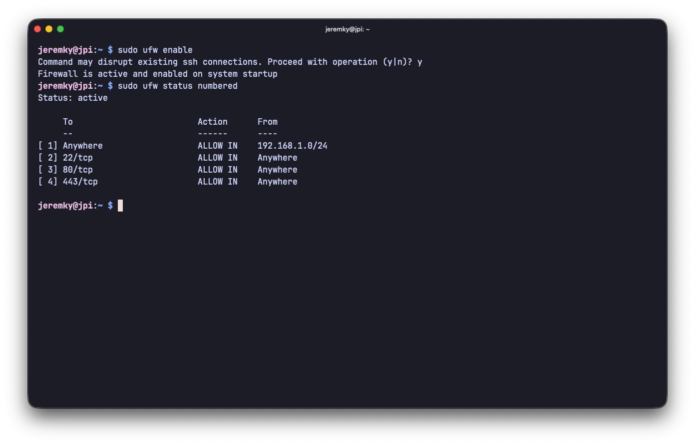

[UFW](https://fr.wikipedia.org/wiki/Uncomplicated_Firewall) (Uncomplicated Firewall) est une interface de configuration simplifiée pour iptables, le pare-feu intégré au noyau Linux. Son objectif est de rendre la gestion des règles réseau accessible sans avoir à maîtriser la syntaxe complexe d'iptables.

UFW est disponible par défaut sur les distributions basées sur Debian, dont Ubuntu. Il est particulièrement adapté pour sécuriser un serveur auto-hébergé en filtrant les connexions entrantes et sortantes.

## Installation

Sur Debian/Ubuntu, UFW est généralement déjà disponible. Si ce n'est pas le cas :

```bash
sudo apt install ufw
```

## Configuration de base

### Autoriser SSH

Avant d'activer UFW, assurez-vous d'autoriser SSH pour ne pas vous couper l'accès à votre serveur !

```bash
sudo ufw allow ssh
```

Cette commande autorise le port 22 en TCP. Si vous utilisez un port SSH personnalisé, remplacez `ssh` par le numéro de port :

```bash
sudo ufw allow 2222/tcp
```

### Activer UFW

Une fois les règles de base en place, on peut activer le pare-feu :

```bash
sudo ufw enable
```



## Gestion des règles

### Autoriser un port

Pour autoriser un port spécifique, par exemple pour un serveur web :

```bash
sudo ufw allow 80/tcp
sudo ufw allow 443/tcp
```

Il est également possible d'utiliser les noms de services connus :

```bash
sudo ufw allow http
sudo ufw allow https
```

### Autoriser une plage de ports

```bash
sudo ufw allow 8000:9000/tcp
```

### Restreindre à une IP source

Pour n'autoriser les connexions que depuis une adresse IP spécifique :

```bash
sudo ufw allow from 192.168.1.10
```

Ou tout un réseau :

```bash
sudo ufw allow from 192.168.1.0/24
```

### Bloquer une IP

```bash
sudo ufw deny from 203.0.113.42
```

### Supprimer une règle

Pour supprimer une règle, deux méthodes sont possibles. La première, en utilisant la syntaxe inverse :

```bash
sudo ufw delete allow 80/tcp
```

La seconde, plus pratique, consiste à lister les règles numérotées puis à supprimer par numéro :

```bash
sudo ufw status numbered
sudo ufw delete 3
```

## Désactivation de l'IPv6

Si vous souhaitez désactiver la gestion de l'IPv6, vous devez modifier le fichier `/etc/default/ufw` et remplacer `IPV6=yes` par `IPV6=no`. Pour le faire directement via la commande `sed` :

```bash
sudo sed -i "s,IPV6=yes,IPV6=no," /etc/default/ufw
```

## Consulter l'état du pare-feu

Pour afficher les règles actives :

```bash
sudo ufw status
```

Pour une vue plus détaillée avec les numéros de règles :

```bash
sudo ufw status verbose
```

## Désactiver et réinitialiser

Pour désactiver temporairement UFW sans supprimer les règles :

```bash
sudo ufw disable
```

Pour remettre à zéro toutes les règles :

```bash
sudo ufw reset
```

> [!NOTE]
> Un `reset` désactivera aussi UFW. Pensez à le réactiver après avoir redéfini vos règles de base, notamment celle pour SSH.

## Journalisation

UFW peut journaliser les connexions bloquées, ce qui est utile pour diagnostiquer des problèmes ou détecter des tentatives d'intrusion :

```bash
sudo ufw logging on
```

Plusieurs niveaux de verbosité existent (`low`, `medium`, `high`, `full`), le niveau `low` étant activé par défaut. Les logs sont consultables via journald :

```bash
sudo journalctl -k | grep UFW
```
