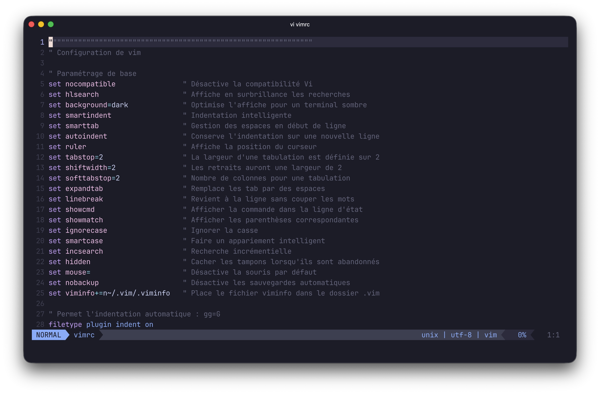

_[Vim](https://fr.wikipedia.org/wiki/Vim) est un éditeur de texte extrêmement personnalisable, que ce soit par l'ajout d'extensions, ou par la modification de son fichier de configuration, écrits dans son propre langage d'extension, le Vim script._

_Bien qu'il ait de nombreuses fonctionnalités, il conserve un temps de démarrage court (même agrémenté d'extensions) et reste ainsi adapté pour des modifications simples et ponctuelles (de fichiers de configuration par exemple)._

_Vim se différencie de la plupart des autres éditeurs par son fonctionnement modal, hérité de vi. En effet, il possède trois modes de base : le mode normal ou mode commande (dans lequel vous êtes lorsque Vim démarre), le mode insertion, et le mode ligne de commande._

## Installation de la version Improved

Selon les distributions, la version Improved n'est pas forcément installée. Sur une distribution basée sur Debian :

```sh
sudo apt install vim
```

Une fois Vim installé, la commande vi devient un alias qui pointe vers ce dernier.

## Les commandes de base

Voici un tableau contenant les commandes principales de Vi :

| Commande | Description                                                                       |
| -------- | --------------------------------------------------------------------------------- |
| Esc      | Quitter le mode édition et repasser en mode commande                              |
| i        | Entrer en mode insertion                                                          |
| a        | Entrer en mode insertion après le curseur                                         |
| A        | Entrer en mode insertion à la fin de la ligne                                     |
| D        | Effacer le reste de la ligne à partir du curseur                                  |
| C        | Effacer le reste de la ligne et entrer en mode édition                            |
| cw       | Effacer le mot et entrer en mode édition                                          |
| u        | Annuler la dernière action                                                        |
| :w       | Enregistrer le fichier                                                            |
| :wq      | Enregistrer le fichier et quitter                                                 |
| :q!      | Quitter sans enregistrer les modifications                                        |
| dd       | Supprimer/couper la ligne courante                                                |
| yy       | Copier la ligne courante                                                          |
| p        | Coller sous la ligne courante                                                     |
| P        | Coller avant la ligne courante                                                    |
| w        | Aller au mot suivant                                                              |
| b        | Aller au mot précédent                                                            |
| $        | Aller à la fin de la ligne                                                        |
| 0        | Aller au début de la ligne                                                        |
| gg       | Aller au début du fichier                                                         |
| G        | Aller à la fin du fichier                                                         |
| /        | Suivi d'une saisie d'une chaîne à rechercher                                      |
| n        | Rechercher l'occurrence suivante                                                  |
| N        | Rechercher l'occurrence précédente                                                |
| \*       | Rechercher les occurrences d'une chaîne à la position du curseur. \* pour suivant |

La liste est loin d'être exhaustive, mais vous avez déjà une bonne base pour éditer efficacement.

## Fichier .vimrc

Je vous partage un exemple de configuration pour vim.
Ce fichier est à créer sous `~/.vimrc`, ou `~/.vim/vimrc`.

> Avant de lancer Vim une fois le fichier créé, assurez-vous d'avoir git et curl installés. Il sont nécessaires pour le téléchargement de [vim-plug](https://github.com/junegunn/vim-plug) et des plugins

```vim {filename=".vimrc"}
"""""""""""""""""""""""""""""""""""""""""""""""""""""""""""""""
" Configuration de vim

" Paramétrage de base
set nocompatible                " Désactive la compatibilité Vi
set hlsearch                    " Affiche en surbrillance les recherches
set background=dark             " Optimise l'affiche pour un terminal sombre
set smartindent                 " Indentation intelligente
set smarttab                    " Gestion des espaces en début de ligne
set autoindent                  " Conserve l'indentation sur une nouvelle ligne
set ruler                       " Affiche la position du curseur
set tabstop=2                   " La largeur d'une tabulation est définie sur 2
set shiftwidth=2                " Les retraits auront une largeur de 2
set softtabstop=2               " Nombre de colonnes pour une tabulation
set expandtab                   " Remplace les tab par des espaces
set linebreak                   " Revient à la ligne sans couper les mots
set showcmd                     " Afficher la commande dans la ligne d'état
set showmatch                   " Afficher les parenthèses correspondantes
set ignorecase                  " Ignorer la casse
set smartcase                   " Faire un appariement intelligent
set incsearch                   " Recherche incrémentielle
set hidden                      " Cacher les tampons lorsqu'ils sont abandonnés
set mouse=                      " Désactive la souris par défaut
set nobackup                    " Désactive les sauvegardes automatiques
set viminfo+=n~/.vim/.viminfo   " Place le fichier viminfo dans le dossier .vim

" Permet l'indentation automatique : gg=G
filetype plugin indent on

" Definition des caractères invisibles
let &listchars = "eol:$,space:\u00B7"

" Changement automatique du curseur en fonction du mode
let &t_SI = "\e[6 q"
let &t_EI = "\e[2 q"

" Mémoriser la dernière position du curseur
autocmd BufReadPost * if (line("'\"") > 1) && (line("'\"") <= line("$")) | silent exe "silent! normal g'\"zO" | endif

" Désactivation des # au retour chariot
autocmd FileType * setlocal formatoptions-=c formatoptions-=r formatoptions-=o

"""""""""""""""""""""""""""""""""""""""""""""""""""""""""""""""
" Fonctions

function! ModeIDE()
  if get(g:, 'modeIDE_enabled', 0)
    let g:modeIDE_enabled = 0
    windo set nonumber mouse=
    echo "Mode IDE désactivé"
  else
    let g:modeIDE_enabled = 1
    windo set number mouse=a
    echo "Mode IDE activé"
  endif
endfunction

"""""""""""""""""""""""""""""""""""""""""""""""""""""""""""""""
" Mapping

" Mode IDE
nnoremap <F2> <Cmd>call ModeIDE()<CR>

" Affichage des caractères invisibles
nnoremap <F3> <Cmd>set list!<CR>

" Commentaire
nnoremap <F4> <Plug>CommentaryLine
xnoremap <F4> <Plug>Commentary

" Indentation automatique
nnoremap <F5> gg=G

" Ménage des plugins
nnoremap <F7> <Cmd>PlugClean<CR>

" MAJ des plugins
nnoremap <F8> <Cmd>PlugUpdate<CR>

" Changement de document
nnoremap <S-TAB> <C-W>w

"""""""""""""""""""""""""""""""""""""""""""""""""""""""""""""""
" Installation des Plugins

" Téléchargement de vim-plug si introuvable
if empty(glob('~/.vim/autoload/plug.vim'))
  silent !curl -fLo ~/.vim/autoload/plug.vim --create-dirs
        \ <https://raw.githubusercontent.com/junegunn/vim-plug/master/plug.vim>
endif

" Lance automatiquement PlugInstall
autocmd VimEnter * if len(filter(values(g:plugs), '!isdirectory(v:val.dir)'))
      \| PlugInstall --sync | source $MYVIMRC
      \| endif

" Liste des plugins
call plug#begin()

" Interface
Plug 'catppuccin/vim', { 'as': 'catppuccin' }
Plug 'itchyny/lightline.vim'

" Edition
Plug 'tpope/vim-commentary'
Plug 'vim-scripts/VimCompletesMe'

" Code
Plug 'jiangmiao/auto-pairs'
Plug 'sheerun/vim-polyglot'

call plug#end()

"""""""""""""""""""""""""""""""""""""""""""""""""""""""""""""""
" Configuration des Plugins

if isdirectory(expand("~/.vim/plugged"))

  " Catppuccin
  colorscheme catppuccin_mocha
  set cursorline
  set termguicolors

  " LightLine
  let g:lightline = {'colorscheme': 'catppuccin_mocha'}
  let g:lightline.separator = { 'left': '', 'right': '' }
  set laststatus=2
  set noshowmode

  " AutoPairs
  let g:AutoPairs = {'(':')', '[':']', '{':'}',"'":"'"}

endif
```

### Modifications

#### Plugins

- catppuccin : applique le thème Catppuccin Mocha
- lightline : améliore la barre de status
- vim-commentary : commenter/décommenter rapidement
- VimCompletesMe : gère l'auto-complétion
- autopairs : ferme automatiquement certains brackets
- vim-polyglot : affichage du code amélioré

#### Mapping

- F2 : bascule en mode **IDE** : prise en charge de la souris et affichage des numéros de ligne
- F3 : Affiche les caractères invisibles (espaces et fins de ligne)
- F4 : commente automatiquement la ligne (s'adapte au type de fichier)
- F5 : effectue une indentation automatique sur l'intégralité du fichier
- F7 : supprime les plugins non utilisés
- F8 : lance une mise à jour des plugins


