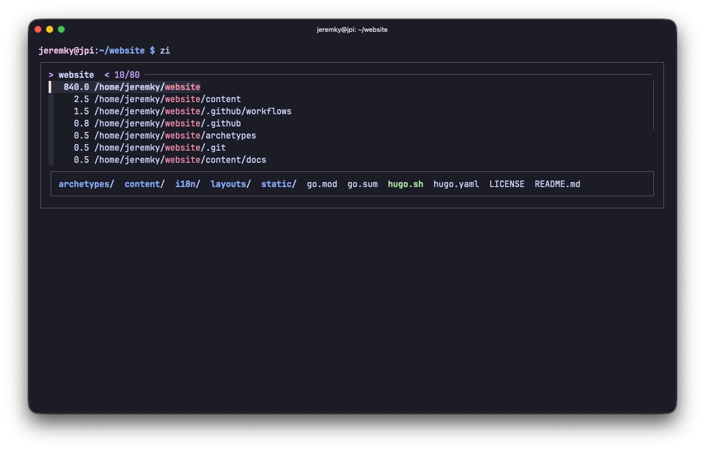

[Zoxide](https://github.com/ajeetdsouza/zoxide) est un remplacement intelligent de la commande `cd`. Cet outil maintient une base de données de tous les répertoires visités, pondérée par la fréquence et l'historique'. en tapant `z <fragment>`, zoxide cherche la correspondance la plus probable dans cette base et nous y envoie directement, sans avoir à saisir le chemin complet.

Par exemple, si `/var/log/nginx` fait partie de l'historique des répertoires consultés, un simple `z nginx` suffira pour y retourner.

## Installation

Zoxide est disponible dans les dépôts Debian/Ubuntu :

```bash
sudo apt install zoxide
```

## Configuration

L'intégration de zoxide dans bash se fait en ajoutant la ligne suivante dans le fichier `.bash_aliases` ou `.bashrc` :

```bash
# zoxide : cd amélioré (utiliser la commande z)
[[ -f /usr/bin/zoxide ]] && eval "$(zoxide init bash)"
```

Pour la prise en compte :

```bash
source ~/.bashrc
```

## Utilisation

| Commande            | Description                                                       |
| ------------------- | ----------------------------------------------------------------- |
| `z <fragment>`      | Se déplacer vers le répertoire correspondant le mieux au fragment |
| `z <frag1> <frag2>` | Affiner la recherche avec plusieurs fragments                     |
| `z -`               | Revenir au répertoire précédent                                   |
| `zi <fragment>`     | Mode interactif                                                   |
| `z ~`               | Retourner au répertoire home                                      |



> [!IMPORTANT]
> Il est nécessaire que [fzf](/docs/linux/applications/fzf) soit installé pour bénéficier de l'interface interactive avec `zi`. Sans lui, zoxide se rabattra sur une sélection basique

## Alimenter la base de données

Zoxide apprend par lui-même au fur et à mesure des déplacements dans les dossiers. Il est possible de consulter la base de données manuellement :

```bash
zoxide query --list --score
```

Il est également possible de supprimer manuellement une entrée devenue obsolète :

```bash
zoxide remove /chemin/du/repertoire
```
