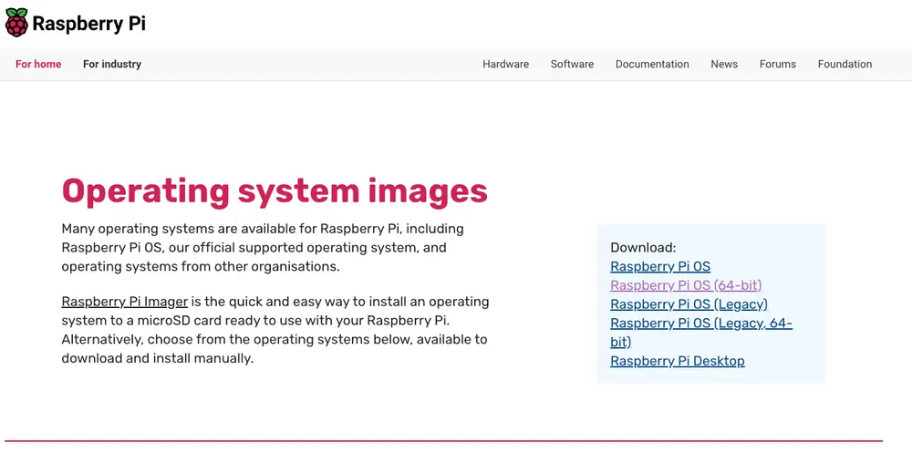
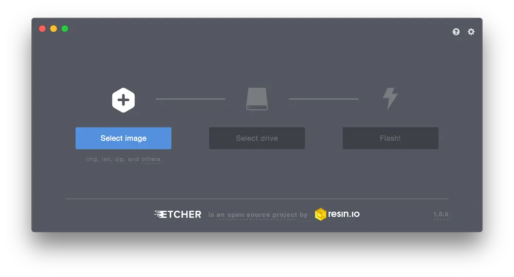
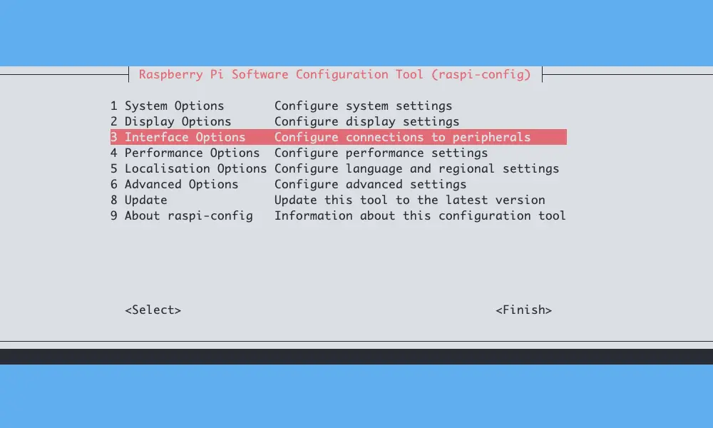

Voici une documentation rapide sur ma manière d'installer Raspberry Pi OS, et de vous partager un petit script pour automatiser la configuration du bébé.

## Installation

Rien de particulier pour cette étape. Tout d'abord, on choisi son OS sur le [site officiel](https://www.raspberrypi.com/software/operating-systems). Pour ma part, c'est Raspberry Pi OS (Lite) en 64 bits, compatible à partir de la version 3B (Certaines images Docker ne fonctionnant pas sur la 32 bits).



Une fois l'image téléchargée, il vous faut un outil pour l'injecter dans votre carte MicroSD. Personnellement, j'utilise [Etcher](https://etcher.balena.io), mais tout autre outil fera l'affaire (dont celui fourni par la fondation raspberry).



On choisi son image, sa carte SD, et on envoie le flash ! Une fois l'image injectée, on peut passer au démarrage.

## Démarrage

Au 1er démarrage, il vous sera demandé de saisir un nom d'utilisateur et un mot de passe. Attention, pour le moment, c'est en qwerty...

Une fois cela fait, vous arrivez au prompt. Nous allons tout d'abord utiliser l'outil fourni par raspberry pour configurer la bête. Pour cela, lancez la commande suivante :

```bash
sudo raspi-config
```

Vous arriverez sur cette interface :



Voici quelques trucs que je vous propose de configurer / activer :

- le hostname, dans _System Options_
- SSH, dans _Interface Options_
- les infos de localisation (langue, timezone, clavier...)
- étendre la taille de la partition, dans _Advanced Options_

Une fois tout cela fait, on lance une mise à jour :

```bash
sudo apt update && sudo apt upgrade
```

Et on termine par un redémarrage :

```bash
sudo reboot
```

## Configuration

Il y a une partie que j'ai volontairement mise de côté : la configuration réseau. Il est par défaut configuré pour fonctionner avec votre DHCP, mais je vous conseille de le désactiver et de passer en IP fixe. C'est donc le bon moment pour vous proposer d’utiliser ce petit script qui vous permettra de configurer tout ça bien plus facilement : [raspinit.sh](https://codeberg.org/jeremky/raspinit).

Ce script vous permet, à l’aide de son fichier de configuration, d'effectuer les opérations suivantes :

- Désactiver ou non le swap, une horreur pour les cartes SD
- Désactiver ou non le Wifi et le Bluetooth
- Configurer le réseau du raspberry en IP fixe
- Installer log2ram, pour réduire encore les écritures sur la carte (les logs seront stockées en RAM et écrites en une seule fois à l'arrêt du système)
- Petit bonus : l'ajout de l'alias "temp" pour connaître rapidement la température du pi

> [!CAUTION]
> Une fois le script exécuté, un redémarrage vous sera demandé pour le bon fonctionnement de Log2ram
