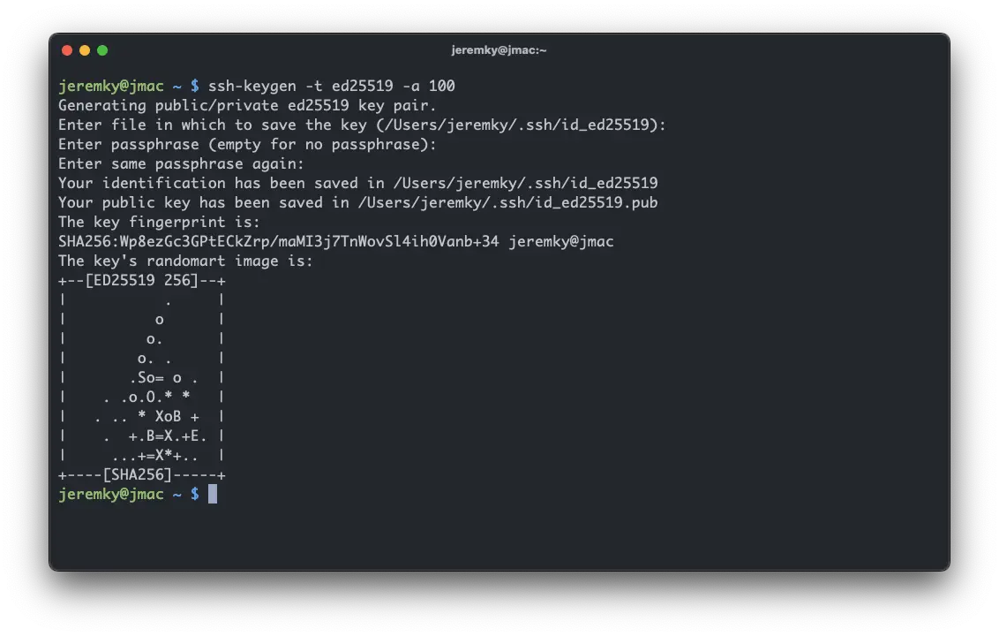
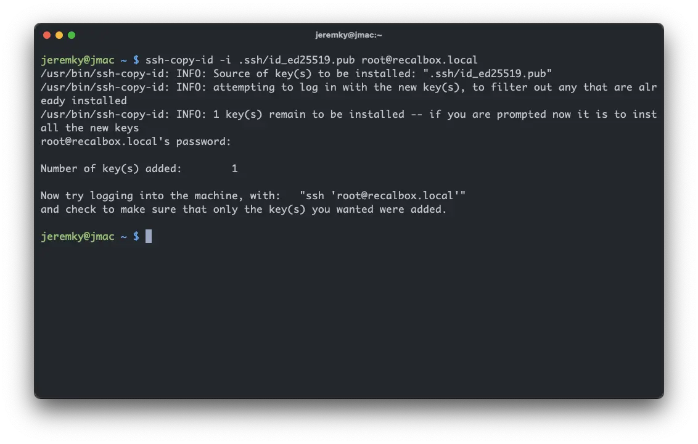

_[Secure Shell](https://fr.wikipedia.org/wiki/Secure_Shell) Secure Shell (SSH) est un protocole de communication sécurisé. Le protocole de connexion impose un échange de clés de chiffrement en début de connexion. Par la suite, tous les segments TCP sont authentifiés et chiffrés. Il devient donc impossible d'utiliser un analyseur de paquets (sniffer) pour voir ce que fait l'utilisateur._

_Le protocole SSH a été conçu avec l'objectif de remplacer les différents protocoles non chiffrés comme rlogin, telnet, rcp et rsh._

## Création d'une clé de sécurité

A noter que ce que je vais indiquer ici est valable aussi bien pour un client sous Linux, Mac, ou Windows (10 et 11).

Il existe différents algorithmes pour créer des clés. Le plus connu, le RSA. Toutefois, je vais vous proposer un algorithme plus récent, et surtout offrant un meilleur niveau de sécurité, le ed25519.
_"Ed25519 a pour but de fournir une résistance aux attaques comparable à celle des chiffrements de 128-bits de qualité. Les clés publiques sont encodées sur 256 bits (32 octets) de long et les signatures sont deux fois plus longues."_

Pour créer votre paire de clé de type **ed25519**, voici la commande à utiliser :

```bash
ssh-keygen -t ed25519 -a 100
```

Quelques questions vous seront posées :

- L'emplacement où générer les clés (vous pouvez laisser par défaut)
- Une passphrase à saisir (non obligatoire, mais recommandé)



Une fois votre clé générée, nous allons utiliser la commande suivante pour l'ajouter au serveur que l'on souhaite :

```bash
ssh-copy-id -i .ssh/id_ed25519.pub <user>@<serveur>
```

Il vous faut spécifier la clé publique a utiliser, ainsi que le serveur de destination. Le mot de passe de connexion à ce dernier vous sera demandé.



Une fois cela fait, vous pouvez retenter une connexion et profiter du résultat :sunglasses:

## Utiliser plusieurs clés

Afin d'augmenter davantage la sécurité, il est possible d'utiliser une clé par serveur SSH. Le plus simple, c'est de vous créer un fichier de config dédié. Ce fichier vous permettra même de vous créer des alias pour vos connexions distantes.

Le fichier, appelé `config`, est à créer sous dans votre dossier utilisateur, sous `.ssh` :

```txt {filename="~/.ssh/config"}
Host *
    AddKeysToAgent yes
    IdentitiesOnly yes

Host recalbox
    HostName recalbox.local
    User root
    Port 22
    IdentityFile ~/.ssh/id_recalbox
```

La 1ère partie s'applique à tous les hosts. Les éléments sont les suivants :

- `AddKeysToAgent` : ajoute le passphrase dans le trousseau du système, pour ne pas avoir à la ressaisir à chaque connexion
- `IdentitiesOnly` : spécifie à ssh de n'utiliser que les clés présentes dans ce fichier de config

Ensuite, vous pouvez créer un bloc par serveur distant, et y indiquer les éléments suivants :

- Le host : qui sera un alias pour vos connexions (`ssh recalbox` dans notre exemple)
- Le hostname, qui peut être une IP
- Le user
- Le port à utiliser
- Et enfin la clé, qui a été renommée

Désormais, au lieu de devoir saisir ssh `<user>@<machine>`, vous pouvez maintenant saisir simplement `ssh <host>`

Les utilisateurs de Windows doivent activer le service `ssh-agent` pour permettre le stockage des passphrases :

```powershell
Get-Service ssh-agent | Set-Service -StartupType Automatic -PassThru | Start-Service
```

## Côté serveur

Maintenant que vous avez mis en place votre système de clé, il est possible de configurer le serveur SSH afin de n'accepter que les connexions via clé. Pour cela, il vous suffit d'éditer sur votre serveur le fichier `/etc/ssh/sshd_config` pour y décommenter la ligne suivante :

```txt
#PasswordAuthentication no
```

Dans le cas où vous avez utilisé mon script de configuration de debian, cette ligne se trouve dans le dernier bloc du fichier. Il suffit de changer la valeur à `no`.

Une fois la modification effectuée, une petite relance du service :

```bash
sudo systemctl restart sshd
```

> Avant de fermer votre session, ouvrez-en une autre afin de vous assurer que vous pouvez toujours vous connecter
