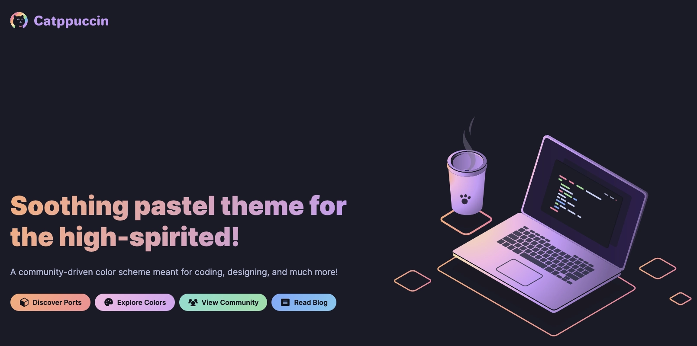
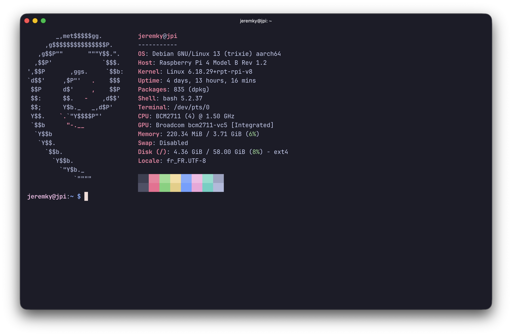
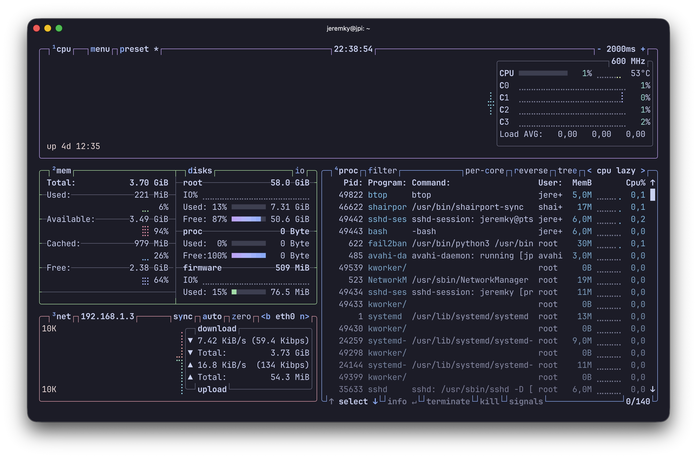

[Catppuccin](https://catppuccin.com/) fait partie des thèmes hyper complets, disponibles sur une grande liste d'applications diverses, comme des IDE, des terminaux, des navigateurs Web, etc...



A noter que Catppuccin propose 4 variantes, 1 claire et 3 sombres :

- Latte
- Frappé
- Macchiato
- Mocha

J'ai fait le choix de la variante Mocha. A vous d'adapter les configurations ci dessous selon vos préférences.

## Ports

Catppuccin propose sur [son site](https://catppuccin.com/ports/) une section ports pour rechercher directement par application. Vous serez redirigé vers le projet GitHub concerné avec la procédure pour l'installation du thème.


## Terminal

Je vous propose tout d'abord d'installer le thème pour le terminal que vous utilisez. Je vous laisse suivre la procédure selon votre terminal :

- [Windows Terminal](https://github.com/catppuccin/windows-terminal)
- [iTerm2](https://github.com/catppuccin/iterm)
- [MobaXterm](https://github.com/catppuccin/mobaxterm)
- [Alacritty](https://github.com/catppuccin/alacritty)

Certains terminaux proposent Catppuccin de base ([Ptyxis](https://flathub.org/en/apps/app.devsuite.Ptyxis), [Ghostty](https://ghostty.org/)...).



## Bash

Maintenant que votre terminal dispose des couleurs de Catppuccin, nous allons adapter certaines applications cli pour être en phase avec le thème. Dans mon cas, cela concerne 2 applications : [fzf](https://github.com/junegunn/fzf), et [tmux](https://github.com/tmux/tmux/wiki).

### fzf

Si vous n'avez pas encore installé fzf, je vous le recommande. Fzf permet entre autre d'améliorer la recherche dans l'historique via le raccourci `ctrl + r`.

Pour l'installer :

```bash
sudo apt install fzf
```

Pour configurer ses couleurs, ajoutez les lignes suivantes dans votre fichier `.bashrc` ou `.bash_aliases` :

```bash
if [[ -f /usr/bin/fzf ]]; then
  eval "$(fzf --bash)"
  export FZF_DEFAULT_OPTS=" \
    --color=bg+:#313244,bg:#1E1E2E,spinner:#F5E0DC,hl:#F38BA8 \
    --color=fg:#CDD6F4,header:#F38BA8,info:#CBA6F7,pointer:#F5E0DC \
    --color=marker:#B4BEFE,fg+:#CDD6F4,prompt:#CBA6F7,hl+:#F38BA8 \
    --color=selected-bg:#45475A \
    --color=border:#6C7086,label:#CDD6F4"
fi
```

### Btop

[Btop](https://github.com/aristocratos/btop) est un moniteur de ressources système comparable à htop.

Rendez-vous sur [cette page](https://github.com/catppuccin/btop/tree/main/themes) pour récupérer le thème de votre choix, et déposez-le ici : `~/.config/btop/themes`.

Relancez btop et rendez vous dans le menu de configuration (touche M) pour sélectionner votre thème.



### Vim

Je vous recommande de vous rendre à [cette page](/docs/linux/applications/vim) afin de récupérer mon fichier `.vimrc`. Cette configuration permet l'installation automatique de [vim-plug](https://github.com/junegunn/vim-plug) ainsi qu'une liste de plugins, dont Catppuccin.


