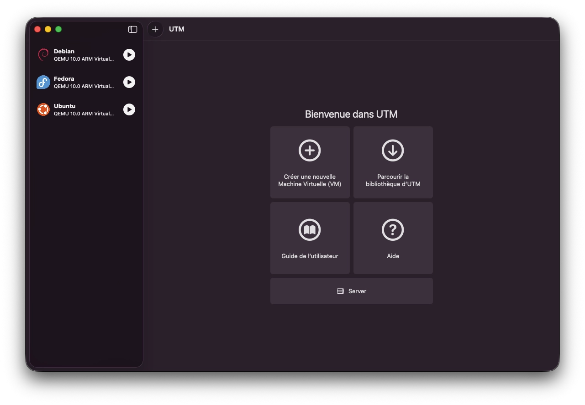
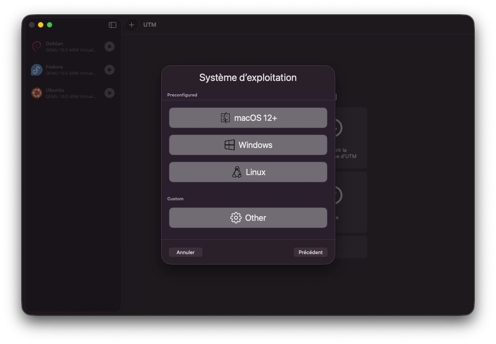
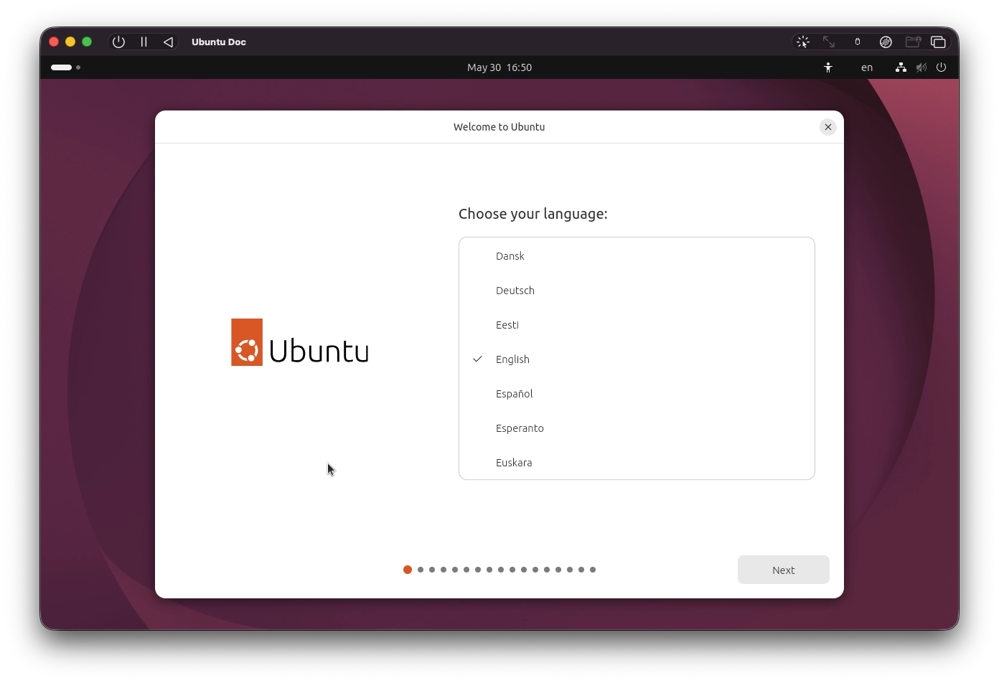
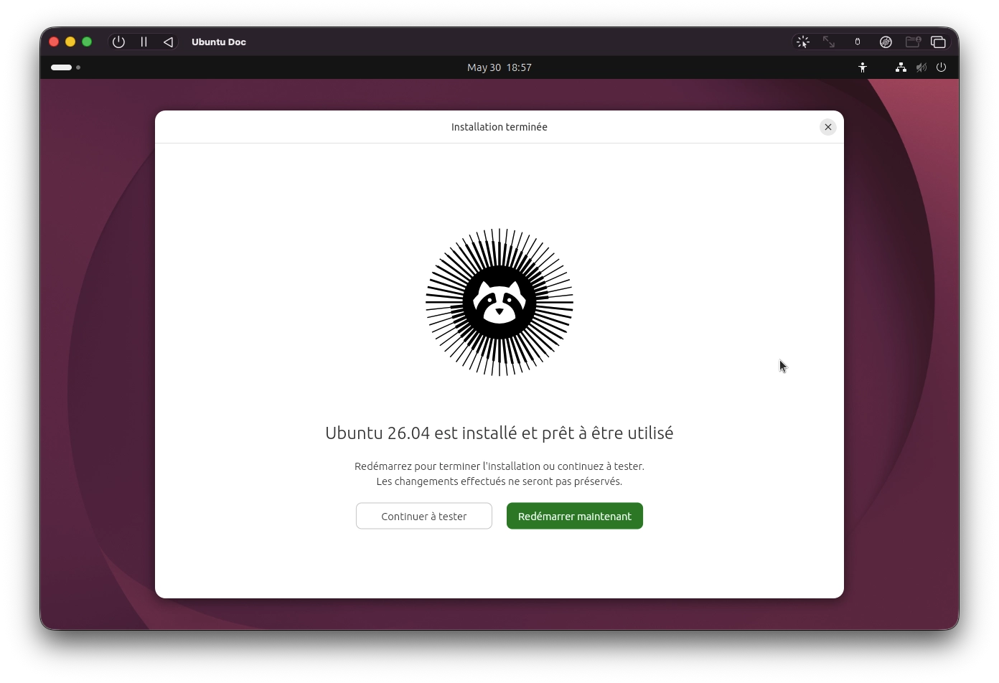
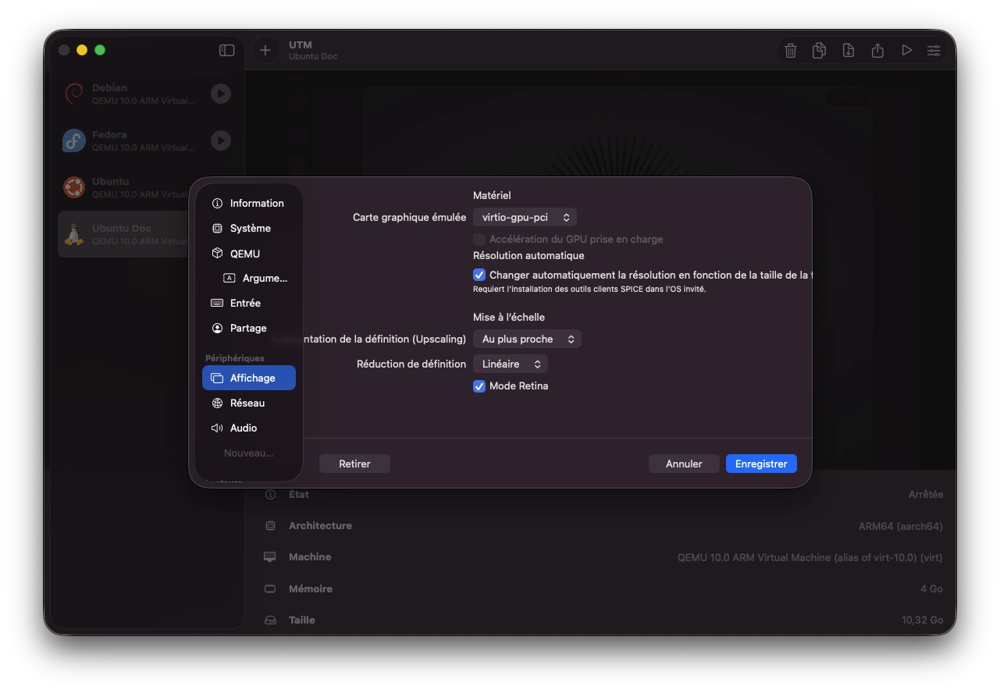

[UTM](https://mac.getutm.app/) est un outil de virtualisation gratuit et open source pour macOS. Il repose sur QEMU tout en proposant une interface graphique native, et peut tirer parti du framework Apple Virtualization pour faire tourner des machines virtuelles Linux ou macOS à des vitesses quasi natives sur Apple Silicon.

## Installation

La façon la plus simple d'installer UTM sur Mac est via Homebrew. S'il n'est pas encore installé sur votre machine, je vous recommande de vous rendre sur [cette page](/docs/macos/utilisation-de-homebrew).

```bash
brew install --cask utm
```

> UTM est également disponible sur le [Mac App Store](https://apps.apple.com/app/utm-virtual-machines/id1538878817) (version payante, identique fonctionnellement, et permet de soutenir les développeurs)

## Créer une VM Ubuntu

Pour la suite, nous allons prendre comme exemple une installation d'Ubuntu.

### Télécharger l'ISO

Récupérez l'image ARM64 d'Ubuntu sur la [page de téléchargement officielle](https://ubuntu.com/download/desktop). Veillez à choisir la version **ARM64** pour une compatibilité native avec Apple Silicon.

### Créer la machine virtuelle

{}

#### Ouvrez UTM et cliquez sur **Créer une nouvelle machine Virtuelle**



#### Sélectionnez **Virtualize**, puis **Linux**



#### Configurez les ressources

Allouez au minimum 4 Go de RAM. Laissez le nombre de cœurs CPU en automatique.

#### Sélectionnez l'ISO Ubuntu téléchargée

Cliquez sur **Parcourir...** et sélectionnez le fichier `.iso` fraîchement téléchargé. N'activez pas l'option pour la virtualisation Apple. Il est préférable de laisser la configuration par défaut.

#### Configurez le stockage

Laissez 64 Go. Ubuntu nécessite environ 20 Go pour le système de base, le reste est pour vos fichiers. À noter que l'espace ne sera pas pré-alloué.

#### Optionnel : répertoire partagé

Vous pouvez sélectionner un dossier de votre Mac à partager avec la VM. Cette étape peut être passée et configurée ultérieurement.

#### Nommez la VM et sauvegardez

Cliquez sur **Save**, puis sur le bouton **Run** pour démarrer la VM.

{}

### Installer Ubuntu

Au démarrage, le menu GRUB s'affiche. Sélectionnez **Try or Install Ubuntu**. Suivez ensuite les étapes de l'installateur.



1. Choisissez la langue, le clavier et le fuseau horaire
2. Connectez-vous au réseau — sélectionnez **Connexion filaire** (UTM partage la connexion du Mac)
3. Choisissez **Installer Ubuntu → Installation interactive → Sélection par défaut**
4. Sélectionnez **Effacer le disque et installer Ubuntu**
5. Créez votre compte utilisateur
6. Cliquez sur **Installer** et patientez jusqu'à la fin



Au redémarrage, Ubuntu vous invite à éjecter le support d'installation. Dans la barre d'outils UTM, cliquez sur l'icône **CD/DVD** et sélectionnez l'image ISO de Ubuntu, cliquez sur **Éjecter**, puis appuyez sur Entrée dans la VM.

### Résolution d'écran

Pour un affichage net sur un écran Retina, arrêtez la VM, faites un clic droit dessus et sélectionnez **Modifier**. Dans la section **Affichage**, activez **Mode Retina** et **Enregistrer**.



Au prochain démarrage, dans Ubuntu, allez dans **Paramètres → Affichage** et réglez l'échelle sur **200%**.

## Suivre le projet

Pour suivre ce projet, rendez-vous sur [GitHub](https://github.com/utmapp/UTM).
