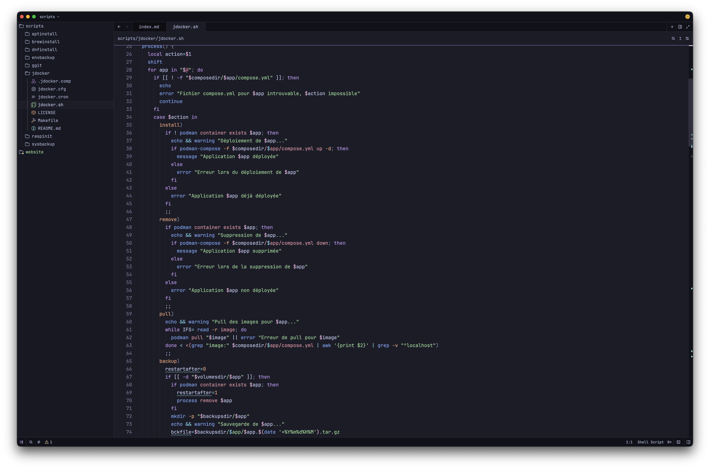
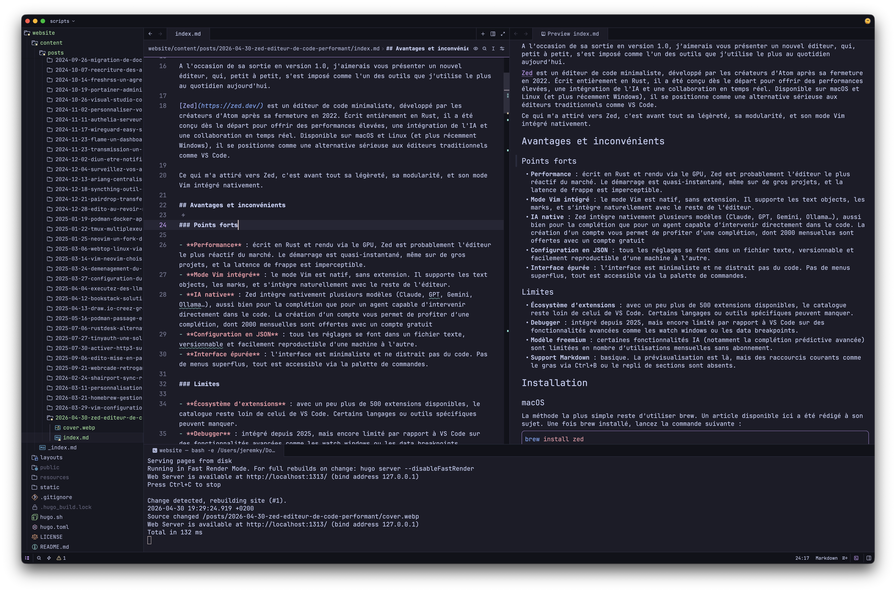

[Zed](https://zed.dev/) est un éditeur de code minimaliste, développé par les créateurs d'Atom après sa fermeture en 2022. Écrit entièrement en Rust, il a été conçu dès le départ pour offrir des performances élevées, une intégration de l'IA et une collaboration en temps réel. Disponible sur macOS et Linux (et plus récemment Windows), il se positionne comme une alternative sérieuse aux éditeurs traditionnels comme VS Code.



## Avantages et inconvénients

### Points forts

- **Performance** : écrit en Rust et rendu via le GPU, Zed est probablement l'éditeur le plus réactif du marché. Le démarrage est quasi-instantané, même sur de gros projets, et la latence de frappe est imperceptible.
- **Mode Vim intégré** : le mode Vim est natif, sans extension. Il supporte les text objects, les marks, et s'intègre naturellement avec le reste de l'éditeur.
- **IA native** : Zed intègre nativement plusieurs modèles (Claude, GPT, Gemini, Ollama…), aussi bien pour la complétion que pour un agent capable d'intervenir directement dans le code. La création d’un compte vous permet de profiter de complétions, dont 2000 mensuelles sont offertes avec un compte gratuit
- **Configuration en JSON** : tous les réglages se font dans un fichier texte, versionnable et facilement reproductible d'une machine à l'autre.
- **Interface épurée** : l'interface est minimaliste et ne distrait pas du code. Pas de menus superflus, tout est accessible via la palette de commandes.

### Limites

- **Écosystème d'extensions** : avec un peu plus de 500 extensions disponibles, le catalogue reste loin de celui de VS Code. Certains langages ou outils spécifiques peuvent manquer.
- **Debugger** : intégré depuis 2025, mais encore limité par rapport à VS Code sur des fonctionnalités avancées comme les watch windows ou les data breakpoints.
- **Modèle freemium** : certaines fonctionnalités IA (notamment la complétion prédictive avancée) sont limitées en nombre d'utilisations mensuelles sans abonnement.
- **Support Markdown** : basique. La prévisualisation est là, mais l'éditeur manque de fonctionnalités pour les longues sessions d'écriture.



## Installation

La méthode la plus simple reste d'utiliser brew. Un article [disponible ici](/docs/macos/utilisation-de-homebrew) a été rédigé à son sujet.

Une fois brew installé, lancez la commande suivante :

```bash
brew install zed
```

Si vous ne voulez pas installer Homebrew et préférez une méthode d’installation traditionnelle, vous pouvez récupérer le fichier `dmg` en suivant [ce lien](https://zed.dev/download-success?asset=Zed-aarch64.dmg&version=0.233.10&channel=stable).

## Configuration

Zed dispose désormais d'une interface de configuration. Mais il est également possible de modifier directement les configurations via différents fichiers :

- les paramètres globaux
- les keymaps (raccourcis clavier)
- les snippets (des alias pour appeler des morceaux de texte/code)

Je vous recommande de consulter la [documentation officielle](https://zed.dev/docs/remote-development?highlight=settings#zed-settings).

> [!NOTE]
> Les fichiers de configuration que je vous partage sont spécifiques à mon usage. Beaucoup d'éléments ont été désactivés ou déplacés, ce qui peut rendre l'expérience très différente des paramètres définis par défaut. Je vous suggère donc de construire votre fichier de configuration en prenant le temps de tester chaque paramètre

### Paramètres généraux

```json {filename="~/.config/zed/settings.json"}
// ─── Zed settings ───────────────────────────────────────

{
  "auto_update": false,
  "disable_ai": false,

  "telemetry": {
    "metrics": false,
    "diagnostics": false,
  },

  "title_bar": {
    "show_sign_in": false,
    "show_branch_name": false,
    "show_worktree_name": false,
  },

  // ─── IA ───────────────────────────────────────────────

  "agent": {
    "default_profile": "ask",
    "enable_feedback": false,
    "sidebar_side": "right",
    "enabled": true,
    "dock": "right",

    "inline_assistant_model": {
      "provider": "mistral",
      "model": "mistral-small-latest",
    },

    "default_model": {
      "enable_thinking": false,
      "provider": "mistral",
      "model": "mistral-medium-latest",
    },
  },

  "agent_servers": {
    "claude-acp": {
      "default_config_options": {
        "mode": "auto",
      },
      "type": "registry",
    },
  },

  "edit_predictions": {
    "provider": "none",
  },

  // ─── Interface ────────────────────────────────────────

  "theme": "Catppuccin Mocha",
  "icon_theme": "Catppuccin Mocha",
  "buffer_font_family": "JetBrains Mono NL",
  "buffer_font_size": 13,
  "ui_font_size": 15,
  "agent_ui_font_size": 15,
  "markdown_preview_font_size": 15,

  "debugger": { "button": false },
  "collaboration_panel": { "dock": "left", "button": false },
  "git_panel": { "dock": "left", "button": true },
  "outline_panel": { "dock": "left", "button": false },

  "project_panel": {
    "dock": "left",
    "hide_hidden": false,
    "hide_root": true,
    "scrollbar": { "horizontal_scroll": false },
  },

  "terminal": {
    "font_family": "JetBrains Mono NL",
    "font_size": 13,
    "copy_on_select": true,
    "line_height": "comfortable",
  },

  // ─── Editor ───────────────────────────────────────────

  "base_keymap": "Zed",
  "cli_default_open_behavior": "existing_window",
  "extend_comment_on_newline": false,
  "snippet_sort_order": "top",
  "soft_wrap": "editor_width",
  "tab_size": 2,

  "autosave": {
    "after_delay": {
      "milliseconds": 3000,
    },
  },
  
  "vim_mode": false,
  "vim": {
    "use_system_clipboard": "never",
    "use_smartcase_find": true,
  },

  // ─── Code ─────────────────────────────────────────────

  "file_types": {
    "Shell Script": ["comp"],
    "ini": ["cron", "cfg"],
  },

  "languages": {
    "Markdown": {
      "show_edit_predictions": false,
    },

    "Make": {
      "hard_tabs": true,
    },

    "Shell Script": {
      "format_on_save": "on",
      "formatter": {
        "external": {
          "command": "shfmt",
          "arguments": ["-i", "2", "-ci", "-"],
        },
      },
    },
  },

  "lsp": {
    "markdownlint": {
      "initialization_options": {
        "config": {
          "MD013": false,
          "MD033": false,
          "MD041": false,
        },
      },
    },
  },

  // ─── SSH ──────────────────────────────────────────────

  // "ssh_connections": [
  //   {
  //     "host": "host",
  //     "args": [],
  //     "projects": [
  //       {
  //         "paths": ["/home/dir"],
  //       },
  //     ],
  //   },
  // ],

  // ─── Extensions ───────────────────────────────────────

  "auto_install_extensions": {
    "catppuccin": true,
    "catppuccin-icons": true,
    "codebook": true,
    "csv": true,
    "docker-compose": true,
    "env": true,
    "ghostty": true,
    "git-firefly": true,
    "html": true,
    "ini": true,
    "log": true,
    "make": true,
    "markdownlint": true,
    "scheme": true,
    "scss": true,
    "sql": true,
    "ssh-config": true,
    "toml": true,
    "xml": true,
  },
}
```

Le fichier a été organisé pour regrouper les paramètres :

- les paramètres généraux et d'interface (désactivation de la télémétrie, taille de police, thème...)
- la configuration des services IA
- les panneaux (position de l'explorateur de fichiers, désactivation des panneaux que je n'utilise pas...)
- l'éditeur lui-même (sauvegarde automatique, taille des tabulations...)
- la gestion du code (gestion de l'outil `shfmt` pour les scripts bash, les tabulations forcées pour les fichier `Makefile`...)
- une section des connexions ssh (Zed peut se connecter nativement à un serveur ssh pour une édition directe)
- et enfin, l'installation automatique des extensions listées

> [!IMPORTANT]
> La police utilisée est `JetBrains Mono NL`. Si vous ne l'avez pas : `brew install font-jetbrains-mono`

#### Dépendances

Pour utiliser la reconnaissance intelligente des scripts bash, il est nécessaire d'installer certains outils. Toujours avec [Homebrew](/docs/macos/utilisation-de-homebrew) :

```bash
brew install shfmt shellcheck
```

### Raccourcis clavier

```json {filename="~/.config/zed/keymap.json"}
[
  {
    "context": "Editor",
    "bindings": {
      "f2": "workspace::ToggleVimMode",
      "f3": "editor::SelectAllMatches",
      "f4": "editor::ToggleComments",
      "f5": "editor::Format",
    },
  },
  {
    "bindings": {
      "f1": "command_palette::Toggle",
      "cmd-shift-a": "workspace::ToggleZoom",
      "cmd-shift-e": "project_panel::ToggleFocus",
      "cmd-shift-g": "git_panel::ToggleFocus",
      "cmd-shift-c": "multi_workspace::ToggleWorkspaceSidebar",
    },
  },
]
```

Passant régulièrement de Zed version Mac à version Windows, j'ai tenté d'adapter des raccourcis pour les rendre communs aux 2 plateformes (`F1` pour exécuter une commande par exemple). Je me suis également basé sur certains raccourcis que j'utilise sous [Vim](/docs/linux/applications/vim).

### Snippets Markdown

```json {filename="~/.config/zed/snippets/markdown.json"}
{
  "Bash bloc": {
    "prefix": "bash",
    "body": ["```bash", "${1:}", "```", ""],
    "description": "Bloc bash"
  },

  "Code bloc": {
    "prefix": "code",
    "body": ["```${1:code}", "${2:}", "```", ""],
    "description": "Bloc texte"
  },

  "Image bloc": {
    "prefix": "img",
    "body": [""],
    "description": "Bloc image"
  },

  "Info bloc": {
    "prefix": "info",
    "body": ["> [!${1:IMPORTANT}]", "> ${2:}", ""],
    "description": "Bloc infos"
  },

  "URL bloc": {
    "prefix": "url",
    "body": ["[${1:text}](${2:})", ""],
    "description": "Bloc URL"
  },

  "Code bloc Hugo": {
    "prefix": "hugo codefile",
    "body": ["```${1:code} {filename=\"${2:file}\"}", "${3:}", "```", ""],
    "description": "Bloc fichier dans Hugo"
  },

  "Card Hugo": {
    "prefix": "hugo card",
    "body": [
      "{{</* card link=\"${1:}\" title=\"${1:}\" icon=\"${2:document}\" */>}}"
    ],
    "description": "Bloc de cards pour un blog avec Hugo"
  },

  "Videos Hugo": {
    "prefix": "hugo video",
    "body": ["{{</* youtube ${1:shorturl} */>}}", ""],
    "description": "Bloc de vidéo pour un blog avec Hugo"
  }
}
```

Il suffit de saisir les préfixes spécifiés dans le fichier pour insérer les blocs concernés (`code` par exemple). Le curseur va se placer automatiquement sur chaque élément à modifier en appuyant sur `TAB`.

### Codebook

Codebook est une extension Zed qui permet d'effectuer de la vérification orthographique. Sa configuration s'effectue via un fichier `toml` présent ici : `~/.config/codebook/codebook.toml`

```toml {filename="~/.config/codebook/codebook.toml"}
dictionaries = [
  "fr",
  "en_us",
]

include_paths = [
  "**/*.md",
  "**/*.txt",
]

words = [
  "Catppuccin",
  "codeberg",
  "cron",
  "flathub",
  "flatpak",
  "fzf",
  "homebrew",
  "hytale",
  "jerem",
  "jeremky",
  "keymaps",
  "podman",
  "shellcheck",
  "tmux",
  "ufw",
  "vimscript",
  "vimrc",
]
```

Cette configuration permet de ne vérifier que les extensions de la section `include_paths`, afin de ne pas charger l'extension inutilement pour les scripts.
