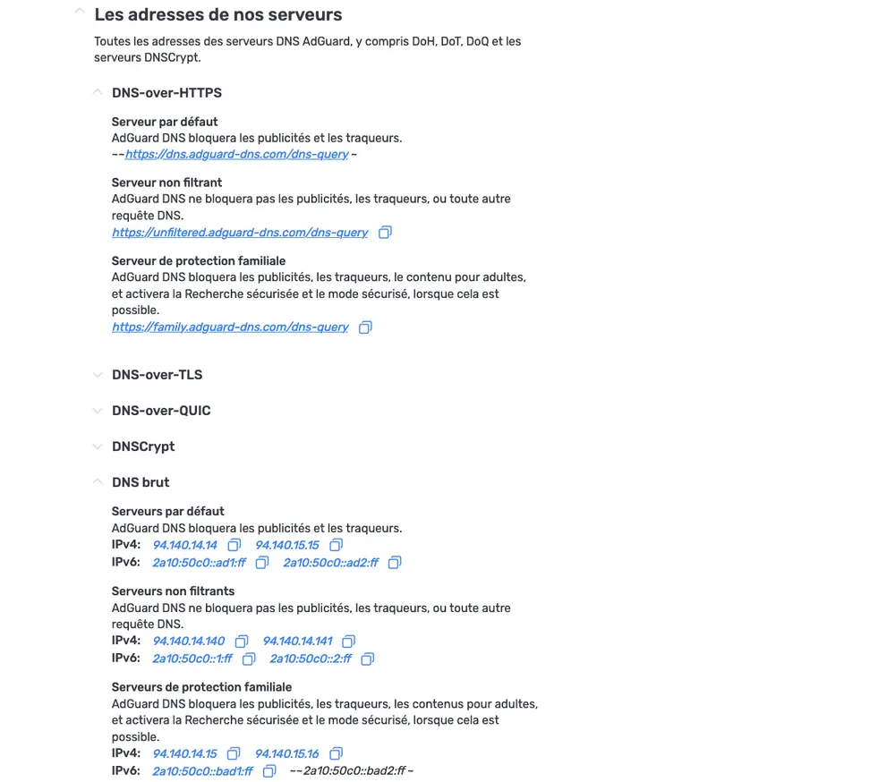
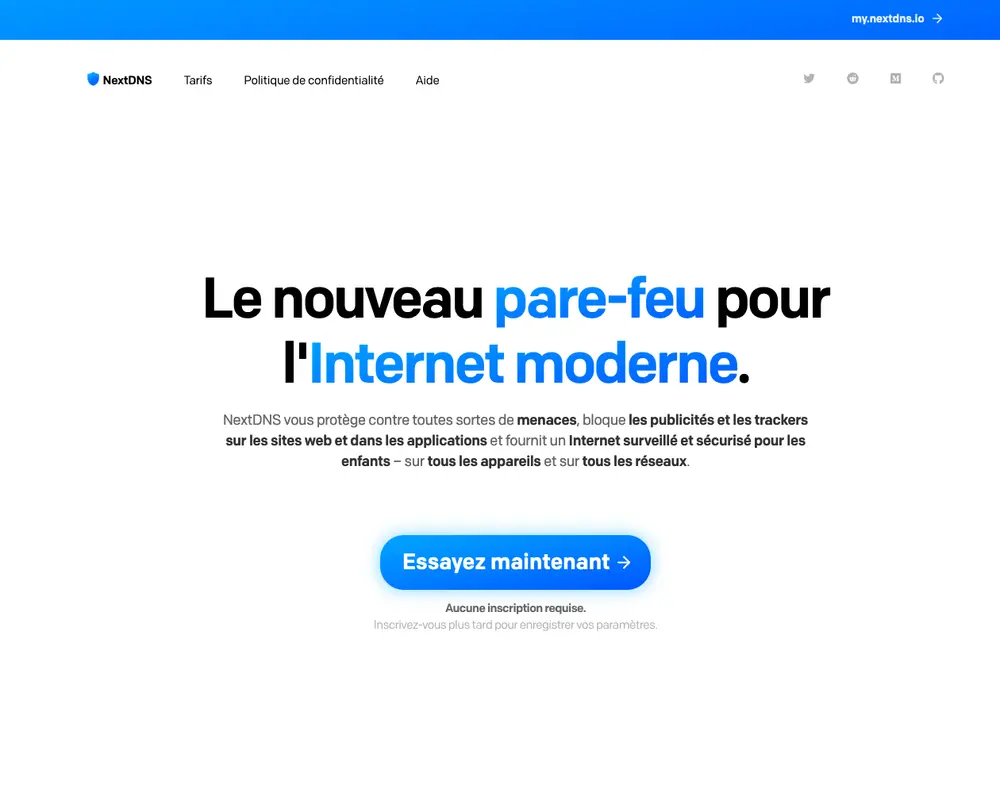
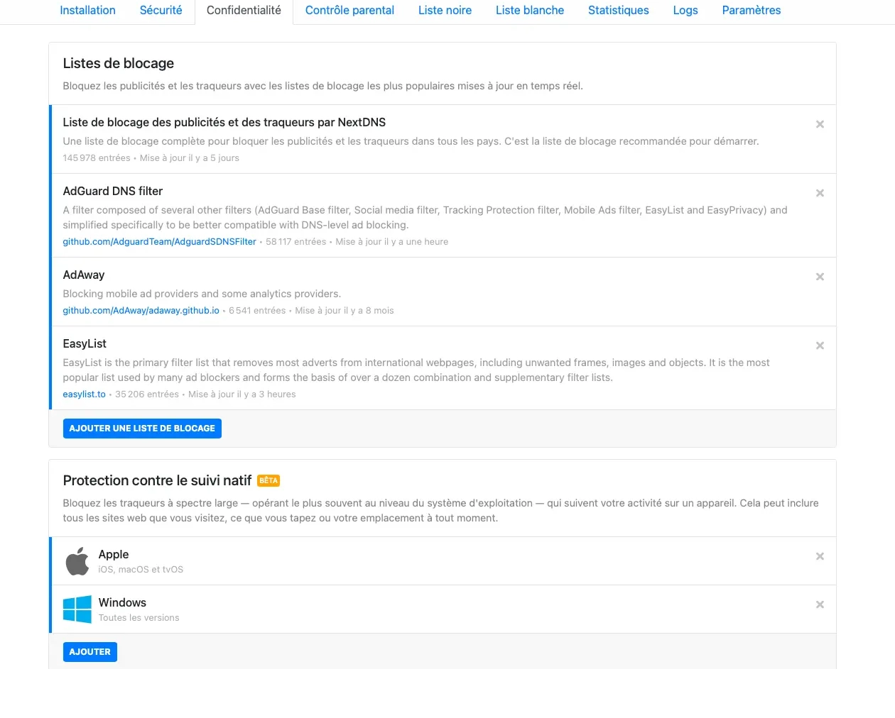
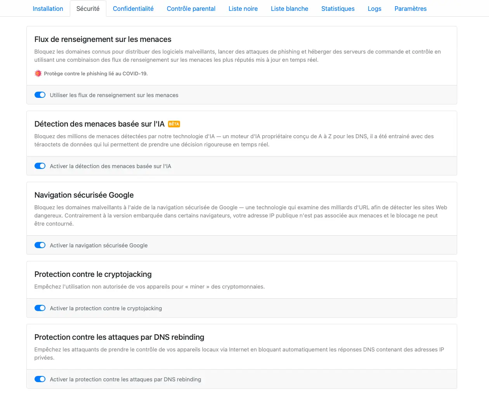
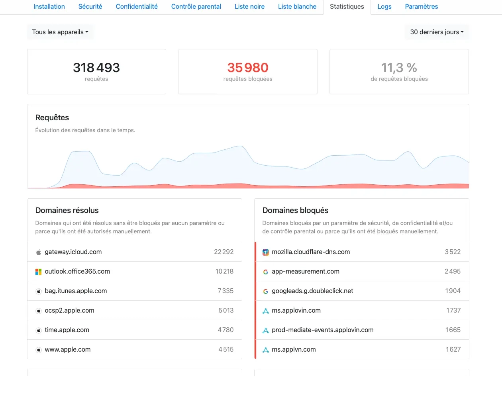

Utiliser un Adblock directement dans son navigateur rend la navigation plus agréable... Mais on peut aller encore plus loin : bloquer les publicités directement au niveau des requêtes DNS, non seulement dans le navigateur, mais également sur tout le système d'exploitation. Il existe plusieurs solutions pour faire cela, mais je vais en présenter deux : Adguard DNS et NextDNS.

## Adguard DNS

[Adguard](https://adguard.com/fr/welcome.html) existe sous la forme d'un bloqueur de pubs traditionnel, mais propose également des solutions de blocage DNS.

Adguard DNS est la plus simple à mettre en place, puisque l'on peut utiliser des serveurs DNS que Adguard nous met à disposition. Vous trouverez sur [cette page](https://adguard-dns.io/fr/public-dns.html), les IPv4 et IPv6 de leurs serveurs. Ils proposent plusieurs possibilités de filtrage : classique, non filtrant, et avec une protection dite familiale.

Le blocage fonctionne plutôt bien dans leur configuration. J'ai toutefois constaté quelques baisses de performance comparé à d'autre fournisseurs DNS, et cette configuration est limitée sur les appareils où vous pouvez manuellement changer les adresses IP DNS.

### Configuration

Sur les appareils ne permettant une configuration DNS brute, voici les IP à utiliser :

- IPv4 : 94.140.14.14, 94.140.15.15
- IPv6 : 2a10:50c0::ad1:ff, 2a10:50c0::ad2:ff

### Adguard Home

Si jamais vous désirez héberger localement leur solution de blocage, vous avez 2 solutions :

- Déploiement via [Docker](/docs/docker/conteneurs/reseau/adguardhome)
- Installation classique via le [script d'installation](https://github.com/AdguardTeam/Adguardhome#automated-install-linux-and-mac)

## NextDNS

[NextDNS](https://nextdns.io/fr) est à mon sens le meilleur compromis entre personnalisation et simplicité d'utilisation. Ce service permet de profiter d'un blocage de publicités quelque soit le réseau utilisé (Wifi, cellulaire). Ce service dispose d'une version gratuite et payante, mais la version gratuite suffit déjà largement, la seule limitation étant de 300 000 requêtes par mois.

Avant de créer un compte chez eux, il est possible de tester leur service une semaine. NextDNS propose plusieurs façons de paramétrer vos appareils. Le plus simple est de passer par l'application (Windows, macOS, Android, iOS)

### Interface

- Dans la partie `Confidentialité`, il vous sera possible d'ajouter les listes de blocage à utiliser :

- La section `Sécurité` propose des options supplémentaires pour vos connexions :

- Il est possible de consulter les statistiques d'utilisation (seulement si vous avez activé les logs) :

