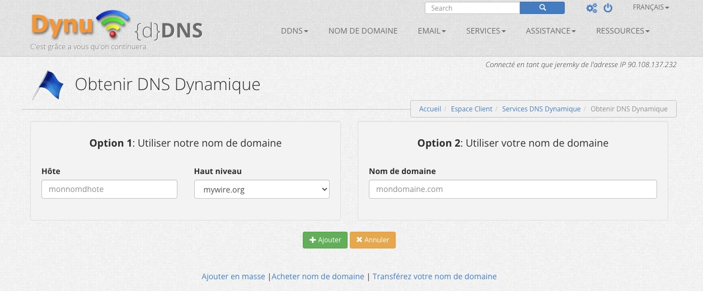
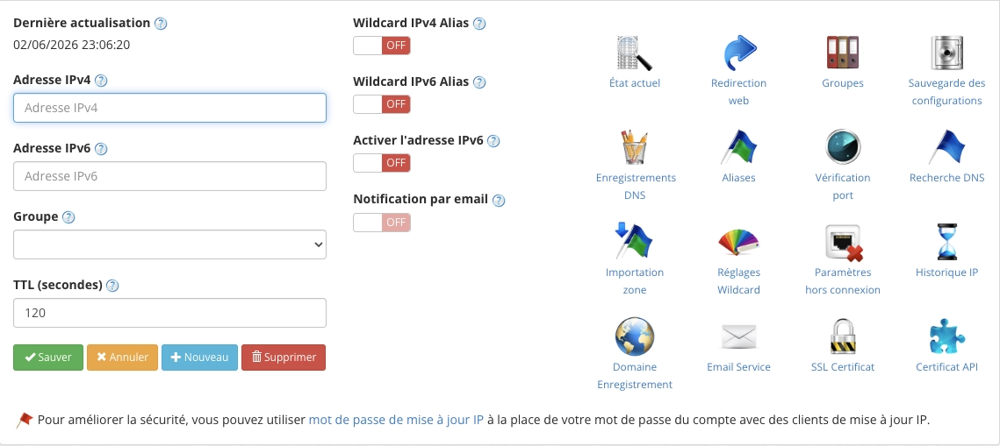
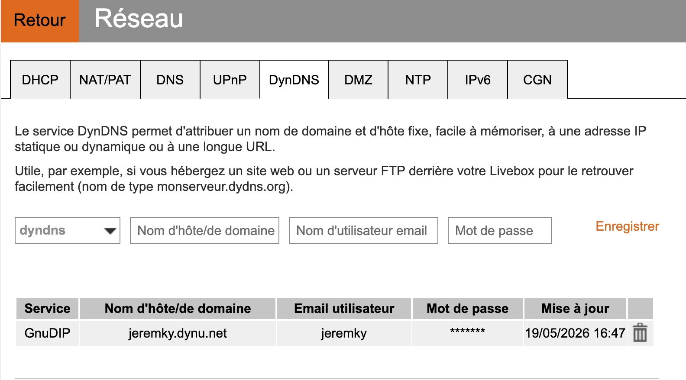
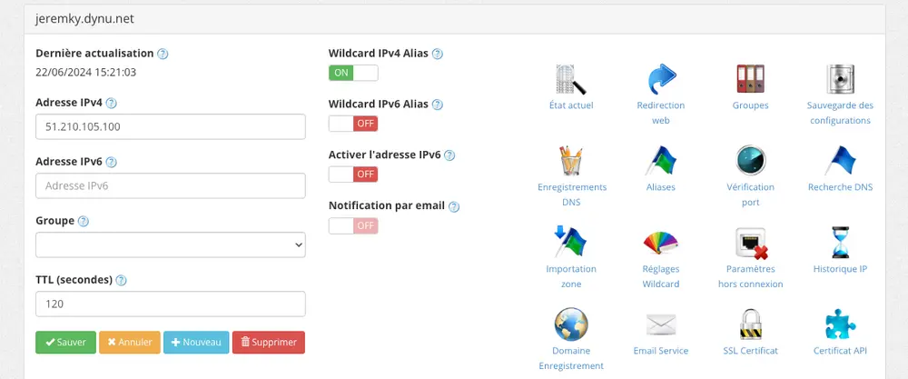

Selon votre FAI, il est possible que votre IP publique change régulièrement. Afin de rendre vos applications accessibles par Internet, il est nécessaire de disposer d'un nom de domaine dynamique. Dans cette procédure, nous allons utiliser le service [Dynu](https://www.dynu.com/fr-FR/)

## Création d'un compte chez Dynu.com

Il existe plusieurs fournisseurs de nom de domaine dynamique. Toutefois, je recommande [Dynu](https://www.dynu.com/fr-FR/), qui propose une solution gratuite, et surtout qui ne nécessite pas de confirmer que l'on existe toujours tous les mois... Vous créez votre compte, et vous allez dans _DDNS Services_. Vous cliquez ensuite sur le bouton _Ajouter_ :



Vous pouvez alors choisir le nom qui vous intéresse parmi la liste des domaines. Une fois votre domaine créé, vous arrivez ici :



## Configuration de la mise à jour automatique

Pour que la mise à jour soit automatique, plusieurs options :

### Votre box est compatible avec Dynu

Les Livebox peuvent effectuer directement la mise à jour. Il suffit de se rendre dans la partie réseau, de sélectionner l'onglet `DynDNS`, et de choisir le service `GnuDIP` :



### Votre box n'est pas compatible

Dans ce cas, je vous recommande d'installer `ddclient` :

- Soit via un [conteneur docker](/docs/docker/conteneurs/reseau/ddclient)
- Soit directement sur votre serveur. Exemple avec Debian :

{}

#### Installation

```bash
sudo apt install ddclient
```

#### Configuration

Éditez le fichier `/etc/ddclient.conf` avec le contenu suivant :

```ini {filename="/etc/ddclient.conf"}
# ddclient config for Dynu.com
pid=/var/run/ddclient.pid
daemon=300
syslog=yes
ssl=yes
use=web, web=checkip.dynu.com/, web-skip='IP Address'
server=api.dynu.com
protocol=dyndns2
login=dynu_username
password=md5_password
your-domain.dynu.net
```

Modifiez les éléments suivants :

- `dynu_username`
- `md5_password`
- `your-domain.dynu.net`

#### Redémarrage

Relancez le service :

```bash
sudo systemctl restart ddclient
```

{}

### Vérification

Sur la page de Dynu, votre IP s'est normalement mise à jour automatiquement :


